# not only chatGPT


## chatbot


## another chatbot

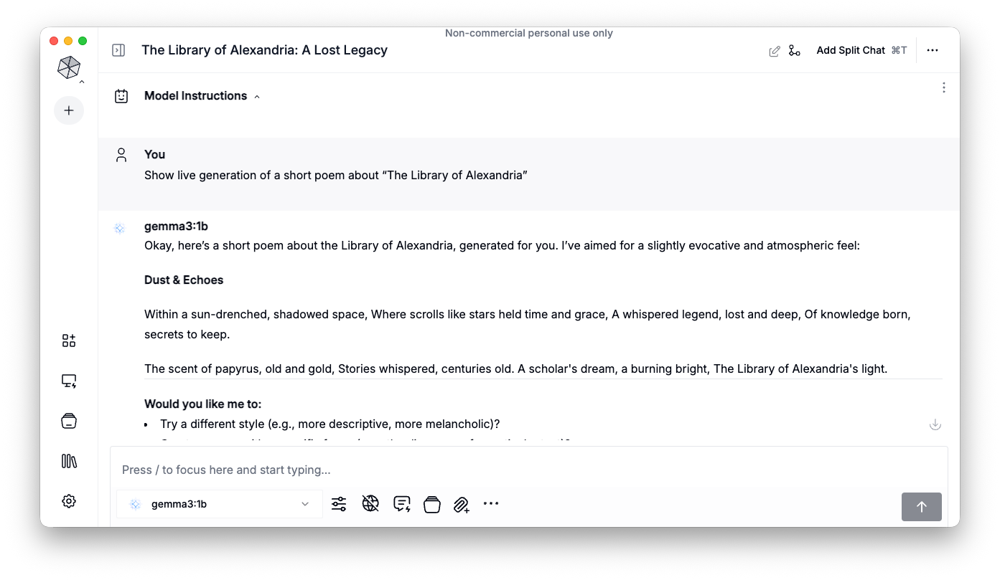


## traditional models not sufficient

multivariate machine learning (e.g. SVM) fails to map a large feature space:

```{r}
DiagrammeR::grViz("digraph {
  graph [layout = dot, rankdir = TD]
  
  node [shape = rectangle, fixedsize = true, width = 4, style = filled, fillcolor = Beige]      
  box1 [label = 'Why did the banana cross the road?']
  box2 [label = 'mapping function', fillcolor = Linen, width = 2]
  box3 [label = 'Perché la banana ha attraversato la strada?']
  
  # edge definitions with the node IDs
  box1 -> box2 -> box3
  
  }")

```


## turning points

- 1970s – artificial neural networks
- 2000s – deep learning networks
- 2013 – word embeddings (word2vec)
- 2014 – sequence mapping (seq2seq)
- 2017 – attention is all you need (The Transformer) 👈
- 2018 – pre-trained multi-language model (BERT)
- 2019 – large generative model (GPT-2)
- 2022 – a model released as a chatbot (chatGPT)
- 2023 – multimodal models
- 2024 – reasoning models 
- 2025 – compressed models (distillation, quantization)
- 2026 – agentic systems (OpenClaw, Hermes-Agent)


# the Transformer


## artificial neural network

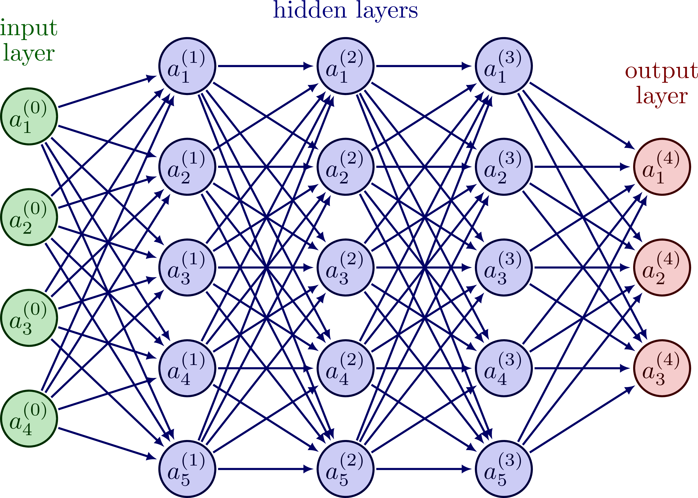


## deep learning neural network

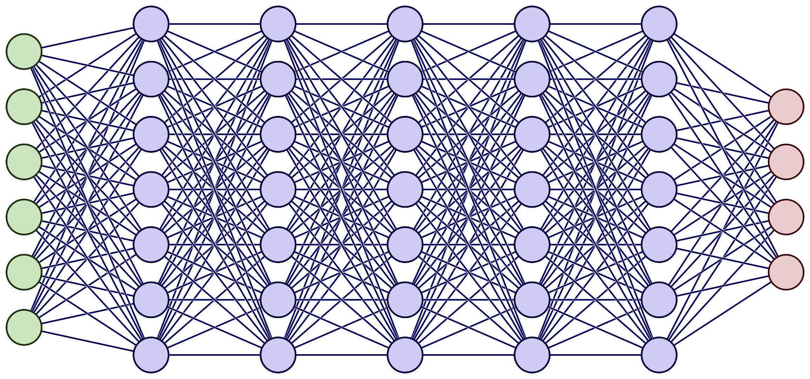


## encoder-decoder neural network

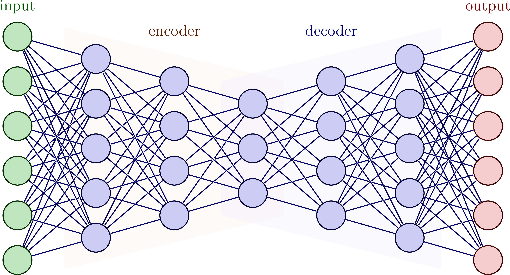


## transformer neural network

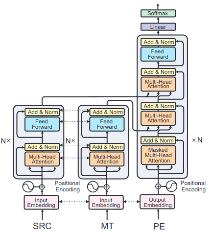


## sequence to sequence mapping

```{r}
DiagrammeR::grViz("digraph {
  graph [layout = dot, rankdir = TD]
  
  node [shape = rectangle, fixedsize = true, width = 3, style = filled, fillcolor = Beige]
  box1 [label = 'input text sequence']
  box2 [label = 'TRANSFORMER', fillcolor = Linen, width = 2]
  box3 [label = 'output text sequence']
  
  # edge definitions with the node IDs
  box1 -> box2 -> box3
  
  }")

```


## from audio to text

```{r}
DiagrammeR::grViz("digraph {
  graph [layout = dot, rankdir = TD]
  
  node [shape = rectangle, fixedsize = true, width = 3, style = filled, fillcolor = Beige]      
  box1 [label = 'input audio signal']
  box2 [label = 'TRANSFORMER', fillcolor = Linen, width = 2]
  box3 [label = 'generated text transcription']
  
  # edge definitions with the node IDs
  box1 -> box2-> box3
  
  }")

```


## from text to audio

```{r}
DiagrammeR::grViz("digraph {
  graph [layout = dot, rankdir = TD]
  
  node [shape = rectangle, fixedsize = true, width = 3, style = filled, fillcolor = Beige]      
  box1 [label = 'input written text']
  box2 [label = 'TRANSFORMER', fillcolor = Linen, width = 2]
  box3 [label = 'speech synthesis']
  
  # edge definitions with the node IDs
  box1 -> box2 -> box3
  
  }")

```


## from text to image

```{r}
DiagrammeR::grViz("digraph {
  graph [layout = dot, rankdir = TD]
  
  node [shape = rectangle, fixedsize = true, width = 3, style = filled, fillcolor = Beige]      
  box1 [label = 'text prompt']
  box2 [label = 'TRANSFORMER', fillcolor = Linen, width = 2]
  box3 [label = 'generated picture']
  
  # edge definitions with the node IDs
  box1 -> box2 -> box3
  
  }")

```


## Universe, LSD, Fractal Worlds, Eyes


## the same prompt, different results


## machine translation

```{r}
DiagrammeR::grViz("digraph {
  graph [layout = dot, rankdir = TD]
  
  node [shape = rectangle, fixedsize = true, width = 4, style = filled, fillcolor = Beige]      
  box1 [label = 'Why did the banana cross the road?']
  box2 [label = 'TRANSFORMER', fillcolor = Linen, width = 2]
  box3 [label = 'Perché la banana ha attraversato la strada?']
  
  # edge definitions with the node IDs
  box1 -> box2 -> box3
  
  }")

```


# Large Language Models


## LLM, LRM, GPT, BERT

- BERT: Bidirectional Encoder Representations from Transformers
- GPT: Generative Pre-trained Transformer
    - not only the architecture
    - but also the trained parameters
    - massive amounts of textual data used
- LLM: Large Language Model
    - a group of modern text-oriented models
- LRM: Large Reasoning Model
    - a group of models involving "the chain of thoughts"


## model size comparison

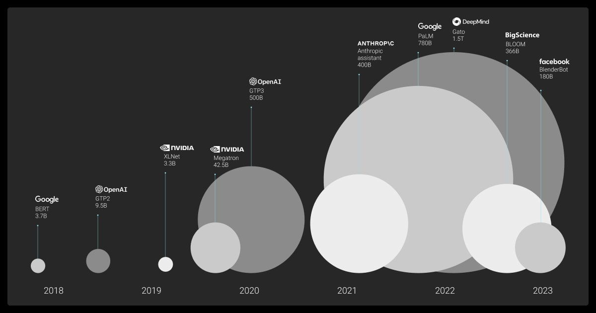


## a small selection of LLMs

| Model | Release | Parameter Count | Training Data |
|-------|---------|-----------------|---------------|
| Opus 4.7 | 2026 | >1.6 trillion | almost the whole internet |
| GPT‑4 | 2023 | >1 trillion | web + proprietary |
| DeepSeek-R1 | 2025 | 671B | >85,000 agent tasks |
| LLaMA 2 | 2023 | 7B, 13B, 70B | public corpora |
| Mistral 7B | 2023 | 7B | public data |
| BERT | 2018 | 110M | Wikipedia + BookCorpus |


> 😲 recent LLMs are over 10,000 times bigger than BERT 


# translation to sign language


## aim of the project

- to provide a system to automatically translate
    - written language to sign language
    - originally from Polish to PSL (PJM)
    - later: Ukrainian to USL
- capable of translatin any input text
- prototype: public administration domain
- plans: the system used by public institutions


## avatar modeling with Unreal

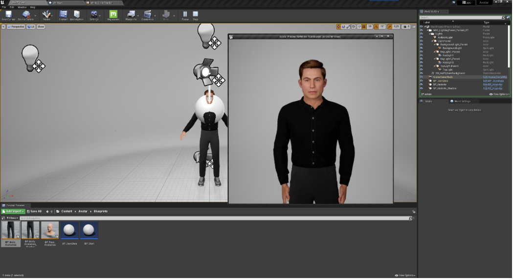


## Kristofer the Avatar


## mock-up gesture capturing

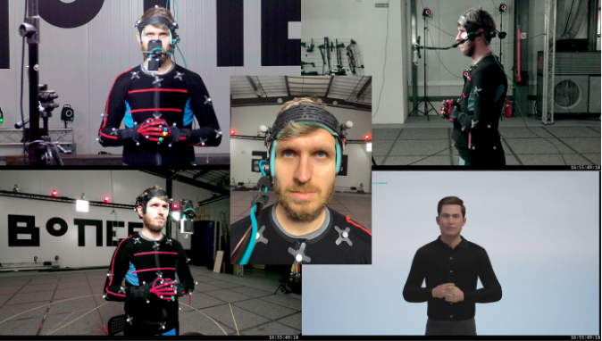


## sign language represented as glosses

A sentence in a phonic language:

- _I will put a book on a table._

Vs. a sentence in a sign language:

- _BOOK, TABLE, PUT-ON_ 

Not only SVO vs. SOV, but also the number of words differ.

(Also, sign languages use space, and have non-manual gestures...)


## translation as a mapping problem

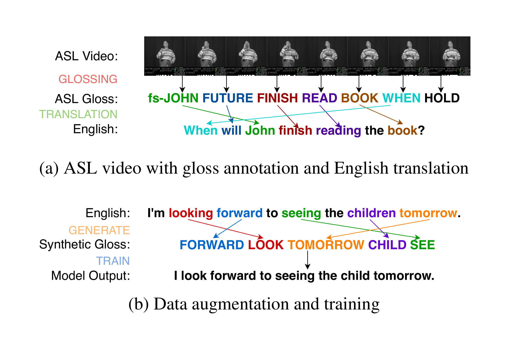


## the Transformer again

- Deep learning neural network
- Based on the multi-head attention mechanism
- Context-aware
- Suitable for language data (i.e. linear order matters)
- Designed to solve machine translation problems (!)


## data scarcity problem

- AI models have to be fed with lots of data
- In our case, only 800 sentences available
- Two approaches to overcome the issue:
    - Data Augmentation (synthetic datasets to rescue)
    - Transfer Learning (train the model, and then fine-tune)


## 800 manually annotated sentences


## Deutsche Gebärdensprache (DGS)


## overcoming data limitations

Transfer Learning:

- training a model on a big yet genral dataset
    - e.g., on 80,000 sentences from DSG corpus
- fine-tuning using a target dataset
    - e.g. the 800 sentences in PJM

Data Augmentation:

- creating a synthetic dataset
- by artificially copying original sentences...
- ... with some random modifications introduced.
- finally, training a model on the augmented dataset


## does it work?

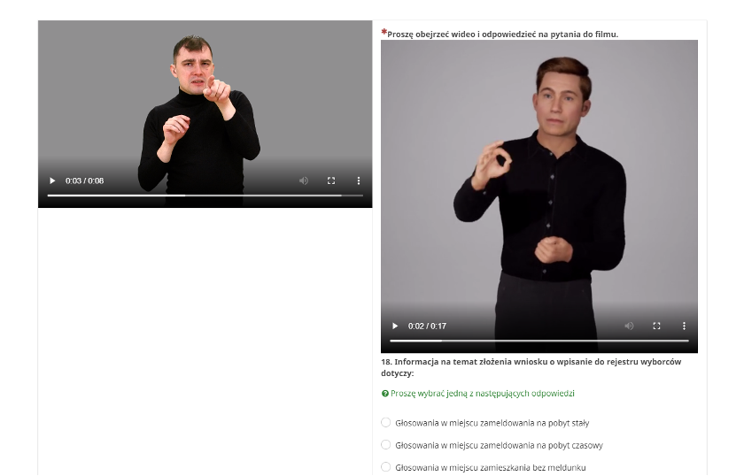


# printing centers </br> in the 16th-19th centuries 


## aim of the study

- to map the printing market in 16th-19th centuries
- to corroborate a centralization (?) of publishing houses
- to observe the shift (?) from Krakow to Vilnius, and then to Warsaw

## the dataset

- there exists a comprehensive biblography of all the prints anyhow related to Poland (i.e. the language, the place of publication, or the content decide)
- compiled by Karol Estreicher at the turn of the 19th century
- completed by his son, and then by his grandson
- ca. 250,000 books recorded for 16th-18th centuries
- ca. 140,000 books recorded for 19th century
- available in print, available as a database (?)


## the bibliogrphy: a sample title page

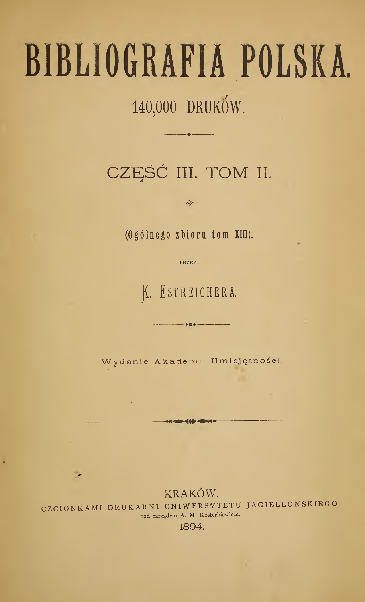


## the bibliogrphy: a sample page

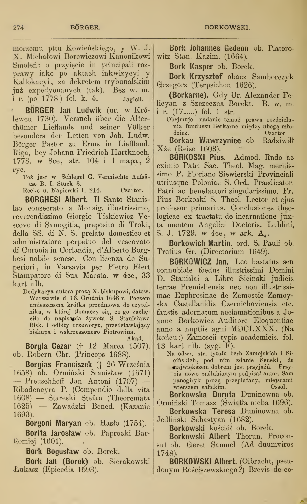


## a database exists, but...

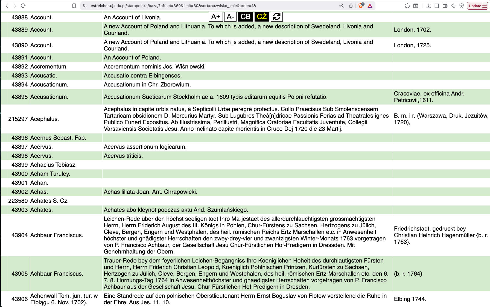


## unstructured data in the wild

``` txt
Cracoviae ex Off. Hier. Szarffenbergii. A. 1549.
Typis Univ. Zamoscensis. A. 1748.
w Łowiczu 1782.
S. Pietierburg, w tip. Wtorago Otdielenija Sobstwiennoj Jego Imp. Wieliczestwa Kancelarii, 1849,
Frankfurt und Leipzig 1728.
W drukarni Lwowskiey Soc. Jesu {b. r. 1746}.
Lemberg, 1888,
V Praze, tisk a sklad c. k. knihtiskárny Synů Bohumila Haase, 1852,
Bromberg, Louis Levit, gedruckt bei C. L. Gasse, 1844,
Dantisci 1644.
München, Druck, Franz Paul Ercacher, (ok. 1895),
1565.
Vindobonae, typ. Ueberreiter, 1840,
Lwiw, tszczanijem, iżdywenijem i typom Instytuta Stauropyhijanskaho pry Cerkwi Usp. Pr. Bohorod., 1857,
Posiedzeń 10,
Danzig, Verlag von Th. Bertling, Druck von A. W. Kafemann, 1860,
Anno M.DC.LXXXV. (1685). Crac: Typis Francisci Cezary, S. R. M. Typ.
Gedruckt zu Leiptzig, M. D. LXXVI (1576),
Dorpat, bei C. A. Kluge; Leipzig bei C. F. Köhler, gedruckt bei J. C. Schünmann in Dorpat, 1836,
Gedruckt zu Dantzigk, durch Jacobum Rhodum. M. D L XXX (1580),
Gdańsk, druk. wdowy Jerzego Rhete, 1649.
Typis Academiae Posnaniensis (1698).
In Venegia appresso Gabriel Giolito de Ferrari MDLXI (1561).
```


## LLMs to rescue

- manual data extraction unrealistic for ~400,000 entries
- LLMs capable of classifying, denoising, translating etc.
- LLMs good in detecting pattenns in unstructured data
- however, the dataset cannot be just fed into a LLM 
- but: the data can be split into batches
- batches of 50 entries sent to the model, one at a time 


## the prompt

``` python
PROMPT_INTRO = """You are an expert librarian, with a profound expertise in Polish prints 
from 16th-19th centuries.

I will give you bibliographic entries divided into three TAB-separated fields:
Author[TAB]Title[TAB]Publication info.

Extract ONLY place of publication and year of publication.
Prioritize place/year inside parentheses if present.
Convert city names to modern Polish spelling when possible (e.g., Breslau/Vratislavia -> Wrocław; 
Lemberg -> Lwów).
If missing, output "-".

OUTPUT RULES:
- Output EXACTLY one line per entry, numbered 1..N.
- Each line must be: "i. Place: <Place>, Year: <Year>"
- No extra text.

Entries:
"""
```


## the system works nicely

``` txt
Place: Mülheim a. d. R., Year: 1871-1876  
Place: Warszawa, Year: 1881  
Place: Warszawa, Year: 1881  
Place: Toruń, Year: 1882  
Place: -, Year: -  
Place: Warszawa, Year: 1895  
Place: -, Year: -  
Place: Kraków, Year: 1892  
Place: -, Year: -  
Place: -, Year: -  
Place: Kraków, Year: 1874  
Place: Lwów, Year: 1848  
Place: -, Year: 1870  
Place: -, Year: -  
Place: Warszawa, Year: 1831  
Place: Lwów, Year: 1848  
Place: Kraków, Year: 1848  
Place: Lwów, Year: 1848  
Place: Warszawa, Year: -  
Place: -, Year: -  
Place: Lwów, Year: 1848  
Place: Paryż, Year: 1843  
Place: Kraków, Year: 1900  
```


## sometimes, LLMs seem confused

``` txt
The given input describes a large set of scenarios for the zombie apocalypse simulation. For each 
of the 12 test cases, a valid path from the upper-left corner to the lower-right corner of the 
50 × 50 grid is not found while avoiding both the obstacles and the attack ranges of the zombies. 
Consequently, the output for every test case is a single line containing `-1`.

-1
-1
-1
-1
-1
-1
-1
-1
-1
-1
-1
-1

Place: -, Year: -  
Place: -, Year: -  
Place: -, Year: -  
Place: -, Year: -  
Place: -, Year: -
```


## some replies are werid...

``` txt
#### Correctness Proof  

We prove that the algorithm outputs the correct value for every query.

---

##### Lemma 1  
During the processing of a query the variable `index` equals the
binary number whose bits are exactly the bits encoded by the query
(`1` → `1`, `2` → `0`), read from the first to the last integer.

**Proof.**

*Initialization.*  
Before the first integer is processed `index = 0`.  
This is the value of a binary number with no bits – the empty prefix.

*Induction step.*  
Assume after reading the first `k` integers (`k ≥ 0`)
`index` equals the integer represented by the first `k` bits.
When the `(k+1)`‑st integer `d` is read,
the algorithm shifts the current value left by one (`index << 1`)
and OR‑s with the new bit `bit` (`0` if `d = 2`, `1` if `d = 1`).
Thus the new value represents the binary number whose prefix
consists of the first `k` bits followed by the `(k+1)`‑st bit.
```


## the eureka moment

```{.python code-line-numbers="12,13"}
PROMPT_INTRO = """You are an expert librarian, with a profound expertise in Polish prints 
from 16th-19th centuries.

I will give you bibliographic entries divided into three TAB-separated fields:
Author[TAB]Title[TAB]Publication info.

Extract ONLY place of publication and year of publication.
Prioritize place/year inside parentheses if present.
Convert city names to modern Polish spelling when possible (e.g., Breslau/Vratislavia -> Wrocław; 
Lemberg -> Lwów).
If missing, output "-".
Take the entries one by one carefully to avoid confusion.
Expect to process exactly 50 entries.

OUTPUT RULES:
- Output EXACTLY one line per entry, numbered 1..N.
- Each line must be: "i. Place: <Place>, Year: <Year>"
- No extra text.

Entries:
"""
```


# results


## results: number of printed books


```{r fig_1, echo=FALSE, message=FALSE}

txt = readLines("output_gpt120_ver3.txt", warn = FALSE)

txt_relevant = grep("Place: .*Year: ", txt, value = TRUE)

# received 269167 items

txt_nonempty = grep("Place: \\w+, Year: [0-9]{4}", txt_relevant, value = TRUE)

place_year_raw = strsplit(txt_nonempty, "Place: |Year: ")


# an obscure way to extract the second element of each row
place_raw = sapply(place_year_raw, `[`, 2)
# extracting the place, by dropping whatever goes after
place = gsub("(\\w+)\\b.*", "\\1", place_raw)

# an obscure way to extract the third element of each row
year_raw = sapply(place_year_raw, `[`, 3)
# extracting just the year, converting to numeric values
year = as.numeric(gsub("([0-9]{4}).*", "\\1", year_raw))


# getting rid of some systematic errors, e.g. wrong entries for 2022
year_clean = year[year > 1450 & year < 1901]

# getting rid of some systematic errors, e.g. wrong entries for 2022
place_clean = place[year > 1450 & year < 1901]


years = sort(unique(year_clean))
cities = c()
#
for(i in years) {
  current_year_data = place_clean[year_clean == i]
  current_year_all = length(current_year_data)

    n_krk = sum(current_year_data == "Kraków") / current_year_all
    n_waw = sum(current_year_data == "Warszawa") / current_year_all
    n_vln = sum(current_year_data == "Wilno") / current_year_all
    n_gda = sum(current_year_data == "Gdańsk") / current_year_all
    n_poz = sum(current_year_data == "Poznań") / current_year_all
    n_lvv = sum(current_year_data == "Lwów") / current_year_all
    n_par = sum(current_year_data == "Paryż" | current_year_data == "Paris") / current_year_all
    n_wro = sum(current_year_data == "Wrocław") / current_year_all
    n_ant = sum(current_year_data == "Antwerpia") / current_year_all

    cities = rbind(cities, c(n_krk, n_waw, n_vln, n_gda, n_poz, n_lvv, n_par, n_wro, n_ant))
}

cities = as.data.frame(cities)


# all the books recorded in the database

years = sort(unique(year_clean))
grand_total = c()
#
for(i in years) {
  current_year_data = place_clean[year_clean == i]
  current_year_all = length(current_year_data)
  grand_total = c(grand_total, current_year_all)
}
plot(grand_total ~ years, pch = 20, col = "darkgray", ylab = "Number of printed books", xlab = "Years")
lines(lowess(grand_total, f = 1/25)$y ~ years, col = rgb(1,0,0,0.7), lwd = 5)

arrows(1795, 1500, 1795, 800, length = 0.1, col = "grey")
text(1795, 1400, labels = "1795", pos = 2, srt = 90, cex = 0.8)
arrows(1649, 1500, 1649, 500, length = 0.1, col = "grey")
text(1649, 1400, labels = "1649", pos = 2, srt = 90, cex = 0.8)
arrows(1618, 1500, 1618, 400, length = 0.1, col = "grey")
text(1618, 1400, labels = "1618", pos = 2, srt = 90, cex = 0.8)

```


## results: centers vs. peripheries

```{r fig_2, echo = FALSE, message = FALSE}

# Simpson's index showing concentration of printing houses

years = sort(unique(year_clean))
simpson_index = c()
#
for(i in years) {
    data = table(place_clean[year_clean == i])
    simpson = sum((data / sum(data))^2)
    simpson_index = c(simpson_index, simpson)
}
plot(simpson_index ~ years, pch = 20, col = "darkgray", ylab = "Simpson Index", xlab = "Years")
lines(lowess(simpson_index, f = 1/25)$y ~ years, col = rgb(1,0,0,0.7), lwd = 5)


arrows(1830, 1, 1830, 0.35, length = 0.1, col = "grey")
text(1830, 1, labels = "1830", pos = 2, srt = 90, cex = 0.8)
arrows(1795, 1, 1795, 0.45, length = 0.1, col = "grey")
text(1795, 1, labels = "1795", pos = 2, srt = 90, cex = 0.8)
arrows(1655, 1, 1655, 0.4, length = 0.1, col = "grey")
text(1655, 1, labels = "1655", pos = 2, srt = 90, cex = 0.8)
arrows(1540, 1, 1540, 0.75, length = 0.1, col = "grey")
text(1540, 1, labels = "1540", pos = 2, srt = 90, cex = 0.8)

```


## results: printing centers

```{r echo = FALSE, message = FALSE}
library(tidyverse)
library(scales)


cities_smoothed = sapply(cities, function(x) lowess(x, f = 1/25)$y)

# ---- 1. Load your data -------------------------------------------------
book_prod = tibble(
  year = sort(unique(year_clean)),
  Krakow   = cities_smoothed[, 1],
  Warsaw   = cities_smoothed[, 2],
  Vilnius  = cities_smoothed[, 3],
  Gdansk   = cities_smoothed[, 4],
  Poznan   = cities_smoothed[, 5],
  Lviv     = cities_smoothed[, 6],
  Paris    = cities_smoothed[, 7],
  Wroclaw  = cities_smoothed[, 8]
)

# ---- 2. Tidy (wide → long) ---------------------------------------------
book_long = book_prod %>%
  pivot_longer(-year,
               names_to = "city",
               values_to = "prop")

# ---- 2a. Custom order of the variables ---------------------------------------------

custom_order = c("Lviv", "Poznan","Warsaw", "Vilnius", "Krakow", "Gdansk", "Paris", "Wroclaw")
book_long = book_long %>%
  mutate(city = factor(city, levels = custom_order))


# ---- 3. Plot ------------------------------------------------------------
ggplot(book_long,
       aes(x = year, y = prop, fill = city)) +
  #geom_area() +
  geom_area(alpha = 0.6 , linewidth = 0.2, colour = "black") +
  scale_y_continuous(labels = percent_format()) +
  scale_fill_brewer(palette = "Set2") +
  labs(
    #title = "Proportion of Book Production by City",
    x = "Year",
    y = "Share of Total Production",
    fill = "City"
  ) +
  theme_minimal(base_size = 13) +
  theme(
    plot.title = element_text(face = "bold", hjust = 0.5),
    legend.position = "right"
  )


```


## Small & tidy vs. Big & dirty

- it would have been great to have it all, but...
- messy dataset better than no dataset
- in the Humanities, we are obsessed with high quality
- however, a bigger picture only possible when the dataset is big too!


## but...

- the model gpt-oss:120b outperformed competition (so far)
- on April 2, 2026: the model Gemma4 released
    - Gemma 4 26b (18 Gb, MoE model)
    - Gemma 4 31b (20 Gb, dense model)
- on April 3, 2026: the model Qwen3.6 released
    - Qwen 3.6 27b (17 Gb, dense model)
    - Qwen 3.6 35b (24 Gb, MoE model)


##

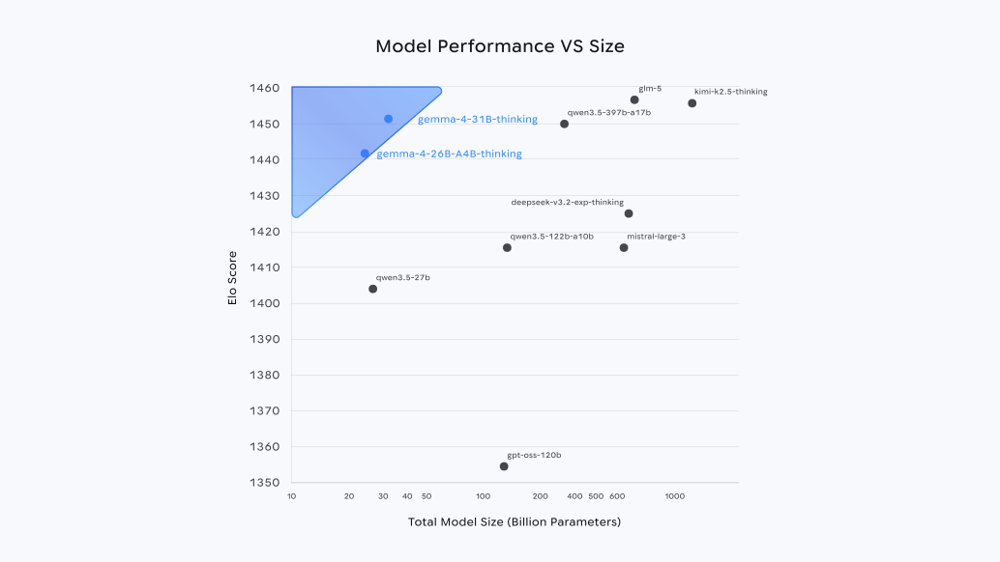


##


##


# evaluation


## benchmark design

- 1,000 entries picked at random
- annotated manually by 2 people
- presented to a number of models
    - the same prompt
    - the same batch size
    - the same order of batches
- compared with manual annotation


## performance comparison


|            | Place|  Year|      |laptop|local |cloud |
|:-----------|-----:|-----:|-----:|-----:|-----:|-----:|
|gpt-oss:20b | 0.890| 0.856|      |✅    |✅    |✅    |
|gemma4:26b  | 0.840| 0.854|      |✅    |✅    |❌    |
|qwen3.6:35b | 0.940| 0.959| 🏆   |🐌    |✅    |❌    |
|gemma4:31b  | 0.929| 0.951| 👀   |🐌🐌  |🐌    |✅    |
|qwen3.6:27b | 0.945| 0.953| 💪   |🐌🐌  |🐌    |❌    |
|deepseek:70b| 0.646| 0.422|      |❌    |✅    |✅    |
|gpt-oss:120b| 0.924| 0.713|      |❌    |✅    |✅    |
|gpt5.4      | ???  | ???  | 🥇   |❌    |❌    |✅    |


# LLMs run locally

## easier than you think

- get a program to run LLMs, e.g.: [https://ollama.com/](https://ollama.com/)
- pull a model of your choice, e.g.:
    - `gemma3n` -- multilingual, designed to work on older laptops
    - `deepseek-r1:8b` -- reasoning model, yet still relatively small
    - `qwen3.5:9b` -- a new kid on the block, reasoning while compact
    - `mistral-small` -- bulky (13Gb on disk), but still can be run locally
    - `gpt-oss:20b` -- might require a recent laptop, but still installable
    - `cogito:70b` -- a monster desktop computer should be able to handle it
    - . . . and dozens of other models.
- run in a chatbot mode (known from chatGPT etc.)
- or process your dataset in batches.


# thank you!


