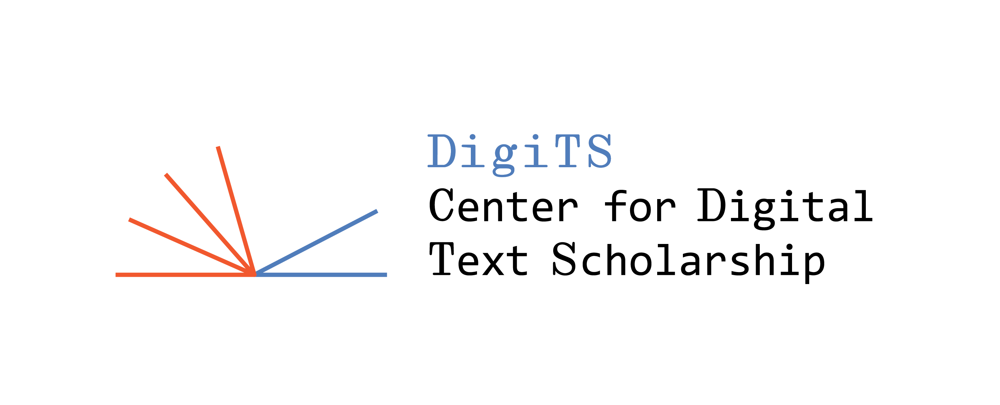
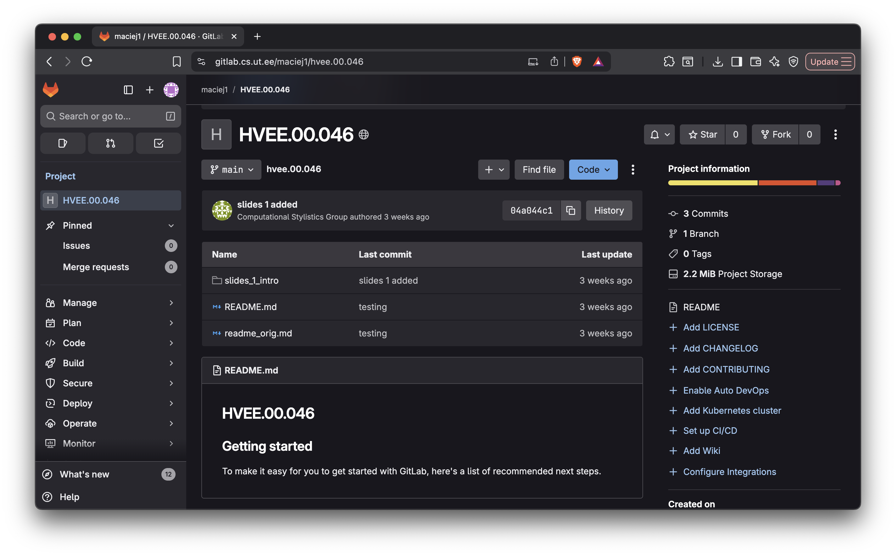
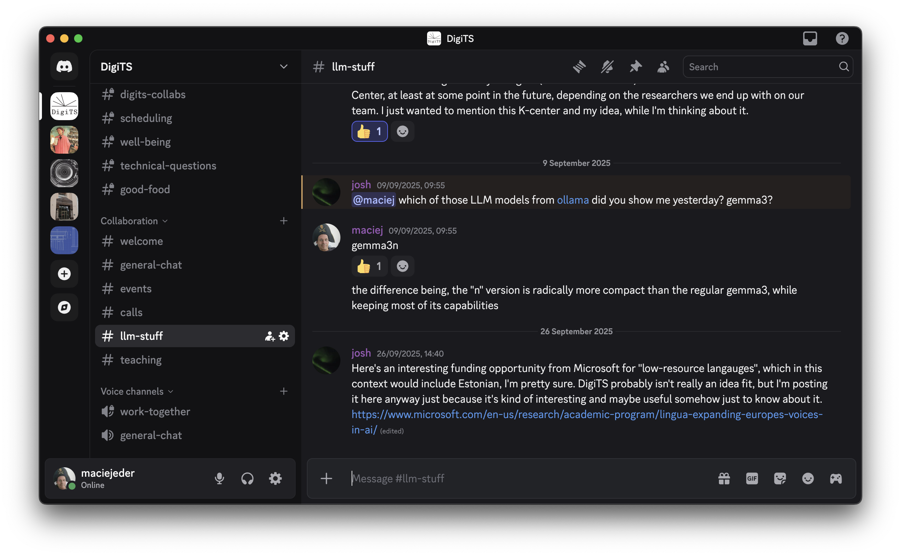
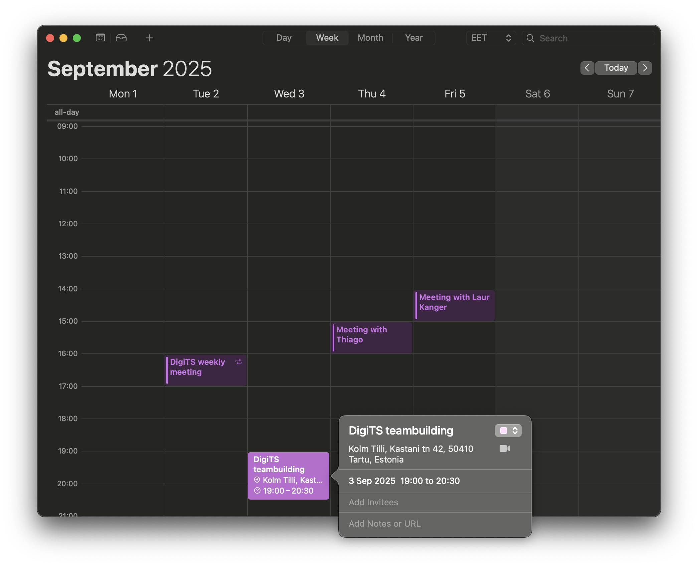
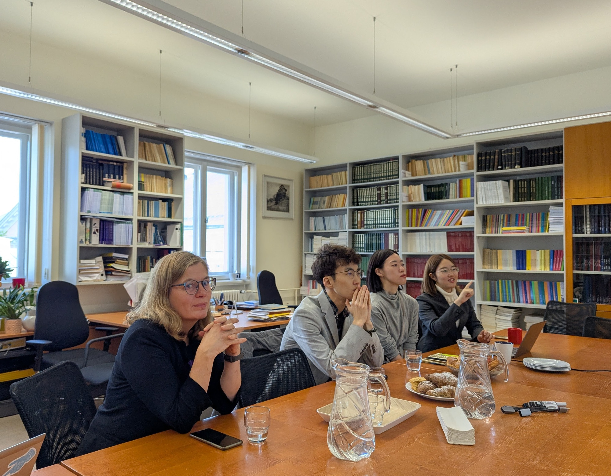

## DigiTS

**Digit**al **T**ext **S**cholarship | Digitekstide uurimiskeskus

- hosted by the Institute of Estonian and General Linguistics
- Horizon Europe _ERA Chair_ grant (#101186601)
- supported by the European Union with €2.5m
- 5 years (March 2025 – February 2030)

##

## objectives

- **Objective 1**: To establish an excellent international research team for DigiTS.
- **Objective 2**: To conduct excellent internationally visible research in text-based DH in collaboration with related institutes of UT.
- **Objective 3**: To improve the quality and diversity of DH teaching and support at UT, training future DH scholars, helping collaborating units in implementing computational methods for text analysis and educating future GLAM professionals.
- **Objective 4**: To contribute to the development and management of the text-based data infrastructure for Estonian LLMs.
- **Objective 5**: To ensure sustainability of DigiTS results.

## objective 1: excellent team

- 3 postdocs and 1 PhD student with complementary backgrounds in literary studies and in computational techniques recruited to form an interdisciplinary team;
- At least 1 additional PhD student recruited with Estonian state funding;
- At least 6 student (research) assistants recruited over the duration of the project to expose students to the field, thereby contributing to its sustainability;
- Individual career development plans prepared for each recruited DigiTS team member.

## objective 2: excellent research

- DigiTS research strategy developed and implemented, with input from collaborating UT institutes;
- At least 30 articles prepared for publication in Web of Science and Scopus-indexed journals by DigiTS team over the course of the project, with at least 10 of those articles co-authored by DigiTS researchers and researchers from collaborating units;
- At least 30 international conferences attended;
- 2 international workshops (20 participants each), 2 international training schools (50-70 participants each) and a final project event (at least 100 participants) organized;
- At least one PhD student co-supervised with collaborating units;
- At least one software package developed or improved.

## objective 3: DH teaching

- BA minor in DH improved and offered to students;
- MA-level micro-degree developed, and then offered to students and professionals twice during the project;
- Feasibility and potential for a full 2-year MA program and PhD specialization in DH assessed;
- Support structures for DH research established at all levels in the form of monthly consultations and targeted events.

## objective 4: Estonian LLMs

- Annual roundtable discussions about utilizing textual datasets and AI tools organized for stakeholders in academia, GLAMs, policy-making and the industry;
- Fragmented and inconsistent datasets consolidated and enhanced to render them useful for LLM development;
- Report on the development of text-based Humanities data infrastructure and replication guidelines for working with smaller languages prepared.

## objective 5: sustainability

- Sustainability strategy developed and implemented;
- Permanent leader of DigiTS elected Full Professor;
- At least 4 funding proposals submitted, 2 with DigiTS researchers as leads;
- At least 1 collaboration with an LLM start-up developed;
- Revenue generated from the creation of a MA-level micro-degree in Digital Humanities.

## ERA Chair professor

- ERA Chair and Visiting Professor in Digital Humanities (Institute of Estonian and General Linguistics, UT)
- ~~Director~~ Professor of Linguistics at the Institute of Polish Language (Polish Academy of Sciences)
- ~~Professor of Literature, Pedagogical University of Kraków~~
- expert in computer-assisted text analysis using machine-learning and neural networks
- PhD in literature, habilitation in linguistics
- PI of the Horizon2020 project _Computational Literary Studies Infrastructure_ (CLS INFRA)
- author of the software package _stylo_ for R
- Tartu Linnamaraton finisher (21k)

## project management

- Liina Lindström, Professor of Modern Estonian (PI)
- Maciej Eder, ERA Chair and Visiting Professor of Digital Humanities
- Joshua Wilbur, Lecturer in Digital Linguistics
- Loone Vilumaa, Project Manager

## research team

- Maciej Eder, research group leader
- Kristiina Vaik, Research Fellow in Digital Humanities
- Botond Szemes, Research Fellow in Digital Humanities
- Thiago Dumont Oliveira, Research Fellow in Digital Humanities
- Bhumika Bhattacharya, Junior Researcher
- Sofia Kriuchkova, Junior Researcher
- student assistants (to be appointed)

## international advisory board

- Prof. Karina van Dalen-Oskam, Huygens Institute (KNAW) and University of Amsterdam
- Prof. Christof Schöch, University of Trier
- Prof. Ray Siemens, University of Victoria
- Assoc. Prof. Nina Tahmasebi, University of Gothenburg
- Dr. Artjoms Šeļa, Czech Academy of Sciences

## a selection of DigiTS work packages

- Achieving Excellence in Text-Based Digital Humanities
- Digital Humanities Education and Support
- Infrastructure Creation and Stakeholder Engagement
- Dissemination and Communication

## what this means for DH at UT

- rethinking the Center for Digital Humanities ([http://digihum.ut.ee/](http://digihum.ut.ee/)) to expand its offer and make it sustainable
- curriculum improvement and development
    - BA: increased course offerings for BA minor
    - MA: micro-degree in digital methods
    - PhD: training schools, master classes; possibly offering degree in DH
- DH research support and development
    - training opportunities and events
    - regular technical support for students and research staff
- (re)new collaboration within SSH

## how to find us

- email: [digits@ut.ee](mailto:digits@ut.ee)
- project office: Jakobi 2-426
- research team office: Jakobi 2-131
- homepage: [https://digits.ut.ee/en](https://digits.ut.ee/en)
- Center for Digital Humanities homepage: [http://digihum.ut.ee/](http://digihum.ut.ee/)
- DH center on Facebook: [https://www.facebook.com/profile.php?id=100060669771976](https://www.facebook.com/profile.php?id=100060669771976)
- LinkedIn profile: [https://www.linkedin.com/company/utartu-digits/](https://www.linkedin.com/company/utartu-digits/)
- bluesky profile: [https://bsky.app/profile/digitsut.bsky.social](https://bsky.app/profile/digitsut.bsky.social)

# project's trivia

##

## 

## 

## 

## 

## 

## 

# questions? suggestions?

