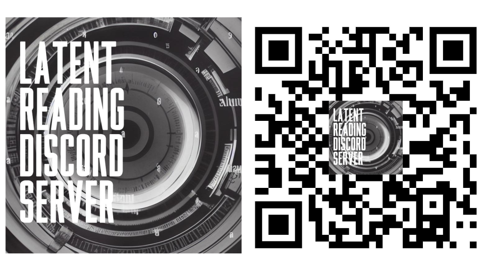

## introduction { .cls_section }

## First, what CLS is about

* Computational Literary Studies
* Aimed at analyzing (large amounts of) textual data...
* ... by computational techniques

## Foundations of CLS

* Computation into criticism
* Distant reading 
* Stylometry
* Authorship attribution
* Digital humanities
* Language resources
* Digital libraries
* Natural language processing
* Machine learning
* Big data
* ...

## 

{height=700}

## 1,000 Polish novels

{height=550}

## Combination of factors needed

* Datasets (language resources)
* Tools (computer programs)
* Suitable methodology
* Computer power (i.e. scientific instruments)

## Research infrastructures { .cls_section }

## infrastructures in DH

* in hard sciences, infrastructures are tangible
    * servers, telescopes, accelerators, ...
* in the humanities, institutions are essential
    * libraries, publishing houses, journals, ...
* in Digital Humanities, multifaceted needs
    * the notion of infrastructure needs reconsideration
    * corpora (FAIR!) but not only

## ELTeC corpus

{height=550}

## CLS INFRA { .cls_section }

An infrastructural project for computational literary studies, founded by Horizon 2020 scheme

## CLS INFRA project

* text collections (corpora)
    * quality
    * metadata
    * conversion
* methodology
    * tools (NLP, datavis, ...)
    * tool chains
    * methodological considerations
    * bibliographic survey
* network of scholars
    * training schools
    * short-term research stays
    * collaboration with COST Action

## Overarching idea is to connect...

* People
  * To establish a network of CLS researchers
* Data
  * To consolidate existing high-quality corpora...
  * ...covering prose, drama and poetry
* Tools
  * To build a chain of NLP tools to analyze texts
* Methods
  * To provide a survey of state-of-the-art methods

## activities { .cls_section }

## training schools

* Prague 2022
    * NLP tools
    * 25 participants on site
    * many more remotely
* Madrid 2023
    * text analysis
    * 10-11 May 2023
* Vienna 2024
    * corpus queries
    * 10-12 June 2024

## TNA

* transnational access
* short-term research stays...
* in one of 6 institutions:
    * NUI Galway
    * Uni Potsdam
    * Uni Trier
    * UNED Madrid
    * OEAW Vienna
    * Charles Uni, Prague
* everyone eligible
* two calls every year

## CLS INFRA and Open Science { .cls_section }

## deliverables published

* 3.1 Report on the methodological baseline for (computational) literary studies
* 4.1 Report on the skills matrix for computational literary studies
* 5.1 Review of the data landscape
* 6.1 Assembly of existing data

## survey of methods

{height=500}

## survey of methods

* Representation of the current CLS research based on a large collection of publications
* Introduction to CLS research areas and prominent issues
* A guide for further reading

https://methods.clsinfra.io/

## programmable corpora: DraCor

{height=550}

## programmable corpora: DraCor

* DraCor: Highly functional prototype for an infrastructural ecosystem
* Programmable Corpora: research-driven API making text machine-actionable
* Open ecosystem: allowing for experimentation and discussion about architectural styles of research environments

https://dracor.org/

## programmable corpora

* API Libraries developed in R and Python (published on the platforms PyPi an CRAN)
* Versioning:
    * Git commits for versioning and retrieving additional metadata
    * Docker containers of the entire research infrastructure - for more complex programmable corpora

## tools and access for CLS

* list and description of Natural Language Processing (NLP) tools (Corpus-Enrichment and NLP toolchain for common CLS research tasks)
* increasing the ease of access and application to NLP tools, as well as their standardization

## CLS INFRA legacy

* all outputs available online (freely!)
* plans to develop the infrastructure
* a network of scholars is growing

## CLS-centric Discord server

{height=550}

## { .no-background }

