# Introduction

## Aims of the study

- Assessing large number of texts
- Leveraging existing explanatory methods
- Automatic analysis of textual relations...
- ... that will reveal groups of similar texts

## Mapping literature

- Chronology
- Genre
- Imitation
- Authorship
- ...

## Basic concepts

- “Computation into criticism” (John Burrows)
- “Distant reading” (Franco Moretti)
- “Macroanalysis” (Matthew Jockers)
- Big Data
- Authorship attribution

## Cluster analysis dendrograms

- Highly dependent on feature selection
- Highly dependent on similarity measure
- Highly dependent on linkage algorithm
- No validation provided

## 136 most frequent words

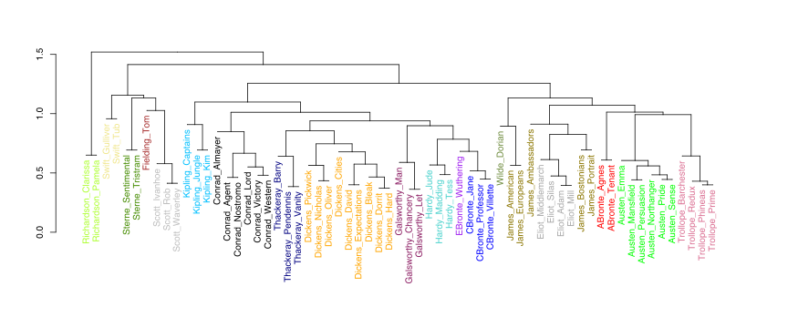

## 137 most frequent words

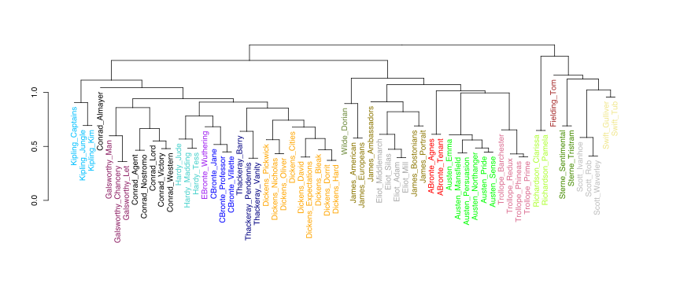

## Unstable results

- Noise?
- Unreliability of the linkage procedure?
- More than one stylistic layer?

## Layers

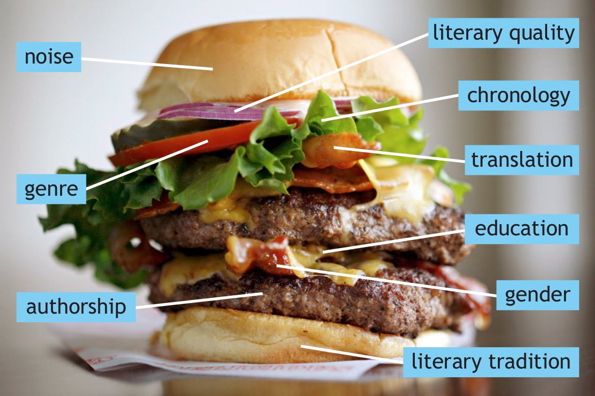

# Networks to rescue

## A new technique: assumptions

- Explanatory power of dendrograms
- Stable results and/or validation
- Scalability: 500 texts? 1000 texts? 31M texts?

## Authorship attribution

- An anonymous text is tested against a set of “candidates”
- Goal: to find the nearest neighbor
- Effective style-marker: most frequent words (grammatical words)

## Establishing a distance

## Another distance...

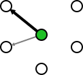

## Checking each sample

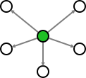

## Deciding which distance is shortest

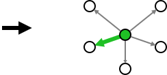

## From attribution to stylometry

- If it works with anonymous texts, ...
- ... what about extending the same procedure?
- What about applying it to _all_ texts?

## Distances to txt1

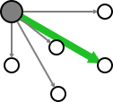

## Distances to txt2

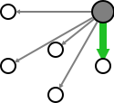

## Distances to txt3

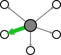

## A resulting network

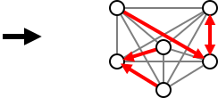

## From stylometry to networks

- Nearest neighbors can be represented as connected nodes of a network.
- A variety of layout algorithms can be applied.

## Example

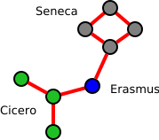

## Reliability, stupid!

- Instead of one analysis (e.g. 100 MFWs)...
- ... a whole range (100, 200, 300 MFW, etc.).
- Next, particular “snapshots” summarized.

## 100 MFWs

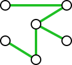

## 200 MFWs

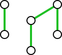

## 300 MFWs

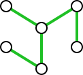

## Consensus network

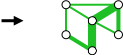

## Importance of runners-up

- Nearest neighbors = the most similar
- Runners-up: do they really deserve to be filtered out?
- Solution: more connections!

## 3 neighbors to txt1

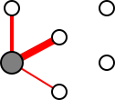

## 3 neighbors to txt2

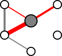

## 3 neighbors to txt3

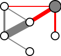

## A resulting network

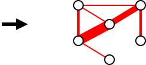

## Two algorithms togegher

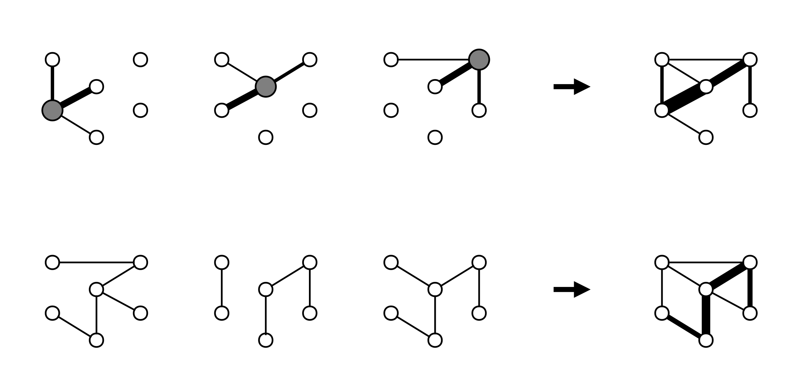

# Latin literature at a glance

## 

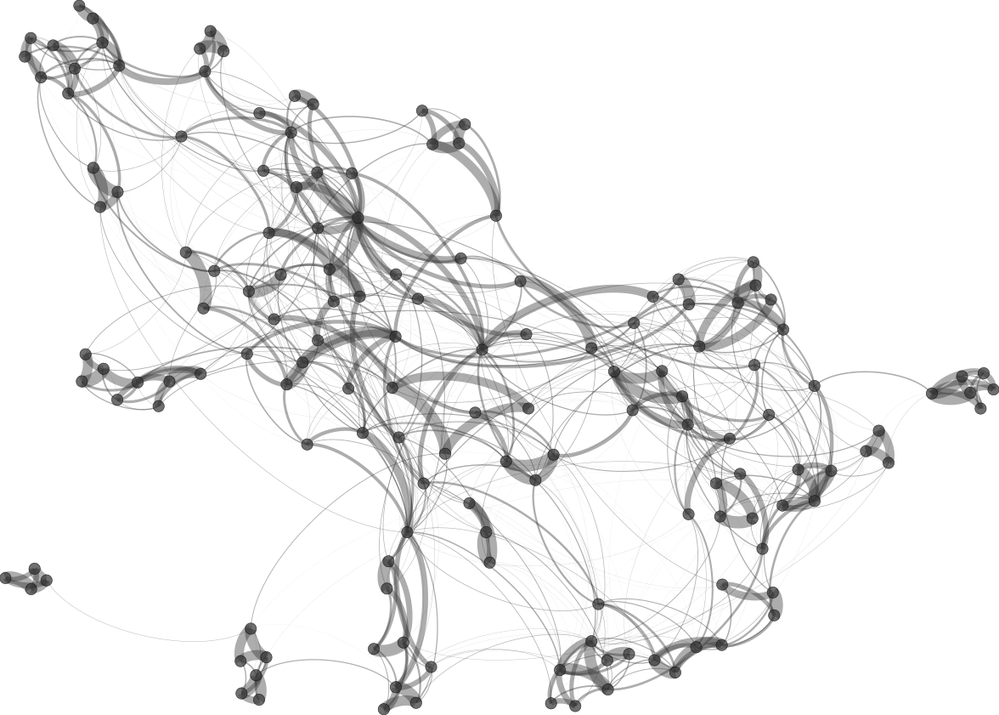

## Traces of chronology?

- “Ciceronianus es, non Christianus!” (God accusing St Jerome)
- “Renovatio antiquitatis” (Renaissance humanists)
- hypothesis: noticeable traces of chronology

## 

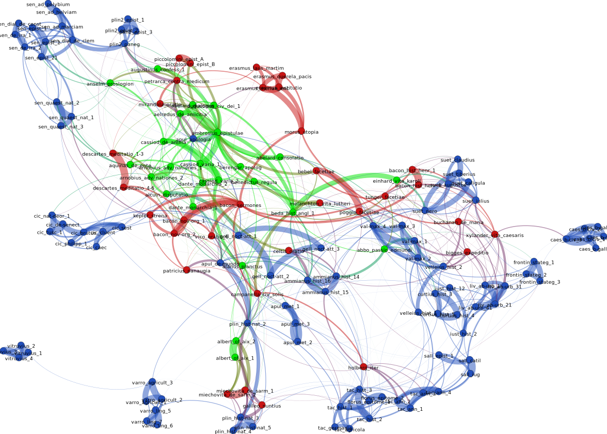

## 

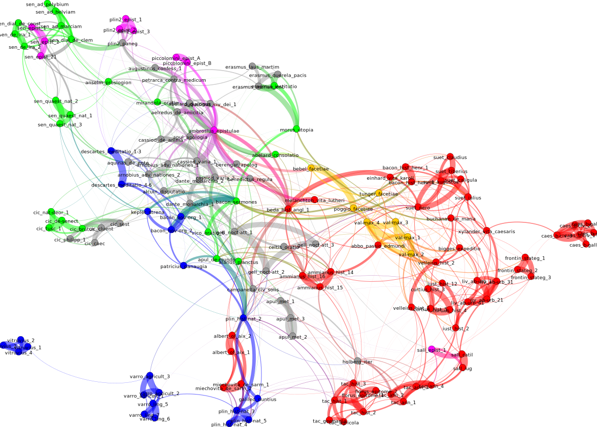

## 

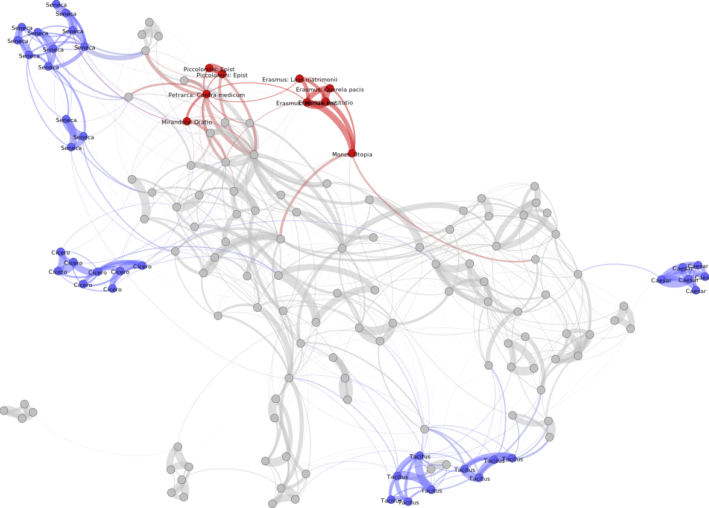

## How influential was Cicero?

- Ciceronian Quarrel: the single most important debate of the Renaissance.
- Imitation of the admirable Ciceronian style.
- hypothesis: visible traces of Cicero in early modern Latin writings.

## 

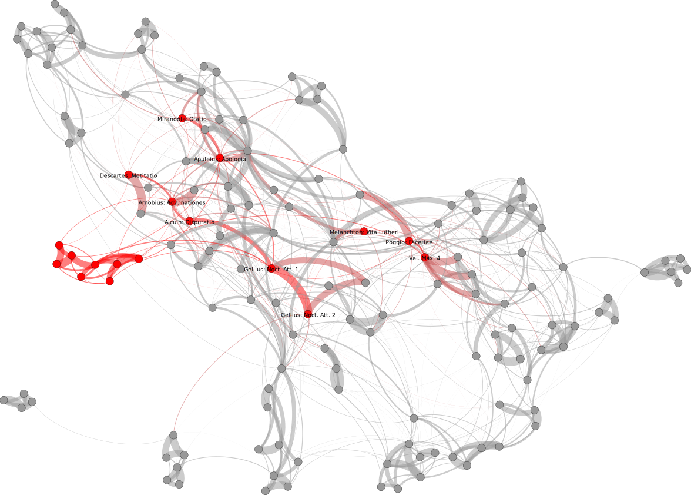

## Conclusions

- No clear chronological pattern.
- Genre signal: predominant.
- Masters of style tend to keep outside the network.

## Further research

- More texts!
- More genres!
- More “Attic” writers (e.g. Lipsius).

