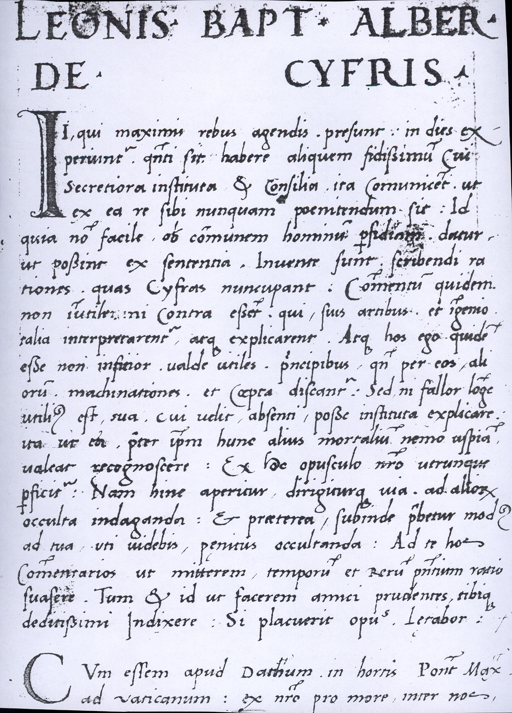
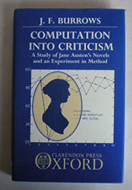
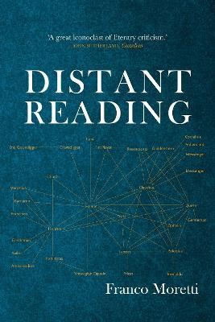
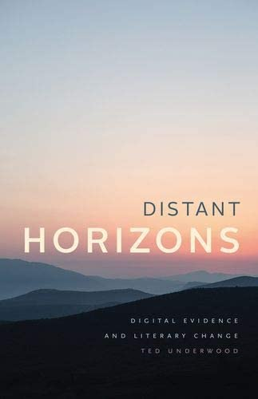
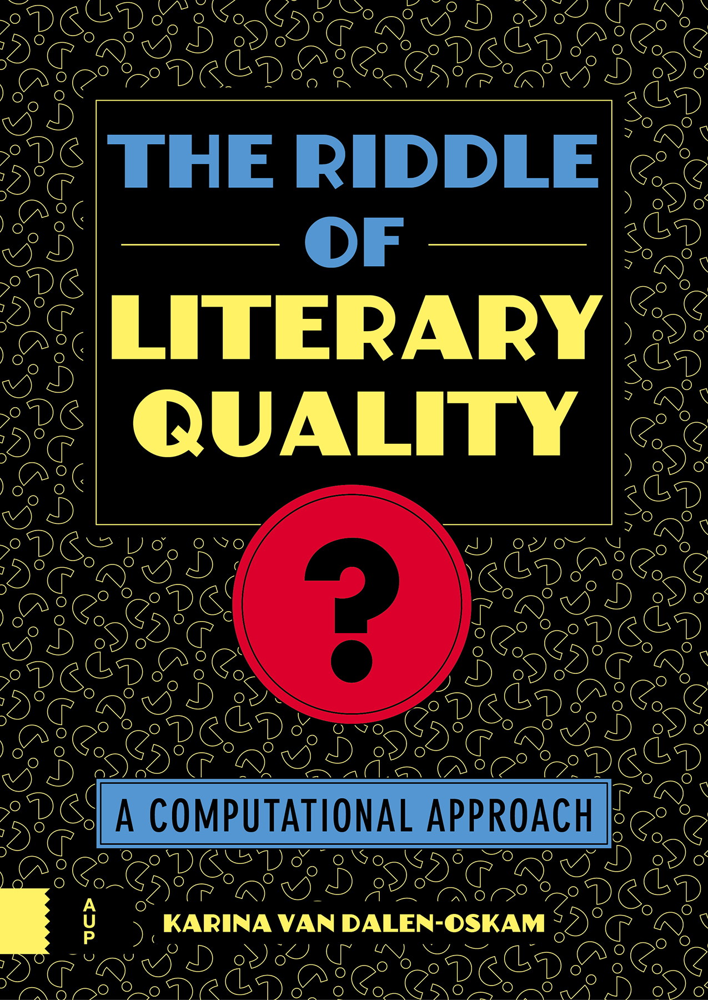
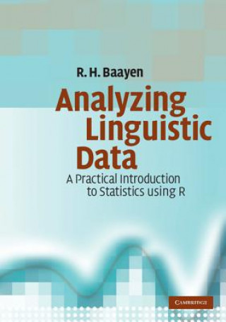

## introduction { .cls_section }

## First, what CLS is about

* Computational Literary Studies
* Aimed at analyzing (large amounts of) textual data...
* ... by computational techniques

## Leon Battista Alberti

{height=450}

Leon Battista Alberti, _De componendis cifris_, ca. 1466

## Computation into criticism

{height=450}

John Burrows, _Computation into Criticism_, 1987

## Distant reading 

{height=450}
{height=450}
{height=450}

Franco Moretti, Matt Jockers, Ted Underwood

## Sociology of reading 

{height=450}

Karina van Dalen-Oskam, _The Riddle of Literary Quality_, 2023

## Quantitative linguistics

{height=450}
<!-- Matematyka i poetyka, Baayen, Analyzing linguistic data with R -->

## Foundations of CLS

* Computation into criticism
* Distant reading 
* Stylometry
* Authorship attribution
* Digital humanities
* Language resources
* Digital libraries
* Natural language processing
* Machine learning
* Big data
* ...

## What CLS has to offer

* Scientific method
  * reproducibility, empirical paradigm, statistical modeling, probabilistic inference, ...
* Scale
  * access to unprecedented amounts of data
* Accuracy
  ability to capture patterns invisible to a naked eye

## Blase Pascal and two infinities

{height=550}
<!-- a picture --> 

## Combination of factors needed

* Datasets (language resources)
* Tools (computer programs)
* Suitable methodology
* Computer power (i.e. scientific instruments)

## Not possible individually { .cls_section }

## Research infrastructures { .cls_section }

## Libraries, journals, publishers, ...

{height=550}

## Dictionaries at IJP PAN

{height=550}

## ELTeC corpus

{height=550}

## DraCor

{height=550}

## CLS INFRA { .cls_section }

An infrastructural project for computational literary studies, founded by Horizon 2020 scheme

## infrastructures in DH and CLS

* in hard sciences, infrastructures are tangible
    * servers, telescopes, accelerators, ...
* in the humanities, institutions are essential
    * libraries, publishing houses, journals, ...
* in DH, multifaceted needs
    * the notion of infrastructure needs reconsideration
    * corpora (FAIR!) but not only

## CLS INFRA project

* text collections (corpora)
    * quality
    * metadata
    * conversion
* methodology
    * tools (NLP, datavis, ...)
    * tool chains
    * methodological considerations
    * bibliographic survey
* network of scholars
    * training schools
    * short-term research stays
    * collaboration with COST Action

## Overarching idea is to connect...

* People
  * To establish a network of CLS researchers
* Data
  * To consolidate existing high-quality corpora...
  * ...covering prose, drama and poetry
* Tools
  * To build a chain of NLP tools to analyze texts
* Methods
  * To provide a survey of state-of-the-art methods

## The project's structure

{height=500}

## The team (30+ people)

Julie Birkholz, Ingo Börner, Joanna Byszuk, Sally Chambers, Vera Maria Charvat, Silvie Cinková, Tess Dejaeghere, Anna Dijkstra, Julia Dudar, Matej Ďurčo, Maciej Eder, Jennifer Edmond, Evgeniia Fileva, Frank Fischer, Serge Heiden, Michal Křen, Bartłomiej Kunda, Michał Mrugalski, Ciara Murphy, Carolin Odebrecht, Marco Raciti, Salvador Ros, Christof Schöch, Artjoms Šeļa, Toma Tasovac, Justin Tonra, Erzsébet Tóth-Czifra, Peer Trilcke, Karina van Dalen-Oskam, Lisanne van Rossum, ...

## activities { .cls_section }

## training schools

* Prague 2022
    * NLP tools
    * dates: 6–9 June 2022
    * 25 participants on site
    * many more remotely
* Madrid 2023
    * text analysis
    * dates: 10-11 May 2023
* Vienna 2024
    * corpus queries
    * tentative dates: 10–12 June 2024

## TNA

* transnational access
* short-term research stays...
* in one of 6 institutions:
    * NUI Galway
    * Uni Potsdam
    * Uni Trier
    * UNED Madrid
    * OEAW Vienna
    * Charles Uni, Prague
* everyone eligible
* two calls every year

## deliverables { .cls_section }

## deliverables published

* 3.1 Report on the methodological baseline for (computational) literary studies
* 3.2 Survey of methods
* 4.1 Report on the skills matrix for computational literary studies
* 5.1 Review of the data landscape
* 6.1 Assembly of existing data
* 7.1 On programmable corpora and DraCor
* 8.1 Tools for basic natural language processing (NLP) tasks
* ...

## survey of methods

{height=500}

## { .no-background }

