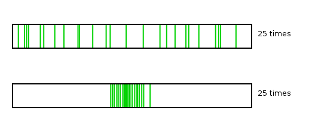
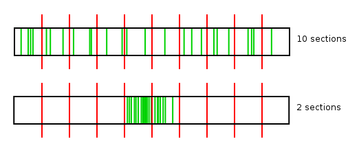
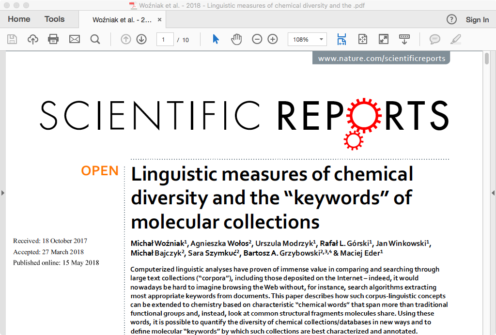
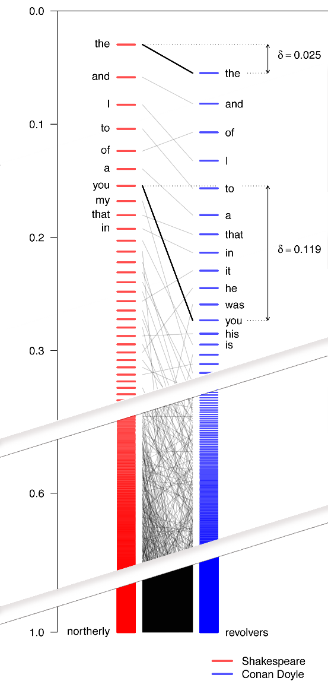
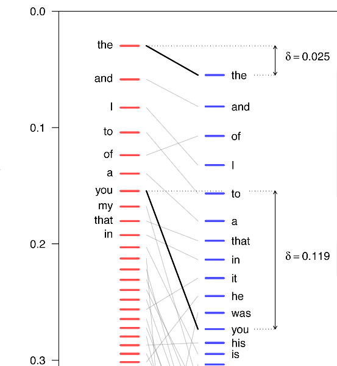

``` {r setup, include = FALSE}
library(knitr)
opts_chunk$set(cache=TRUE)
```


## Motivation

* Information retrieval:
  * How to “read” a big collection of documents, e.g. an archive?
* Linguistics:
  * What is the underlying model for defining word meaning?

---


## Does an ideal keyword exist?

* information retrieval:
    * "meaningful" words
    * what a given text is about
* stylometry:
    * is the stylistic layer also important?
    * if a given author/genre overuses the word "the", should that be captured? neglected?

---


## Basic assumptions

* Words are unevenly distributed in two text collections. 
* Distribution of a word in text corpora will _always_ differ.
* The real problem is to identify differences that are _significant_.
* Keyword = a word significantly more frequent in a given text.

---


## A simple idea...

I have just returned from a visit to my landlord – the solitary neighbour that I shall be troubled with.

neighbour solitary troubled landlord visit returned just shall from I have be with my that a to the

``` {r echo = FALSE, message = FALSE, fig.width = 9, fig.height = 3}
par(mar = c(2, 4, 0, 5)) # default margins are too large!
plot(c(12.961, 12.742, 12.724, 12.030, 9.185, 8.350, 6.904, 5.450, 3.521, 2.855, 2.325, 2.049, 1.958, 1.845, 1.192, 0.681, 0.221, 0.056), ylab = "keyness", xlab = "", ylim = c(0, 15), type = "p", lwd = 2, col = "blue")
```

---


## Bronte, _The Wuthering Heights_

heathcliff, linton, catherine, hareton, earnshaw, cathy, edgar, ellen, heights, hindley, nelly, ll, grange, i, wuthering, t, joseph, isabella, master, gimmerton, zillah, m, exclaimed, he, thrushcross, and, answered, yah, kenneth, ve, maister, lockwood, kitchen, you, dean, moors, replied, cried, him, muttered, lintons, papa, she, till, commenced, on, wer, ech, shoo, leant, hearth, bonny, door, stairs, hell, me, crags, moor, wouldn, fiend, settle, jabez, penistone, fire, ye, its, bid, nowt, naught, yer, hush, mistress, grew, lad, compelled, minny, won, hisseln, skulker, soa, wisht, cousin, lattice, didn, yon, minute, lass, needn, inquired, snow, branderham, flaysome, gooid, sud, thear, affirming, interrupted, couldn, window, 
..., ..., ..., **a, in, the**

---


## Frequencies? { .ijppan_section }

---


## Frequencies in two texts

``` {r include = FALSE}
library(stylo)
data(novels)
tokenized.texts = parse.corpus(novels, corpus.lang = "English.all")

freqlist = make.frequency.list(tokenized.texts)
freqs = make.table.of.frequencies(tokenized.texts, freqlist)
```

``` {r echo = FALSE, message = FALSE}
plot(as.numeric(freqs[1,1:500]), col = "blue", ylab = "frequency", xlab = "rank")
points(as.numeric(freqs[2,1:500]), col = "red")
```

---


## Differences between frequencies


the    | and   | to    | i     | of    | ...
------ | ----- | ----- | ----- | ----- | ----
3.557  | 2.938 | 3.398 | 1.696 | 2.965 | ...
3.919  | 4.068 | 2.988 | 3.078 | 1.905 | ...

the difference between the values:

the    | and   | to    | i     | of    | ...
------ | ----- | ----- | ----- | ----- | ----
-0.362 | -1.130 | 0.410 | -1.382 | 1.059 | ... 


---


## Differences between frequencies

``` {r echo = FALSE, message = FALSE}
diffs = (freqs[4,] - freqs[9,])[1:1000]
color_values = as.numeric(diffs > 0) + 2
plot(diffs, type = "h", ylab = "differenes", col = color_values)
```

---


## The most distinctive words

``` {r echo = FALSE, message = FALSE}
# preferred
names(sort(freqs[4,] - freqs[9,], decreasing = TRUE)[1:100])

# avoided
#sort(freqs[9,] - freqs[4,], decreasing = TRUE)[1:100]
```

---


## Keywords LL { .ijppan_section }

---


## Keywords analysis

* log likelihood used to capture the differences
* implementation: AntConc, WordSmith Tools, etc.


---


## Keywords analysis

``` {r echo = FALSE, message = FALSE}
freqs1 = freqs[4,]
freqs2 = freqs[9,]

#words = factor(union(names(freqs1), names(freqs2)))
words = union(names(freqs1), names(freqs2))

freqs1 = freqs1[words]
freqs2 = freqs2[words]

names(freqs1) = words
names(freqs2) = words
freqs1[is.na(freqs1)] = 0
freqs2[is.na(freqs2)] = 0

N1 = sum(freqs1) # total size of the corpus 1
N2 = sum(freqs2) # corpus 2
E1 = N1 * (freqs1 + freqs2) / (N1 + N2) # expected values
E2 = N2 * (freqs1 + freqs2) / (N1 + N2)

O1 = freqs1 * log(freqs1 / E1) # observed values
O1[is.na(O1)] = 0
O2 = freqs2 * log(freqs2 / E2)
O2[is.na(O2)] = 0

G2 = 2 * (O1 + O2)

# antimarkers multiplied by -1, to get them in reverse order
G2[(freqs2 / N2) >= (freqs1 / N1)] = G2[(freqs2 / N2) >= (freqs1 / N1)] * -1

G2 = sort(unclass(G2), decreasing = TRUE)


names(G2[1:100])
```

---


## Zeta { .ijppan_section }

---


## Zeta: the background


{height=300}

---


## Zeta: the solution

{height=300}

$$\zeta_{(a,b)} = \left(\frac{f_a - f_b}{100}\right) +1$$

(Burrows, 2007; Craig, 2009)

---


## Zeta: outcomes

``` {r echo = FALSE, message = FALSE}
a = oppose(primary.corpus = list(tokenized.texts[[4]], tokenized.texts[[4]]), secondary.corpus = list(tokenized.texts[[9]], tokenized.texts[[9]]))

# aaa = c(a$words.preferred.scores, a$words.avoided.scores)
```

---


## Zeta’s words

``` {r echo = FALSE, message = FALSE}
a$words.preferred[1:100]
#a$words.avoided[1:100]
```

---


## TF–IDF { .ijppan_section }

---


## TF–IDF

* Term frequency x inversed document frequency
* IDF: a weighting factor to boost **important** frequencies
* important being the ones that appear in few texts and yet, are frequent


$$ TFIDF_{w} = f_{w} \times \log \frac{N}{n_{t}} $$

---


## TF–IDF’s words


``` {r echo = FALSE, message = FALSE}
freqs_copy = freqs
freqs_copy[freqs_copy > 0] = 1
d = colSums(freqs_copy)
N = length(freqs[,1])
idf = log(N / d)
tfidf = t( t(freqs) * idf)

# grabbing specific texts:

names(sort(tfidf[4,], decreasing = TRUE)[1:100])
#names(sort(tfidf[9,], decreasing = TRUE)[1:100])
```

---


## A new method { .ijppan_section }

---


## An ideal measure

1. will automatically extract meaningful words for a text A and B
    * by "automatically" we mean that the technique will be unsupervised 
    * by "meaningful" we mean that an extracted keyword brings much semantic information about a given subset of texts.
2. will be able to distinguish if the texts to be compared differ substantially, or only marginally. 
3. will not require any computation-intense algorithms;
4. will be conceptually simple;
5. will have an intuitive linguistic interpretation;

---

## An ideal measure (cont.)

6. will not make any statistical assumptions, i.e. will be non-parametric;
7. will allow for significance testing of the identified keywords;
8. will not require any hyperparameters, or at least any arbitrarily chosen hyperparameters;
9. will correct for frequent words.


---


## A new measure

* Given the above constrains, we propose a simple measure of keyness that relies on: 
    1. words' frequencies,
    2. words' positions on a frequency list. 
* Since (2) is directly derivable from (1), the only thing that the measure requires is two lists of word frequencies. 
* Mathematically, then, the only assumption we formulate is that there exist two texts of a finite length of $\lambda \in \mathbb{N}$. 


---


## 

{height=600}


## Shakespeare vs. Conan Doyle


word      | count | word      | count
--------- | ----- | --------- | -----
the       | 27595 | the       | 28662
and       | 26735 | and       | 14109
I         | 22538 | of        | 13229
...       | ...   | ...       | ...
northerly | 1     | revolvers | 1


---


## Frequency **and** position


$$P_{r(x)} = \frac{1}{N}\sum_{i=1}^{r(x)}f(i)$$

which also guarantees that the values are scaled into the range {0, 1}.


---

## Frequency **and** position

a simpler and more elegant version of the above:

$$P_{r(x)} = \left( \frac{1}{N}\sum_{i=1}^{r(x)}f(x_{i}) \right) - f(x)$$

which is of course equal to:

$$P_{r(x)} = \frac{1}{N}\sum_{i=1}^{r(x-1)}f(x_{i})$$


--- 

##


{height=600}

---


##

{height=600}


---


## The cracovian

Having normalized the frequencies/positions of the words, one can easily compute the distance between the same word between two sets (texts or subcorpora), say A and B, by simply estimating their difference. This can be defined as

$$\delta_{x,AB} = \| P_{r(x),A} - P_{r(x),B} \|$$


---


## Cumulative sums

The above geometric interpretation can be also solved algebraically. In this interpretation, the position $P_{r(x)}$ of a given word is **simply a cumulative sum of frequencies of all the preceding words**. 


``` {r include = FALSE}
freqs1 = make.frequency.list(tokenized.texts[[4]], value = TRUE)
freqs2 = make.frequency.list(tokenized.texts[[9]], value = TRUE)

freqs1 = cumsum(freqs1/100)
freqs2 = cumsum(freqs2/100)

freqs21 = freqs2[names(freqs1)]
freqs21[is.na(freqs21)] = 1
names(freqs21) = names(freqs1)
freqs11 = freqs1[names(freqs2)]
freqs11[is.na(freqs11)] = 1
names(freqs11) = names(freqs2)

x1 = (freqs21 - freqs1)
x2 = (freqs11 - freqs2)
x1 = x1[names(freqs1)] # I don't remember the reason of doing this step
x2 = x2[names(freqs2)] # same here
```

---

## The words

``` {r echo = FALSE, message = FALSE}
names(sort(x1, decreasing = TRUE)[1:100])
#sort(x2, decreasing = TRUE)[1:100]

#plot(sort(x1, decreasing = TRUE))
```


---


## Similar yet not identical


``` {r echo = FALSE, message = FALSE}
# relative freqs
aa = names(sort(freqs[4,] - freqs[9,], decreasing = TRUE)[1:100])
# zeta
bb = a$words.preferred[1:100]
# tfidf
cc = names(sort(tfidf[4,], decreasing = TRUE)[1:100])
dd = names(sort(x1, decreasing = TRUE)[1:100])
xx = cbind(aa, bb, cc, dd)
colnames(xx) = c("freqs", "zeta", "tfidf", "cracovian")

xx
```


---


## Comparison { .ijppan_section }

---


## Gender keywords (19th century)

* 12 novels by female authors
    * Anne Bronte, Jane Austen, Charlotte Bronte, Emily Bronte, George Eliot
* 12 novels by male authors
    * Charles Dickens, Henry Fielding, Samuel Richardson, William Thackeray, Anthony Trollope
* A comparison of keywords returned by:
    * LL keywords analysis methdod
    * Cracovian
    * Zeta

``` {r include = FALSE}
load("gender_keywords.RData")
```
---


## LL keywords

* female (?)

``` {r echo = FALSE, message = FALSE}
names(keywords_preferred)[1:35]
```

* male (?)

``` {r echo = FALSE, message = FALSE}
names(keywords_avoided)[1:35]
```

---


## Cracovian

* female (?)

``` {r echo = FALSE, message = FALSE}
names(cracovian_preferred)[1:35]
```

* male (?)

``` {r echo = FALSE, message = FALSE}
names(cracovian_avoided)[1:35]
```


---


## Zeta

* women are from Venus...

``` {r echo = FALSE, message = FALSE}
zeta_preferred[1:34]
```

* ...and men are from Mars

``` {r echo = FALSE, message = FALSE}
zeta_avoided[1:34]
```


---


## Conclusions { .ijppan_section }

---


## Conclusions

* Keywords are **all the words** ordered from the most to the least relevant.
* For a given text, the extracted keywords **depend on the method** used.
* **No cut-off point** between keywords and “ordinary” words.
* The new method (the Cracovian) **competitive yet simpler** than the time-proven solutions.
* In real-life applications, the method **Zeta seems to outperform** other techniques...
* ...but systematic evaluation is needed to scrutinize this observation.

---


## Thank you!

* maciej.eder@ijp.pan.pl
* [\@MaciejEder](https://twitter.com/MaciejEder)
* [https://github.com/computationalstylistics](https://github.com/computationalstylistics)


## Appendix { .ijppan_section }


``` {r include = FALSE}
freqs1 = make.frequency.list(tokenized.texts[[4]], value = TRUE)
freqs2 = make.frequency.list(tokenized.texts[[9]], value = TRUE)

freqs1 = cumsum(freqs1/100)
freqs2 = cumsum(freqs2/100)

freqs21 = freqs2[names(freqs1)]
freqs21[is.na(freqs21)] = 0
names(freqs21) = names(freqs1)
freqs11 = freqs1[names(freqs2)]
freqs11[is.na(freqs11)] = 0
names(freqs11) = names(freqs2)

x1 = (freqs21 - freqs1)
x2 = (freqs11 - freqs2)
x1 = x1[names(freqs1)] # I don't remember the reason of doing this step
x2 = x2[names(freqs2)] # same here
```

---

## Intersection of the two sets

``` {r echo = FALSE, message = FALSE}
names(sort(x1, decreasing = TRUE)[1:100])

```

Jane Austen, _Pride and Prejudice_

## Words for the other set

``` {r echo = FALSE, message = FALSE}
names(sort(x2, decreasing = TRUE)[1:100])

```

Emily Bronte, _Wuthering Heights_
