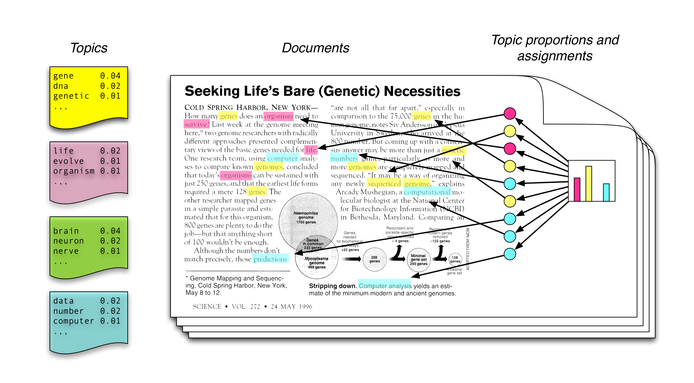
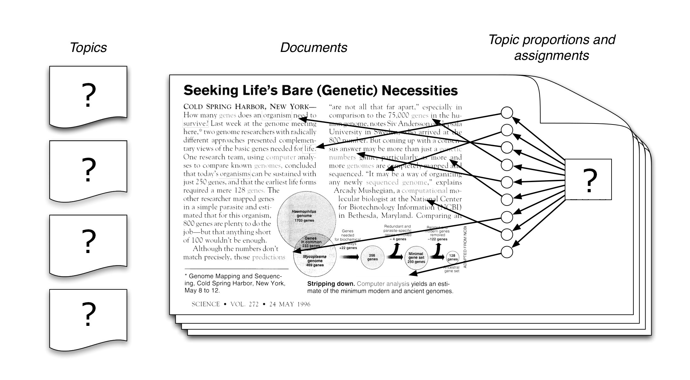
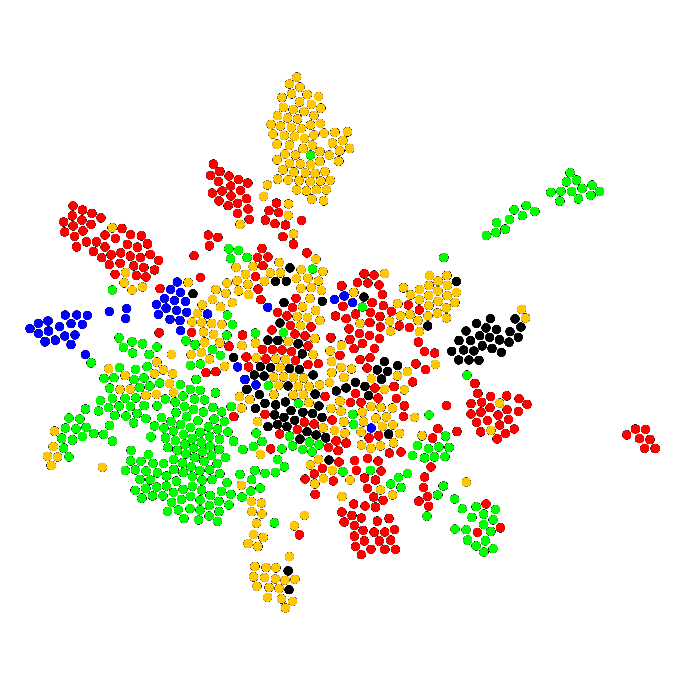
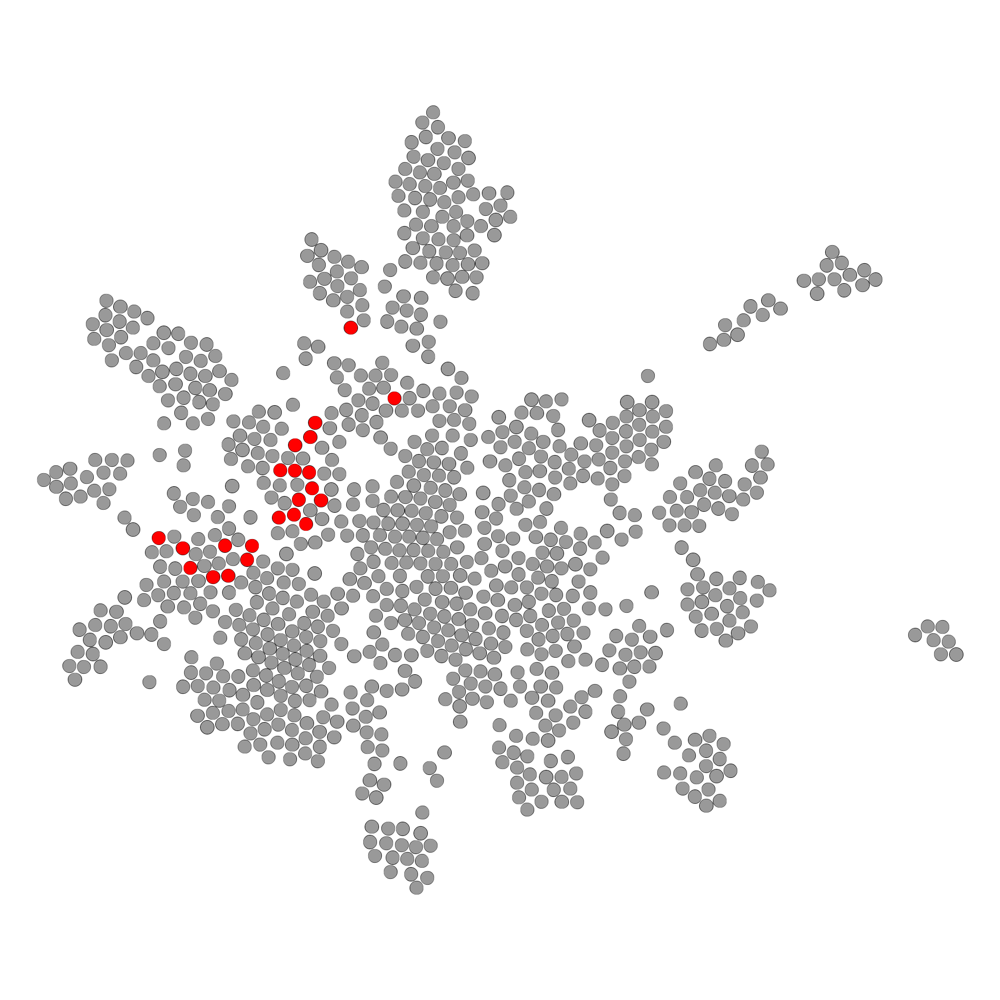
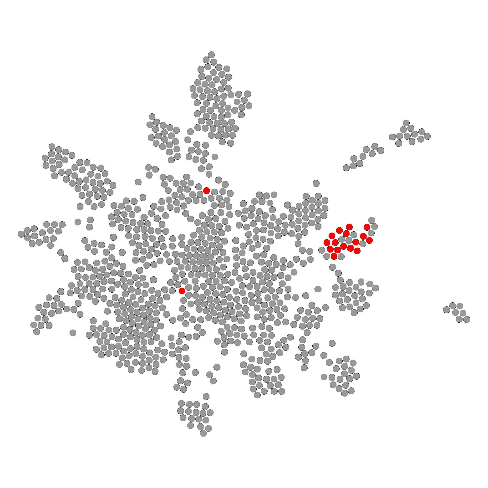
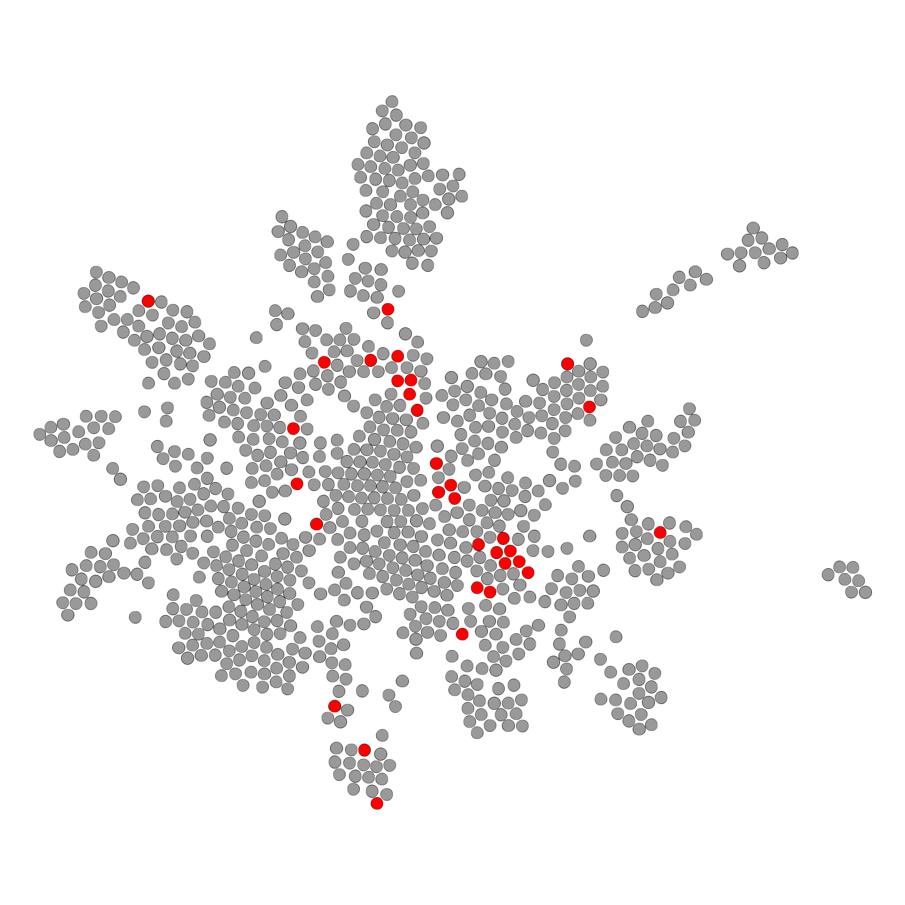

```{r setup, include = FALSE}

# set global chunk options
library(knitr)
library(wordcloud)
library(stylo)

load("img_and_data/doc_topics.RData")
load("img_and_data/topic_words.RData")

opts_chunk$set(cache=TRUE)
```


## { .white }

<p class="black" style="font-size: 180%">
<b>Extracting keywords and topics</b> </br> <b>from text collections</b>
</p>
<p class="black" style="font-size: 120%">
Maciej Eder
</p>
<p class="black" style="font-size: 80%; margin-bottom: 10em;">
Institute of Polish Language (Polish Academy of Sciences)
</p>
<p class="black">
Verona, 19.11.2024
</p>


## Motivation

* Information retrieval:
  * How to “read” a big collection of documents, e.g. an archive?
  * How to get relevant websites using search engines?
  * How to fine-grain the results for ‘apple’ (1. a fruit, 2. a company)
* Linguistics:
  * What is the underlying model for defining word meaning?

---


## Meaning defined by the context

> The meaning of words lies in their use.

(Wittgenstein 1953: 80, 109)

> You shall know a word by the company it keeps.

(Firth 1962: 11)

---


## Distributional semantics

* A set of methods that make **no assumption** as to words’ relations and/or functions
* Meaning of the words is **inferred** from their:
  * Frequency
  * Context
* These methods include:
  * Keyword analysis
  * Collocations
  * Topic modeling
  * Word embeddings

---


## 

<h2 class="shout">Keywords</h2>

---


## Does an ideal keyword exist?

* information retrieval:
    * "meaningful" words
    * what a given text is about
* stylometry:
    * is the stylistic layer also important?
    * if a given author/genre overuses the word "the", should that be captured? neglected?

---


## Basic assumptions

* Words are unevenly distributed in two text collections. 
* Distribution of a word in text corpora will _always_ differ.
* The real problem is to identify differences that are _significant_.
* Keyword = a word significantly more frequent in a given text.

---


## A simple idea...

I have just returned from a visit to my landlord – the solitary neighbour that I shall be troubled with.

neighbour solitary troubled landlord visit returned just shall from I have be with my that a to the

``` {r echo = FALSE, message = FALSE, fig.width = 9, fig.height = 3}
par(mar = c(2, 4, 0, 5)) # default margins are too large!
plot(c(12.961, 12.742, 12.724, 12.030, 9.185, 8.350, 6.904, 5.450, 3.521, 2.855, 2.325, 2.049, 1.958, 1.845, 1.192, 0.681, 0.221, 0.056), ylab = "keyness", xlab = "", ylim = c(0, 15), type = "p", lwd = 2, col = "blue")
```

---


## Bronte, _The Wuthering Heights_

heathcliff, linton, catherine, hareton, earnshaw, cathy, edgar, ellen, heights, hindley, nelly, ll, grange, i, wuthering, t, joseph, isabella, master, gimmerton, zillah, m, exclaimed, he, thrushcross, and, answered, yah, kenneth, ve, maister, lockwood, kitchen, you, dean, moors, replied, cried, him, muttered, lintons, papa, she, till, commenced, on, wer, ech, shoo, leant, hearth, bonny, door, stairs, hell, me, crags, moor, wouldn, fiend, settle, jabez, penistone, fire, ye, its, bid, nowt, naught, yer, hush, mistress, grew, lad, compelled, minny, won, hisseln, skulker, soa, wisht, cousin, lattice, didn, yon, minute, lass, needn, inquired, snow, branderham, flaysome, gooid, sud, thear, affirming, interrupted, couldn, window, 
..., ..., ..., **a, in, the**

---


## 

<h2 class="shout">Frequencies?</h2>

---


## Frequencies in two texts

``` {r include = FALSE}
library(stylo)
data(novels)
tokenized.texts = parse.corpus(novels, corpus.lang = "English.all")

freqlist = make.frequency.list(tokenized.texts)
freqs = make.table.of.frequencies(tokenized.texts, freqlist)
```

``` {r echo = FALSE, message = FALSE}
plot(as.numeric(freqs[1,1:500]), col = "blue", ylab = "frequency", xlab = "rank")
points(as.numeric(freqs[2,1:500]), col = "red")
```

---


## Differences between frequencies


the    | and   | to    | i     | of    | ...
------ | ----- | ----- | ----- | ----- | ----
3.557  | 2.938 | 3.398 | 1.696 | 2.965 | ...
3.919  | 4.068 | 2.988 | 3.078 | 1.905 | ...

the difference between the values:

the    | and   | to    | i     | of    | ...
------ | ----- | ----- | ----- | ----- | ----
-0.362 | -1.130 | 0.410 | -1.382 | 1.059 | ... 


---


## Differences between frequencies

``` {r echo = FALSE, message = FALSE}
diffs = (freqs[4,] - freqs[9,])[1:1000]
color_values = as.numeric(diffs > 0) + 2
plot(diffs, type = "h", ylab = "differenes", col = color_values)
```

---


## The most distinctive words

``` {r echo = FALSE, message = FALSE}
# preferred
names(sort(freqs[4,] - freqs[9,], decreasing = TRUE)[1:100])

# avoided
#sort(freqs[9,] - freqs[4,], decreasing = TRUE)[1:100]
```

---


## 

<h2 class="shout">Keywords LL</h2>

---


## Keywords analysis

* log likelihood used to capture the differences
* implementation: AntConc, WordSmith Tools, etc.


---


## Keywords analysis

``` {r echo = FALSE, message = FALSE}
freqs1 = freqs[4,]
freqs2 = freqs[9,]

#words = factor(union(names(freqs1), names(freqs2)))
words = union(names(freqs1), names(freqs2))

freqs1 = freqs1[words]
freqs2 = freqs2[words]

names(freqs1) = words
names(freqs2) = words
freqs1[is.na(freqs1)] = 0
freqs2[is.na(freqs2)] = 0

N1 = sum(freqs1) # total size of the corpus 1
N2 = sum(freqs2) # corpus 2
E1 = N1 * (freqs1 + freqs2) / (N1 + N2) # expected values
E2 = N2 * (freqs1 + freqs2) / (N1 + N2)

O1 = freqs1 * log(freqs1 / E1) # observed values
O1[is.na(O1)] = 0
O2 = freqs2 * log(freqs2 / E2)
O2[is.na(O2)] = 0

G2 = 2 * (O1 + O2)

# antimarkers multiplied by -1, to get them in reverse order
G2[(freqs2 / N2) >= (freqs1 / N1)] = G2[(freqs2 / N2) >= (freqs1 / N1)] * -1

G2 = sort(unclass(G2), decreasing = TRUE)


names(G2[1:100])
```

---


## 

<h2 class="shout">Zeta</h2>


---


## Zeta: the background


{height=300}

---


## Zeta: the solution

{height=300}

$$\zeta_{(a,b)} = \left(\frac{f_a - f_b}{100}\right) +1$$

(Burrows, 2007; Craig, 2009)

---


## Zeta: outcomes

``` {r echo = FALSE, message = FALSE}
a = oppose(primary.corpus = list(tokenized.texts[[4]], tokenized.texts[[4]]), secondary.corpus = list(tokenized.texts[[9]], tokenized.texts[[9]]))

# aaa = c(a$words.preferred.scores, a$words.avoided.scores)
```

---


## Zeta’s words

``` {r echo = FALSE, message = FALSE}
a$words.preferred[1:100]
#a$words.avoided[1:100]
```

---


## 

<h2 class="shout">TF–IDF</h2>

---


## TF–IDF

* Term frequency x inversed document frequency
* IDF: a weighting factor to boost **important** frequencies
* important being the ones that appear in few texts and yet, are frequent


$$ TFIDF_{w} = f_{w} \times \log \frac{N}{n_{t}} $$

---


## TF–IDF’s words


``` {r echo = FALSE, message = FALSE}
freqs_copy = freqs
freqs_copy[freqs_copy > 0] = 1
d = colSums(freqs_copy)
N = length(freqs[,1])
idf = log(N / d)
tfidf = t( t(freqs) * idf)

# grabbing specific texts:

names(sort(tfidf[4,], decreasing = TRUE)[1:100])
#names(sort(tfidf[9,], decreasing = TRUE)[1:100])
```

---


## 

<h2 class="shout">A new method</h2>

---


## An ideal measure

1. will automatically extract meaningful words for a text A and B
    * by "automatically" we mean that the technique will be unsupervised 
    * by "meaningful" we mean that an extracted keyword brings much semantic information about a given subset of texts.
2. will be able to distinguish if the texts to be compared differ substantially, or only marginally. 
3. will not require any computation-intense algorithms;
4. will be conceptually simple;
5. will have an intuitive linguistic interpretation;

---

## An ideal measure (cont.)

6. will not make any statistical assumptions, i.e. will be non-parametric;
7. will allow for significance testing of the identified keywords;
8. will not require any hyperparameters, or at least any arbitrarily chosen hyperparameters;
9. will correct for frequent words.


---


## A new measure

* Given the above constrains, we propose a simple measure of keyness that relies on: 
    1. words' frequencies,
    2. words' positions on a frequency list. 
* Since (2) is directly derivable from (1), the only thing that the measure requires is two lists of word frequencies. 
* Mathematically, then, the only assumption we formulate is that there exist two texts of a finite length of $\lambda \in \mathbb{N}$. 


---


## 

{height=600}


## Shakespeare vs. Conan Doyle


word      | count | word      | count
--------- | ----- | --------- | -----
the       | 27595 | the       | 28662
and       | 26735 | and       | 14109
I         | 22538 | of        | 13229
...       | ...   | ...       | ...
northerly | 1     | revolvers | 1


---


## Frequency **and** position


$$P_{r(x)} = \frac{1}{N}\sum_{i=1}^{r(x)}f(i)$$

which also guarantees that the values are scaled into the range {0, 1}.


---

## Frequency **and** position

a simpler and more elegant version of the above:

$$P_{r(x)} = \left( \frac{1}{N}\sum_{i=1}^{r(x)}f(x_{i}) \right) - f(x)$$

which is of course equal to:

$$P_{r(x)} = \frac{1}{N}\sum_{i=1}^{r(x-1)}f(x_{i})$$


--- 

##


{height=600}

---


##

{height=600}


---


## The cracovian

Having normalized the frequencies/positions of the words, one can easily compute the distance between the same word between two sets (texts or subcorpora), say A and B, by simply estimating their difference. This can be defined as

$$\delta_{x,AB} = \| P_{r(x),A} - P_{r(x),B} \|$$


---


## Cumulative sums

The above geometric interpretation can be also solved algebraically. In this interpretation, the position $P_{r(x)}$ of a given word is **simply a cumulative sum of frequencies of all the preceding words**. 


``` {r include = FALSE}
freqs1 = make.frequency.list(tokenized.texts[[4]], value = TRUE)
freqs2 = make.frequency.list(tokenized.texts[[9]], value = TRUE)

freqs1 = cumsum(freqs1/100)
freqs2 = cumsum(freqs2/100)

freqs21 = freqs2[names(freqs1)]
freqs21[is.na(freqs21)] = 1
names(freqs21) = names(freqs1)
freqs11 = freqs1[names(freqs2)]
freqs11[is.na(freqs11)] = 1
names(freqs11) = names(freqs2)

x1 = (freqs21 - freqs1)
x2 = (freqs11 - freqs2)
x1 = x1[names(freqs1)] # I don't remember the reason of doing this step
x2 = x2[names(freqs2)] # same here
```

---

## The words

``` {r echo = FALSE, message = FALSE}
names(sort(x1, decreasing = TRUE)[1:100])
#sort(x2, decreasing = TRUE)[1:100]

#plot(sort(x1, decreasing = TRUE))
```


---


## Similar yet not identical


``` {r echo = FALSE, message = FALSE}
# relative freqs
aa = names(sort(freqs[4,] - freqs[9,], decreasing = TRUE)[1:100])
# zeta
bb = a$words.preferred[1:100]
# tfidf
cc = names(sort(tfidf[4,], decreasing = TRUE)[1:100])
dd = names(sort(x1, decreasing = TRUE)[1:100])
xx = cbind(aa, bb, cc, dd)
colnames(xx) = c("freqs", "zeta", "tfidf", "cracovian")

xx
```


---


## 

<h2 class="shout">Comparison</h2>

---


## Gender keywords (19th century)

* 12 novels by female authors
    * Anne Bronte, Jane Austen, Charlotte Bronte, Emily Bronte, George Eliot
* 12 novels by male authors
    * Charles Dickens, Henry Fielding, Samuel Richardson, William Thackeray, Anthony Trollope
* A comparison of keywords returned by:
    * LL keywords analysis methdod
    * Cracovian
    * Zeta

``` {r include = FALSE}
load("gender_keywords.RData")
```
---


## LL keywords

* female (?)

``` {r echo = FALSE, message = FALSE}
names(keywords_preferred)[1:35]
```

* male (?)

``` {r echo = FALSE, message = FALSE}
names(keywords_avoided)[1:35]
```

---


## Cracovian

* female (?)

``` {r echo = FALSE, message = FALSE}
names(cracovian_preferred)[1:35]
```

* male (?)

``` {r echo = FALSE, message = FALSE}
names(cracovian_avoided)[1:35]
```


---


## Zeta

* women are from Venus...

``` {r echo = FALSE, message = FALSE}
zeta_preferred[1:34]
```

* ...and men are from Mars

``` {r echo = FALSE, message = FALSE}
zeta_avoided[1:34]
```


---


## 

<h2 class="shout">Collocations</h2>

---


## Collocations in corpus linguistics

* A collocation is a pair of words that co-occur more often than would be expected by chance.
* Typical collocations are idioms, as _hot potato_, and phrasal verbs.
* Word frequencies used to calculate co-occurence probabilities. 

---


## Word frequencies as probabilities

* Probability of finding a word A in a corpus is $P(A)$
* Probability of finding a word B in a corpus is $P(B)$
* Probability of finding them together is $P(A) \times P(B)$

An example:
$$ P(A) = 0.001 \quad\quad P(B) = 0.002 \quad\quad P(A) \times P(B) = 0.000002 $$

---


## Collocations in corpus linguistics

* However, some words tend to ‘like’ each other...
* ... despite their theoretical probabilities.
* _Cf._:

strong tea — *powerful tea

powerful computer — *strong computer

---


## 

<h2 class="shout">Topic modeling</h2>

---


## What’s the aim?

* To discover hidden thematic structure in large collections of texts...
* ... without any prior knowledge about word meanings or grammar.

---


## Assumptions

* Certain words tend to occur more frequently in a text covering a given topic than in other texts.
* Texts are usually about many topics.
* A topic is a recurring pattern of co-occurring words.

---


## What is a topic?

> We formally define a topic to be a distribution over a fixed vocabulary. For example, the _genetics_ topic has words about genetics with high probability and the evolutionary biology topic has words about _evolutionary biology_ with high probability. 

(Blei 2012, 78)

---


##



---


## Latent Dirichlet Allocation (LDA)

* Each **topic** is a distribution over words
* Each **document** is a mixture of corpus-wide topics
* Each **word** is drawn from one of those topics

---


## Latent Dirichlet Allocation (LDA)

* in reality, we only observe the documents
* the other structure are **hidden variables**
* the goal is **to infer** the hidden variables

---


##



---


## Assumptions (cont.)

* The order of words is not relevant (“bag of words”)
* The order of documents is not relevant
* The number of topics is fixed and known in advance

---


## A topic (50 top words)


fight soldier arms war soldiers field fly sword horse valiant march battle brave messenger arm army trumpet valour kings camp alarum walls join wars slain tent forces gates drum courage trumpets lion town fought foes english armour city saint guard colours victory herald swords fame armed country wounds plain safe ...

``` {r echo = FALSE, message = FALSE, fig.width = 9, fig.height = 3}
par(mar = c(2, 4, 0, 5)) # default margins are too large!
plot(sort(topic.words[6,], decreasing = TRUE)[1:1000], ylab = "proportion", xlab = "", ylim = c(0, 0.03), col = "blue")
```

---


## 

<h2 class="shout">Shakespeare</h2>

---


## Topics in the Shakespearean canon

* a corpus of 42 texts by Shakespeare...
* ... sliced into samples of 1000 words each
* topic model inferred:
  * LDA algorithm
  * 25 topics
  * excluded speakers’ names
  * excluded common stop words
  * topics visualized using wordclouds


## Fights & swords (topic 6)

``` {r echo = FALSE, message = FALSE}
# to get N words from Xth topic
no.of.words = 50
topic.id = 6
current.topic = sort(topic.words[topic.id,], decreasing = T)[1:no.of.words]

# to make a wordcloud out of the most characteristic topics
wordcloud(names(current.topic), current.topic, random.order = FALSE, rot.per = 0)
```

---


## Family relations (topic 21)

``` {r echo = FALSE, message = FALSE}
# to get N words from Xth topic
no.of.words = 50
topic.id = 21
current.topic = sort(topic.words[topic.id,], decreasing = T)[1:no.of.words]

# to make a wordcloud out of the most characteristic topics
wordcloud(names(current.topic), current.topic, random.order = FALSE, rot.per = 0)
```

---


## Tears & sorrow (topic 24)

``` {r echo = FALSE, message = FALSE}
# to get N words from Xth topic
no.of.words = 50
topic.id = 24
current.topic = sort(topic.words[topic.id,], decreasing = T)[1:no.of.words]

# to make a wordcloud out of the most characteristic topics
wordcloud(names(current.topic), current.topic, random.order = FALSE, rot.per = 0)
```

---


## Night & sleep (topic 23)

``` {r echo = FALSE, message = FALSE}
# to get N words from Xth topic
no.of.words = 50
topic.id = 23
current.topic = sort(topic.words[topic.id,], decreasing = T)[1:no.of.words]

# to make a wordcloud out of the most characteristic topics
wordcloud(names(current.topic), current.topic, random.order = FALSE, rot.per = 0)
```

---


## Face & kisses (topic 8)

``` {r echo = FALSE, message = FALSE}
# to get N words from Xth topic
no.of.words = 50
topic.id = 8
current.topic = sort(topic.words[topic.id,], decreasing = T)[1:no.of.words]

# to make a wordcloud out of the most characteristic topics
wordcloud(names(current.topic), current.topic, random.order = FALSE, rot.per = 0)
```

---


## Love (topic 5)

``` {r echo = FALSE, message = FALSE}
# to get N words from Xth topic
no.of.words = 50
topic.id = 5
current.topic = sort(topic.words[topic.id,], decreasing = T)[1:no.of.words]

# to make a wordcloud out of the most characteristic topics
wordcloud(names(current.topic), current.topic, random.order = FALSE, rot.per = 0)
```

---


## The elements (topic 10)

``` {r echo = FALSE, message = FALSE}
# to get N words from Xth topic
no.of.words = 50
topic.id = 10
current.topic = sort(topic.words[topic.id,], decreasing = T)[1:no.of.words]

# to make a wordcloud out of the most characteristic topics
wordcloud(names(current.topic), current.topic, random.order = FALSE, rot.per = 0)
```

---


## People? (topic 15)

``` {r echo = FALSE, message = FALSE}
# to get N words from Xth topic
no.of.words = 50
topic.id = 15
current.topic = sort(topic.words[topic.id,], decreasing = T)[1:no.of.words]

# to make a wordcloud out of the most characteristic topics
wordcloud(names(current.topic), current.topic, random.order = FALSE, rot.per = 0)
```

---


## A mixture of everything? (topic 17)

``` {r echo = FALSE, message = FALSE}
# to get N words from Xth topic
no.of.words = 50
topic.id = 17
current.topic = sort(topic.words[topic.id,], decreasing = T)[1:no.of.words]

# to make a wordcloud out of the most characteristic topics
wordcloud(names(current.topic), current.topic, random.order = FALSE, rot.per = 0)
```

---


## How to interpret topics?

> Indeed calling these models “topic models” is retrospective – the topics that emerge from the inference algorithm are interpretable for almost any collection that is analyzed. The fact that these look like topics has to do with the statistical structure of observed language and how it interacts with the specific probabilistic assumptions of LDA. 

(Blei 2012, 79)

---


## Topics in documents

* Each document contains (many) topics.
* The proportions of these topics can be plotted.

---


## The climax of _Romeo and Juliet_

``` {r echo = FALSE, message = FALSE}
# to plot the proportions of topics in the Xth sample
no.of.sample = 880
plot(doc.topics[no.of.sample,], type = "h", xlab = "topic ID", ylab = "probability", ylim = c(0, 0.5), main = rownames(doc.topics)[no.of.sample], lwd = 5, col = "green")
```

---


## The beginnig of _The Tempest_

``` {r echo = FALSE, message = FALSE}
# to plot the proportions of topics in the Xth sample
no.of.sample = 626
plot(doc.topics[no.of.sample,], type = "h", xlab = "topic ID", ylab = "probability", ylim = c(0, 0.5), main = rownames(doc.topics)[no.of.sample], lwd = 5, col = "blue")
```

---


## _A Midsummer Night’s Dream_

``` {r echo = FALSE, message = FALSE}
# to plot the proportions of topics in the Xth sample
no.of.sample = 24
plot(doc.topics[no.of.sample,], type = "h", xlab = "topic ID", ylab = "probability", ylim = c(0, 0.5), main = rownames(doc.topics)[no.of.sample], lwd = 5, col = "red")
```

---


## Topics vs. genres

* Proportions of topics can be used as features in machine learning.
* Will the topic structure corroborate the traditional division into Shakespearean genres?
  * red: comedies
  * orange: tragedies
  * green: histories
  * black: romances
  * blue: poetry

---


## Topics vs. genres – cluster analysis

``` {r echo = FALSE, message = FALSE}
stylo(frequencies = doc.topics, gui = FALSE, dendrogram.layout.horizontal = FALSE, titles.on.graphs = FALSE)
```

---


## Topics vs. genres – PCA

``` {r echo = FALSE, message = FALSE}
stylo(frequencies = doc.topics, gui = FALSE, analysis.type = "PCR", titles.on.graphs = FALSE)

```

---


## Topics vs. genres – PCA

``` {r echo = FALSE, message = FALSE}
stylo(frequencies = doc.topics, gui = FALSE, analysis.type = "PCR", titles.on.graphs = FALSE, text.id.on.graphs = "points")
```

---


## Topics vs. genres



---


## _Titus Andronicus_



---


## _The Tempest_



---


## _Hamlet_



---


## Thank you!

* maciej.eder@ijp.pan.pl
* [\@MaciejEder](https://twitter.com/MaciejEder)
* [https://github.com/computationalstylistics](https://github.com/computationalstylistics)


## Appendix { .ijppan_section }


``` {r include = FALSE}
freqs1 = make.frequency.list(tokenized.texts[[4]], value = TRUE)
freqs2 = make.frequency.list(tokenized.texts[[9]], value = TRUE)

freqs1 = cumsum(freqs1/100)
freqs2 = cumsum(freqs2/100)

freqs21 = freqs2[names(freqs1)]
freqs21[is.na(freqs21)] = 0
names(freqs21) = names(freqs1)
freqs11 = freqs1[names(freqs2)]
freqs11[is.na(freqs11)] = 0
names(freqs11) = names(freqs2)

x1 = (freqs21 - freqs1)
x2 = (freqs11 - freqs2)
x1 = x1[names(freqs1)] # I don't remember the reason of doing this step
x2 = x2[names(freqs2)] # same here
```

---

## Intersection of the two sets

``` {r echo = FALSE, message = FALSE}
names(sort(x1, decreasing = TRUE)[1:100])

```

Jane Austen, _Pride and Prejudice_

## Words for the other set

``` {r echo = FALSE, message = FALSE}
names(sort(x2, decreasing = TRUE)[1:100])

```

Emily Bronte, _Wuthering Heights_
