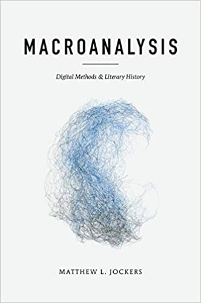
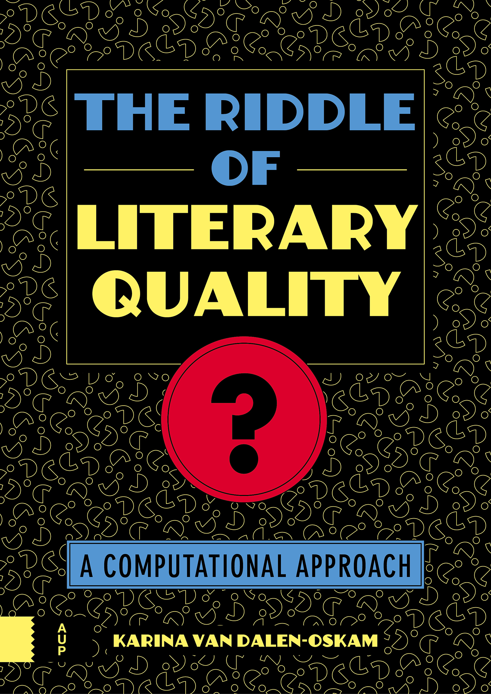

```{r setup, include=FALSE}
# set global chunk options

library(knitr)
library(plotly)
library(lattice)
library(viridisLite)

library(stylo)
data(novels)
corpus = parse.corpus(novels)
freqs = lapply(corpus, table)


load("data/results_wurzburg.RData")
load("data/results_baseline_wurzburg.RData")
performance_wurzburg = collect_results_all_similarity_areas 
# define the gain of performance as a difference between the final results and the baseline (both expressed in f1 scores)
performance_gain_wurzburg = performance_wurzburg - collect_baseline_results
# get rid of the values that are worse than the baseline
performance_gain_wurzburg[performance_gain_wurzburg <= 0] = NA

load("data/results_delta.RData")
load("data/results_baseline_delta.RData")
performance_delta = collect_results_all_similarity_areas 
# define the gain of performance as a difference between the final results and the baseline (both expressed in f1 scores)
performance_gain_delta = performance_delta -  collect_baseline_results
# get rid of the values that are worse than the baseline
performance_gain_delta[performance_gain_delta <= 0] = NA


load("data/sample_vector_neighbors.RData")


opts_chunk$set(cache = TRUE)
```


## introduction { .cls_section }


## First, what CLS is about

* Computational Literary Studies
* Aimed at analyzing (large amounts of) textual data...
* ... by computational techniques


## Leon Battista Alberti

{height=450}

Leon Battista Alberti, _De componendis cifris_, ca. 1466


## Computation into criticism

{height=450}

John Burrows, _Computation into Criticism_, 1987


## Distant reading 

{height=450}
{height=450}
{height=450}

Franco Moretti, Matt Jockers, Ted Underwood


## Sociology of reading 

{height=450}

Karina van Dalen-Oskam, _Het raadsel literatuur_, 2021


## Quantitative linguistics

{height=450}
<!-- Matematyka i poetyka, Baayen, Analyzing linguistic data with R -->


## Foundations of CLS

* Computation into criticism
* Distant reading 
* Stylometry
* Authorship attribution
* Digital humanities
* Language resources
* Digital libraries
* Natural language processing
* Machine learning
* Big data
* ...


## What CLS has to offer

* Scientific method
  * reproducibility, empirical paradigm, statistical modeling, probabilistic inference, ...
* Scale
  * access to unprecedented amounts of data
* Accuracy
  ability to capture patterns invisible to a naked eye


## 

{height=700}


## 1,000 Polish novels

{height=550}


## Combination of factors needed

* Datasets (language resources)
* Tools (computer programs)
* Suitable methodology
* Computer power (i.e. scientific instruments)


## Not possible individually { .cls_section }


## Research infrastructures { .cls_section }


## Libraries, journals, publishers, ...

{height=550}


## Dictionaries at IJP PAN

{height=550}


## ELTeC corpus

{height=550}


## DraCor


{height=550}


## CLS INFRA { .cls_section }

An infrastructural project for computational literary studies, founded by Horizon 2020 scheme


## infrastructures in DH and CLS

* in hard sciences, infrastructures are tangible
    * servers, telescopes, accelerators, ...
* in the humanities, institutions are essential
    * libraries, publishing houses, journals, ...
* in DH, multifaceted needs
    * the notion of infrastructure needs reconsideration
    * corpora (FAIR!) but not only


## CLS INFRA project

* text collections (corpora)
    * quality
    * metadata
    * conversion
* methodology
    * tools (NLP, datavis, ...)
    * tool chains
    * methodological considerations
    * bibliographic survey
* network of scholars
    * training schools
    * short-term research stays
    * collaboration with COST Action


## Overarching idea is to connect...

* People
  * To establish a network of CLS researchers
* Data
  * To consolidate existing high-quality corpora...
  * ...covering prose, drama and poetry
* Tools
  * To build a chain of NLP tools to analyze texts
* Methods
  * To provide a survey of state-of-the-art methods


## outcomes { .cls_section }


## activities

* training schools
    * Prague 2022, Madrid 2023, Vienna 2024
* workshops
    * DH 2024, DH 2025
* closing event
    * at CCLS 2025
* transnationan access fellowships
    * short-term research stays...
    * in one of 6 institutions:


## selected deliverables

* 3.1 Report on the methodological baseline for (computational) literary studies
* 4.1 Report on the skills matrix for computational literary studies
* 5.1 Review of the data landscape
* 6.1 Assembly of existing data


## survey of methods

{height=500}


## CLS-centric Discord server

{height=550}


## Text analysis { .cls_section }


## Why text analysis?

* Authorship attribution
* Forensic linguistics
* Register analysis
* Genre recognition
* Gender differences
* Translatorial signal
* Early vs. mature style
* Style evolution
* Detecting dementia
* ...


## stylometry

* measures stylistic differences between texts
* oftentimes aimed at authorship attribution
* relies on _stylistic fingerprint_, ...
* ... aka measurable linguistic features
  * frequencies of function words 
  * frequencies of grammatical patterns, etc.
* proves successful in several applications


## How two compare texts?

* Extracting valuable (i.e. countable) language features from texts
  * frequencies of words 👈
  * frequencies of syllables
  * versification patterns
  * grammatical patterns
  * distribution of topics
  * ...
* Comparing these features by means of multivariate analysis
  * distance-based methods 👈
  * neural networks
  * ...


## From words to features

> ‘It is a truth universally acknowledged, that a single man in possession of a good fortune, must be in want of a wife.’ </br> (J. Austen, _Pride and Prejudice_)

<p>“<span style="color: red;">the</span>” = 4.25%</p>
<p>“<span style="color: red;">in</span>” = 3.45%</p>
<p>“<span style="color: red;">of</span>” = 1.81%</p>
<p>“<span style="color: red;">to</span>” = 1.44%</p>
<p>“<span style="color: red;">a</span>” = 1.37%</p>
<p>“<span style="color: red;">was</span>” = 1.17%</p>
<p><span style="color: red;">. . .</span></p>


## From features to similarities


```{r, echo = FALSE, message = FALSE}
library(stylo)
data(lee)
round(lee[1:19,1:8], 3)
```


## What we hope to get 

```{r, echo = FALSE, message = FALSE, fig.align = "center"}
stylo(frequencies = lee, gui = FALSE, analysis.type = "BCT", mfw.min = 100, mfw.max = 1000, titles.on.graphs = FALSE)
```


## stylometry beyond attribution

{height=550}


## boosting frequencies { .cls_section }


## areas of improvement

* classification method
  * distant-based
  * svm, nsc, knn, ...
  * neural networs
  * ...
* feature engineering
  * dimension reduction
  * lasso
  * ...
* feature choice 
  * MFWs
  * POS _n_-grams
  * character _n_-grams
  * ... 


## relative frequencies { .cls_section }


## simple normalization

Occurrences of the most frequent words (MFWs): 

``` {r echo = FALSE, message = TRUE}
freqs$EBronte_Wuthering[make.frequency.list(corpus)[1:16]]
```

Relative frequencies:

``` {r echo = FALSE, message = TRUE}
rel_freqs = freqs$EBronte_Wuthering[make.frequency.list(corpus)[1:11]] / sum(freqs$EBronte_Wuthering)
round(rel_freqs, 4)
```


## relative frequencies

The number of occurrences of a given word divided by the total number of words:

$$ f_\mathrm{the} = \frac{n_\mathrm{the}}{ n_\mathrm{the} +  n_\mathrm{of} + n_\mathrm{and} + n_\mathrm{in} + ... } $$

In a generalized version:

$$ f_{w} = \frac{n_{w}}{N} $$


## relative frequencies

* routinely used
* reliable
* simple
* intuitive
* conceptually elegant


## words that matter { .cls_section }


## synonyms

Proportions within synonym groups might betray a stylistic signal:

* _on_ and _upon_
* _drink_ and _beverage_
* _buy_ and _purchase_
* _big_ and _large_
* _et_ and _atque_ and _ac_


## proportions within synonyms


The proportion of _on_ to _upon_:

$$ f_\mathrm{on} = \frac{n_\mathrm{on}}{ n_\mathrm{on} +  n_\mathrm{upon} } $$


The proportion of _upon_ to _on_:


$$ f_\mathrm{upon} = \frac{n_\mathrm{upon}}{ n_\mathrm{on} +  n_\mathrm{upon} } $$


Certainly, they sum up to 1.


## 'on'/total vs. 'on'/('upon' + 'on') 

``` {r echo = FALSE, message = FALSE}

color_space = viridis(4)
text_colors = c(color_space[1], color_space[1], color_space[2], color_space[2], color_space[2], color_space[3], color_space[3], color_space[3], color_space[4])

plot_freqs = function(x, ...) {
  plot(x, type = "h", col = text_colors, lwd = 10, xlab = "", axes = FALSE, ...)
  axis(2)
  legend("topleft", legend = c("A. Bronte", "J. Austen", "C. Bronte", "E. Bronte"), bty = "n", lwd = 10, col = color_space)
}

on_ = lapply(freqs, function(x) x[grep("\\bon\\b", names(x))] )
upon_ = lapply(freqs, function(x) x[grep("\\bupon\\b", names(x))] )

total = lapply(freqs, sum)

op = par(mfrow = c(1, 2))
#plot_freqs( unlist(on_) / unlist(total), ylim = c(0, 0.008) )
plot_freqs( unlist(on_) / unlist(total), ylab = "relative frequency")
plot_freqs( unlist(on_) / (unlist(on_) + unlist(upon_)) , ylab = "")

```


## 'the'/total vs. 'the'/('of' + 'the')

``` {r echo = FALSE, message = FALSE}
the_ = lapply(freqs, function(x) x[grep("\\bthe\\b", names(x))] )
of_ = lapply(freqs, function(x) x[grep("\\bof\\b", names(x))] )

total = lapply(freqs, sum)

op = par(mfrow = c(1, 2))
plot_freqs( unlist(the_) / unlist(total), ylab = "relative frequency")
plot_freqs( unlist(the_) / (unlist(of_) + unlist(the_)), ylab = "" )

```


``` {r eval = FALSE, echo = FALSE, message = FALSE}

the_ = lapply(freqs, function(x) x[grep("\\bthe\\b", names(x))] )
and_ = lapply(freqs, function(x) x[grep("\\band\\b", names(x))] )
to_ = lapply(freqs, function(x) x[grep("\\bto\\b", names(x))] )
i_ = lapply(freqs, function(x) x[grep("\\bi\\b", names(x))] )
of_ = lapply(freqs, function(x) x[grep("\\bof\\b", names(x))] )
a_ = lapply(freqs, function(x) x[grep("\\ba\\b", names(x))] )
in_ = lapply(freqs, function(x) x[grep("\\bin\\b", names(x))] )
was_ = lapply(freqs, function(x) x[grep("\\bwas\\b", names(x))] )
her_ = lapply(freqs, function(x) x[grep("\\bher\\b", names(x))] )
it_ = lapply(freqs, function(x) x[grep("\\bit\\b", names(x))] )

total = lapply(freqs, sum)

op = par(mfrow = c(1, 2))
plot_freqs( unlist(the_) / unlist(total) )
plot_freqs( unlist(the_) /
(unlist(the_) + unlist(and_) + unlist(to_) + unlist(i_) + unlist(of_) + unlist(a_) + unlist(in_) + unlist(was_) + unlist(her_) + unlist(it_)) )

```


## limitations of synonyms

* in many cases, several synonyms
    * cf. _et_ and _atque_ and _ac_ in Latin
* in many cases, no synonyms at all
* target words might belong to different grammatical categories
* what are the synonyms for function words?
* provisional conclusion:
    * synonyms are but a subset of the _words that matter_


## beyond synonyms { .cls_section }


## semantic similarity


* target words: synonyms and more
* e.g. for the word _make_ the target words can involve:
  * _perform_, _do_, _accomplish_, _finish_, _reach_, _produce_, ...
  * all their inflected forms (if applicable)
  * derivative words: nouns, adjectives, e.g. _a deed_
* the size of a target semantic area is unknown


## word vector models


* trained on a large amount of textual data
* capable of capturing (fuzzy) semantic relations between words
* many implementations:
  * word2vec
  * GloVe
  * faxtText
  * ...


## GloVe model: examples


the neighbors of _house_:
``` {r echo = FALSE, message = TRUE}
round(sample_neighbors$house, 3)
```

the neighbors of _home_:
``` {r echo = FALSE, message = TRUE}
round(sample_neighbors$home, 3)
```

the neighbors of _buy_:
``` {r echo = FALSE, message = TRUE}
round(sample_neighbors$buy, 3)
```

the neighbors of _style_:
``` {r echo = FALSE, message = TRUE}
round(sample_neighbors$style, 3)
```


## relative frequencies revisited

for a 2-word semantic space, the frequency of the word _house_: 

$$ f_\mathrm{house} = \frac{n_\mathrm{house}}{ n_\mathrm{house} +  n_\mathrm{where} + n_\mathrm{place} } $$


for a 5-word semantic space, the frequency of the word _house_: 

$$ f_\mathrm{house} = \frac{n_\mathrm{house}}{ n_\mathrm{house} +  n_\mathrm{where} + n_\mathrm{place} + n_\mathrm{room} + n_\mathrm{town} + n_\mathrm{houses} } $$


for a 7-word semantic space, the frequency of the word _house_: 

$$ f_\mathrm{house} = \frac{n_\mathrm{house}}{ n_\mathrm{house} +  n_\mathrm{where} + n_\mathrm{place} + n_\mathrm{room} + n_\mathrm{town} + n_\mathrm{houses} + n_\mathrm{farm} + n_\mathrm{rooms} } $$


## will it fly? { .cls_section }


## experimental setup

* a corpus of 99 novels in English
* by 33 authors (3 texts per author)
* tokenized and classified by the package `stylo`
  * stratified cross-validation scenario
  * 100 cross-validation folds
  * distance-based classification performed
  * F1 scores reported


## distance measures used

* classic Burrows's Delta
* Cosine Delta (Wurzburg)
* Eder's Delta
* raw Manhattan distance


## results { .cls_section }


## results for Cosine Delta

``` {r echo = FALSE, message = FALSE}
plot_data = performance_wurzburg 
p <- plot_ly(y = as.numeric(rownames(plot_data)), z = performance_wurzburg, type = "surface", colors = rev(turbo(1000)))
p %>% layout(scene = list(
    xaxis = list(
      ticktext = list(1, 10, 100, 1000, 10000), 
      tickvals = list(1, 10, 19, 28, 37),
      tickmode = "array"
  )))

```


## results for Cosine Delta

``` {r echo = FALSE, message = FALSE}
# setting the scales
x.scale <- list(at = c(1, 5, 10, 14, 19, 23, 28, 32, 36), label = c(1, 5, 10, 50, 100, 500, 1000, 5000, 10000))
y.scale <- list(at = c(1, 4, 7, 10, 13, 16, 19), labels = seq(100, 1000, 150))
# absolute values
plot_1 = levelplot(t(performance_wurzburg), cuts = 1000, scales = list(x = x.scale, y = y.scale), col.regions = rev(turbo(1000)), xlab= "semantic background (words)", ylab = "number of MFWs", main = "Cosine Delta", at=seq(0.45, 0.96, length.out=120))
# gain over the baseline
plot_1

# keep the performance outcomes for later
f1_all_wurzburg = sort(as.vector(performance_wurzburg))
f1_gain_wurzburg = sort(as.vector(performance_gain_wurzburg))
```


## results for Burrows's Delta

``` {r echo = FALSE, message = FALSE}
# setting the scales
x.scale <- list(at = c(1, 5, 10, 14, 19, 23, 28, 32, 36), label = c(1, 5, 10, 50, 100, 500, 1000, 5000, 10000))
y.scale <- list(at = c(1, 4, 7, 10, 13, 16, 19), labels = seq(100, 1000, 150))
# absolute values
plot_1 = levelplot(t(performance_delta), cuts = 1000, scales = list(x = x.scale, y = y.scale), col.regions = rev(turbo(1000)), xlab= "semantic background (words)", ylab = "number of MFWs", main = "Burrows's Delta")#, at=seq(0.45, 0.96, length.out=120))
# gain over the baseline
plot_1

# keep the performance outcomes for later
f1_all_delta = sort(as.vector(performance_delta))
f1_gain_delta = sort(as.vector(performance_gain_delta))
```


## results for Eder's Delta

``` {r echo = FALSE, message = FALSE}
load("data/results_eder.RData")
load("data/results_baseline_eder.RData")

# define the gain of performance as a difference between the final results and the baseline (both expressed in f1 scores)
performance_gain_eder = collect_results_all_similarity_areas - collect_baseline_results
# get rid of the values that are worse than the baseline
performance_gain_eder[performance_gain_eder <= 0] = NA

# setting the scales
x.scale <- list(at = c(1, 5, 10, 14, 19, 23, 28, 32, 36), label = c(1, 5, 10, 50, 100, 500, 1000, 5000, 10000))
y.scale <- list(at = c(1, 4, 7, 10, 13, 16, 19), labels = seq(100, 1000, 150))
# absolute values
plot_1 = levelplot(t(collect_results_all_similarity_areas), cuts = 1000, scales = list(x = x.scale, y = y.scale), col.regions = rev(turbo(1000)), xlab= "semantic background (words)", ylab = "number of MFWs", main = "Eder's Delta")#, at=seq(0.45, 0.96, length.out=120))
# gain over the baseline
plot_1

# keep the performance outcomes for later
f1_all_eder = sort(as.vector(collect_results_all_similarity_areas))
f1_gain_eder= sort(as.vector(performance_gain_eder))
```


## results for Manhattan Distance 

``` {r echo = FALSE, message = FALSE}
load("data/results_manhattan.RData")
load("data/results_baseline_manhattan.RData")

# define the gain of performance as a difference between the final results and the baseline (both expressed in f1 scores)
performance_gain_manhattan = collect_results_all_similarity_areas - collect_baseline_results
# get rid of the values that are worse than the baseline
performance_gain_manhattan[performance_gain_manhattan <= 0] = NA

# setting the scales
x.scale <- list(at = c(1, 5, 10, 14, 19, 23, 28, 32, 36), label = c(1, 5, 10, 50, 100, 500, 1000, 5000, 10000))
y.scale <- list(at = c(1, 4, 7, 10, 13, 16, 19), labels = seq(100, 1000, 150))
# absolute values
plot_1 = levelplot(t(collect_results_all_similarity_areas), cuts = 1000, scales = list(x = x.scale, y = y.scale), col.regions = rev(turbo(1000)), xlab= "semantic background (words)", ylab = "number of MFWs", main = "Manhattan")#, at=seq(0.45, 0.96, length.out=120)) 
# gain over the baseline
plot_1

# keep the performance outcomes for later
f1_all_manhattan = sort(as.vector(collect_results_all_similarity_areas))
f1_gain_manhattan = sort(as.vector(performance_gain_manhattan))

```


## the best F1 scores


* Cosine Delta: <span style="color: red;">0.96</span>
* Burrows's Delta: 0.84
* Eder's Delta: 0.83
* raw Manhattan: 0.77


## how good are the results?

* we know that Cosine Delta outperforms Classic Delta etc.
* what is the actual gain in performance, then?
* an additional round of tests performed to get baseline
* the gain above the baseline reported below 


## gain for Cosine Delta

``` {r echo = FALSE, message = FALSE}
# gain over the baseline
plot_2 = levelplot(t(performance_gain_wurzburg), cuts = 1000, scales = list(x = x.scale, y = y.scale), col.regions = rev(plasma(1000)), xlab= "semantic background (words)", ylab = "number of MFWs", main = "Cosine Delta", at=seq(0, 0.12, length.out=150))
plot_2
```


## gain for Burrows's Delta

``` {r echo = FALSE, message = FALSE}
# gain over the baseline
plot_2 = levelplot(t(performance_gain_delta), cuts = 1000, scales = list(x = x.scale, y = y.scale), col.regions = rev(plasma(1000)), xlab= "semantic background (words)", ylab = "number of MFWs", main = "Burrows's Delta", at=seq(0, 0.12, length.out=150))
plot_2
```


## gain for Eder's Delta

``` {r echo = FALSE, message = FALSE}
# gain over the baseline
plot_2 = levelplot(t(performance_gain_eder), cuts = 1000, scales = list(x = x.scale, y = y.scale), col.regions = rev(plasma(1000)), xlab= "semantic background (words)", ylab = "number of MFWs", main = "Eder's Delta", at=seq(0, 0.12, length.out=150))
plot_2
```


## gain for Manhattan Distance 

``` {r echo = FALSE, message = FALSE}
# gain over the baseline
plot_2 = levelplot(t(performance_gain_manhattan), cuts = 1000, scales = list(x = x.scale, y = y.scale), col.regions = rev(plasma(1000)), xlab= "semantic background (words)", ylab = "number of MFWs", main = "Manhattan", at=seq(0, 0.12, length.out=150))
plot_2
```


## conclusions 

* in <span style="color: red;">each scenario</span>, the gain was <span style="color: red;">considerable</span>
* the hot spot of performance varied depending on the method...
* ... yet it was spread between 5 and 100 semantic neighbors
* best classifiers are even better: up. to <span style="color: red;">12%</span> improvement! 


## conclusions (cont.)

* the new method is very simple
* it doesn't require any NLP tooling...
* ... except getting a general list of _n_ semantic neighbors for MFWs
* such a list can be generated once and re-used several times
* if a rough method of tracing the _words that matter_ was already successful, a bigger gain can be expected with sophisticated language models


## { .no-background }

<!--

-->

<h2 style="margin-bottom: 3em">Thank you!</h2>


mail: maciej.eder@ut.ee

twitter: @MaciejEder

GitHub: 
https://github.com/computationalstylistics/word_frequencies


## appendix { .cls_section }


## alt semantic space 

* perhaps the _n_ closest neighbors is not the best way to define semantic spaces
* therefore: testing all the words at the cosine distance of _x_ from the reference word


## results for cosine similarities

``` {r echo = FALSE, message = FALSE}
load("data/results_areas_of_cosine_similarity_wurzburg.RData")
# in order to be compliant with the previous plots, let's trim the last two columns of the results' matrix (the results for -0.95 and -1 are meaningless anyway...):
collect_results_all_similarity_areas = collect_results_all_similarity_areas[,1:37]
x.scale <- list(at = seq(1, 37, 4), label = seq(0.9, -1, -0.2))
y.scale <- list(at = c(1, 4, 7, 10, 13, 16, 19), labels = seq(100, 1000, 150))
# absolute values
plot_3 = levelplot(t(collect_results_all_similarity_areas), cuts = 1000, scales = list(x = x.scale, y = y.scale), col.regions = rev(turbo(1000)), xlab= "semantic background (cosine distance)", ylab = "number of MFWs", main = "Cosine Delta", at=seq(0.45, 0.97, length.out=150))
plot_3
```


## gain for Cosine Delta

``` {r echo = FALSE, message = FALSE}

load("data/results_baseline_wurzburg.RData")
# define the gain of performance as a difference between the final results and the baseline (both expressed in f1 scores)
performance_gain_wurzburg = collect_results_all_similarity_areas - collect_baseline_results
# get rid of the values that are worse than the baseline
performance_gain_wurzburg[performance_gain_wurzburg <= 0] = NA


# gain over the baseline
plot_2 = levelplot(t(performance_gain_wurzburg), cuts = 1000, scales = list(x = x.scale, y = y.scale), col.regions = rev(plasma(1000)), xlab= "semantic background (cosine distance)", ylab = "MFWs", main = "Cosine Delta")#, at=seq(0, 0.089, length.out=150))
plot_2

```


## results for delta similarities

``` {r echo = FALSE, message = FALSE}
load("data/results_areas_of_cosine_similarity_delta.RData")
# in order to be compliant with the previous plots, let's trim the last two columns of the results' matrix (the results for -0.95 and -1 are meaningless anyway...):
collect_results_all_similarity_areas = collect_results_all_similarity_areas[,1:37]
x.scale <- list(at = seq(1, 37, 4), label = seq(0.9, -1, -0.2))
y.scale <- list(at = c(1, 4, 7, 10, 13, 16, 19), labels = seq(100, 1000, 150))
# absolute values
plot_3 = levelplot(t(collect_results_all_similarity_areas), cuts = 1000, scales = list(x = x.scale, y = y.scale), col.regions = rev(turbo(1000)), xlab= "semantic background (cosine distance)", ylab = "number of MFWs", main = "Burrows's Delta")#, at=seq(0.45, 0.97, length.out=150))
plot_3
```


## gain for Burrows's Delta

``` {r echo = FALSE, message = FALSE}

load("data/results_baseline_delta.RData")
# define the gain of performance as a difference between the final results and the baseline (both expressed in f1 scores)
performance_gain_delta = collect_results_all_similarity_areas - collect_baseline_results
# get rid of the values that are worse than the baseline
performance_gain_delta[performance_gain_delta <= 0] = NA


# gain over the baseline
plot_2 = levelplot(t(performance_gain_delta), cuts = 1000, scales = list(x = x.scale, y = y.scale), col.regions = rev(plasma(1000)), xlab= "semantic background (cosine distance)", ylab = "MFWs", main = "Burrows's Delta", at=seq(0, 0.089, length.out=150))
plot_2


```


## results for Eder's similarities

``` {r echo = FALSE, message = FALSE}
load("data/results_areas_of_cosine_similarity_eder.RData")
# in order to be compliant with the previous plots, let's trim the last two columns of the results' matrix (the results for -0.95 and -1 are meaningless anyway...):
collect_results_all_similarity_areas = collect_results_all_similarity_areas[,1:37]
x.scale <- list(at = seq(1, 37, 4), label = seq(0.9, -1, -0.2))
y.scale <- list(at = c(1, 4, 7, 10, 13, 16, 19), labels = seq(100, 1000, 150))
# absolute values
plot_3 = levelplot(t(collect_results_all_similarity_areas), cuts = 1000, scales = list(x = x.scale, y = y.scale), col.regions = rev(turbo(1000)), xlab= "semantic background (cosine distance)", ylab = "number of MFWs", main = "Eder's Delta")#, at=seq(0.45, 0.97, length.out=120))
plot_3
```


## gain for Eder's Delta

``` {r echo = FALSE, message = FALSE}

load("data/results_baseline_eder.RData")
# define the gain of performance as a difference between the final results and the baseline (both expressed in f1 scores)
performance_gain_eder = collect_results_all_similarity_areas - collect_baseline_results
# get rid of the values that are worse than the baseline
performance_gain_eder[performance_gain_eder <= 0] = NA


# gain over the baseline
plot_2 = levelplot(t(performance_gain_eder), cuts = 1000, scales = list(x = x.scale, y = y.scale), col.regions = rev(plasma(1000)), xlab= "semantic background (cosine distance)", ylab = "MFWs", main = "Eder's Delta", at=seq(0, 0.084, length.out=120))
plot_2


```


## exotic distances { .cls_section }


## What is a distance?

take any two texts:

```{r, echo = FALSE, message = FALSE}
galbraith = round(galbraith, 3)
galbraith[c(13,24), 1:11]
```

subtract the values vertically:

```{r, echo = FALSE, message = FALSE}
difference = galbraith[13, 1:11] - galbraith[24, 1:11]
difference = t(as.matrix(difference))
rownames(difference) = "      "
difference
```

then drop the minuses:


```{r, echo = FALSE, message = FALSE}
rownames(difference) = "             "
abs(difference)
```

sum up the obtained values:

```{r, echo = FALSE, message = FALSE}
sum(abs(difference))
```


## Manhattan vs. Euclidean


{height=500}


## Euclidean distance 

between any two texts represented by two points A and B in an _n_-dimensional space can be defined as:

$$ \delta_{AB} = \sqrt{ \sum_{i = 1}^{n} (A_i - B_i)^2 } $$

where _A_ and _B_ are the two documents to be compared, and $A_i,\, B_i$ are the scaled (z-scored) frequencies of the _i_-th word in the range of _n_ most frequent words.

## Manhattan distance 

can be formalized as follows:

$$ \delta_{AB} = \sum_{i = 1}^{n} | A_i - B_i | $$

which is equivalent to

$$ \delta_{AB} = \sqrt[1]{ \sum_{i = 1}^{n} | A_i - B_i |^1 } $$

(the above weird notation will soon become useful)


## They are siblings!


$$ \delta_{AB} = \sqrt[2]{ \sum_{i = 1}^{n} (A_i - B_i)^2 } $$

vs.

$$ \delta_{AB} = \sqrt[1]{ \sum_{i = 1}^{n} | A_i - B_i |^1 } $$

For that reason, Manhattan and Euclidean are named L1 and L2, respectively.


## An (infinite) family of distances

* The above observations can be further generalized 
* Both Manhattan and Euclidean belong to a family of (possible) distances:

$$ \delta_{AB} = \sqrt[p]{ \sum_{i = 1}^{n} | A_i - B_i |^p } $$

where _p_ is both the power and the degree of the root.


## The norms L1, L2, L3, ...

* The power _p_ doesn’t need to be a natural number
* We can easily imagine norms such as L1.01, L3.14159, L1¾, L$\sqrt{2}$ etc. 
* Mathematically, $p < 1$ doesn’t satisfy the formal definition of a norm... 
* ... yet still, one can easily imagine a dissimilarity L0.5 or L0.0001. 
* (plus, the so-called Cosine Distance doesn't satisfy the definition either).


## To summarize...

* The _p_ parameter is a continuum
* Both $p = 1$ and $p = 2$ (for Manhattan and Euclidean, respectively) are but two specific points in this continuous space
* _p_ is a method’s hyperparameter to be set or possibly tuned


## research question { .cls_section }


## 


<h2> 🧐 How do the norms from a wide range beyond L1 and L2 affect text classification?</h2>


## experiment { .cls_section }


## Data

Four full-text datasets used:

* 99 English novels by 33 authors,
* 99 Polish novels by 33 authors, 
* 28 books by 8 American Southern authors: 
  * Harper Lee, Truman Capote, William Faulkner, Ellen Glasgow, Carson McCullers, Flannery O’Connor, William Styron and Eudora Welty, 
* 26 books by 5 fantasy authors: 
  * J.K. Rowling, Harlan Coben, C.S. Lewis, and J.R.R. Tolkien.


## Method

* A supervised classification experiment was designed
* Aimed at authorship attribution
* leave-one-out cross-validation scenario
  * 100 independent bootstrap iterations... 
  * ... each of them involving 50\% randomly selected input features (most frequent words)
  * The procedure repeated for the ranges of 100, 200, 300, …, 1000 most frequent words. 
* The whole experiment repeated iteratively for L0.1, L0.2, …, L10.
* The performance in each iteration evaluated using accuracy, recall, precision, and the F1 scores. 


## results { .cls_section }


## 99 English novels by 33 authors

{height=600}


## 99 Polish novels by 33 authors

{height=600}


## 28 novels by 8 Southern authors

{height=600}


## 26 novels by 5 fantasy writers

{height=600}


## conclusions { .cls_section }


## A few observations

* Metrics with lower $p$ generally outperform higher-order norms. 
* Specifically, Manhattan is better than Euclidean...
* ... but values $p < 1$ are even better.
* Feature vectors that yield the best results (here: long vectors of most frequent words) are the most sensitive to the choice of the distance measure.


## Plausible explanations

* Small $p$ makes it more important for two feature vectors to have fewer differing features (rather than smaller differences among many features),
* Small $p$ amplifies small differences (important, e.g., for low-frequency features in distinguishing between 0 difference – for two texts lacking a feature – and a small difference).

Therefore:

* Small $p$ norms might be one way of effectively utilizing long feature vectors.


## Questions?


Sources of the texts: the ELTeC corpus, and the package `stylo`.

The code and the datasets: [https://github.com/computationalstylistics/beyond_Manhattan](https://github.com/computationalstylistics/beyond_Manhattan)


## appendix { .cls_section }


## L _p_ distances vs. Cosine Delta

English novels:

mfw   | Manhattan | Lp distance       | Cosine 
------|-----------|-------------------| ------
100   | 0.625     | 0.625 (_p_ = 0.9) | 0.666  
500   | 0.814     | 0.823 (_p_ = 0.6) | 0.865
1000  | 0.833     | 0.871 (_p_ = 0.3) | 0.892


Polish novels:

mfw   |  Manhattan | Lp distance       | Cosine 
------|------------|-------------------|--------
100   | 0.655      | 0.659 (_p_ = 0.8) | 0.684  
500   | 0.760      | 0.769 (_p_ = 0.6) | 0.840
1000  | 0.751      | 0.835 (_p_ = 0.1) | 0.842


## 99 English novels by 33 authors

{height=600}


## 99 Polish novels by 33 authors

{height=600}


## { .no-background }


