# Kilka faktów 

## Prehistoria IJP PAN

* IJP PAN utworzony w 1973 roku...
* ... ale jego historia sięga głębiej:
    * w 1873 pomysł wydania _Słownika staropolskiego_
    * pod auspicjami Akademii Umiejętności
    * Jan Baudouin de Courtenay opracował metodologię
    * materiał zbierany nieprzerwanie do dziś
    * w 1953 redakcja _Słownika_ przeniesiona do PAN

## Profil IJP PAN

* profil od początku leksykograficzny
* choć także: istotne prace teoretyczne
* kategoria A w dyscyplinie językoznawstwo

## Struktura IJP PAN

* Pracownia Dialektologii Polskiej
* Pracownia Etymologii i Geolingwistyki
* Pracownia Historii Języka Polskiego XVII i XVIII Wieku
* Pracownia Języka Staropolskiego
* Pracownia Łaciny Średniowiecznej
* Pracownia Metodologiczna
* Pracownia Onomastyki
* Pracownia Polszczyzny Kresowej
* Pracownia Wielkiego Słownika Języka Polskiego

# Projekty infrastrukturalne

## { .no-background }

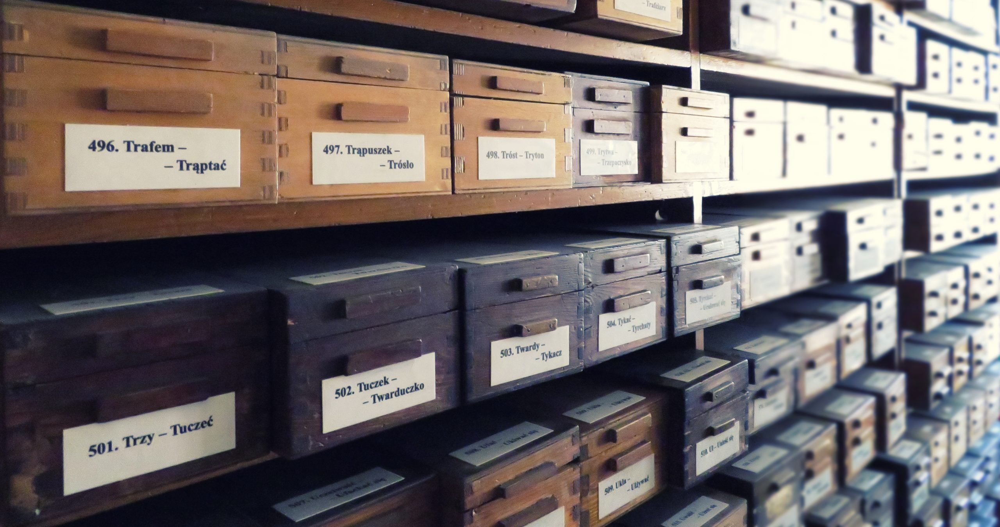{height=650}

## Wielki słownik języka polskiego

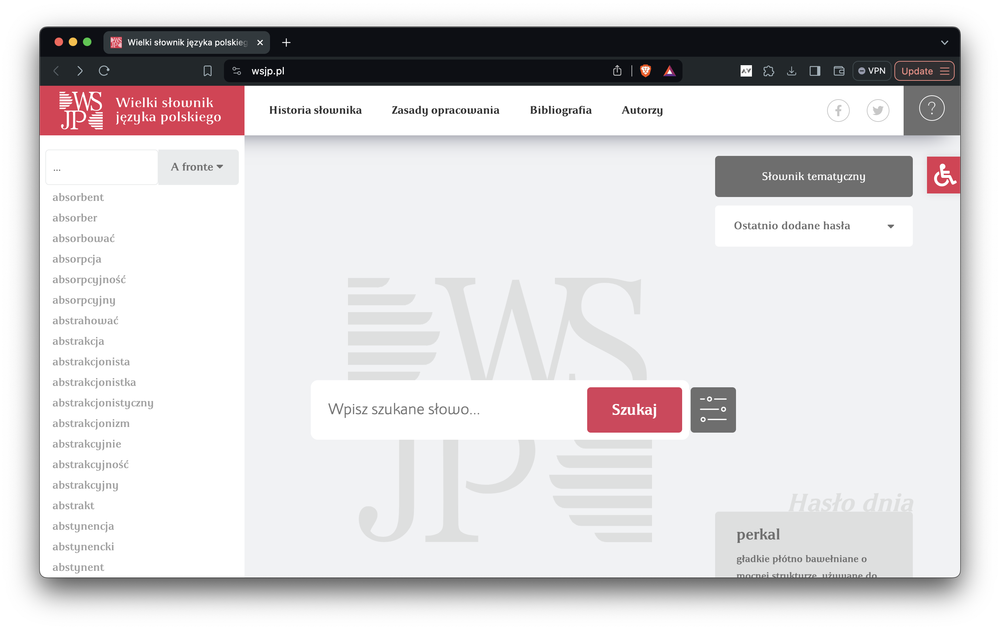{height=600}

## Słownik polszczyzny XVII wieku

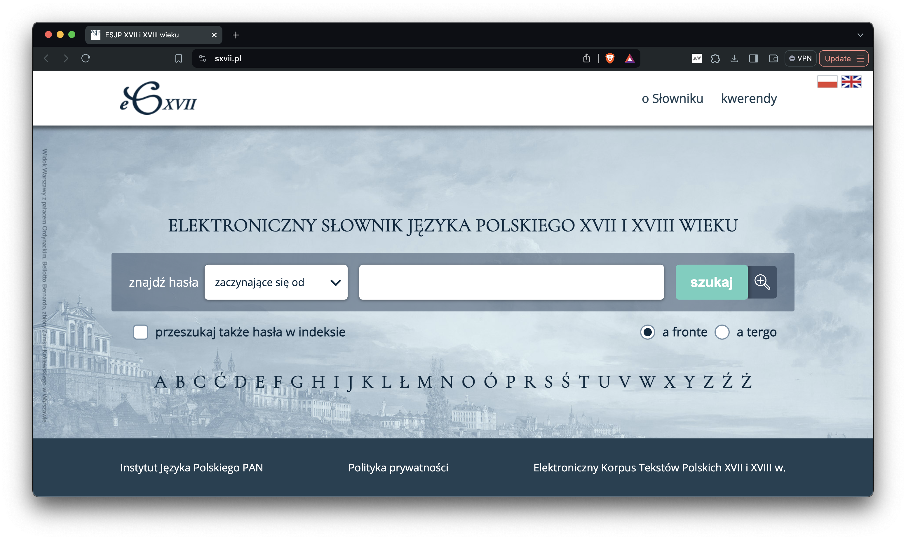{height=600}

## Słownik staropolski

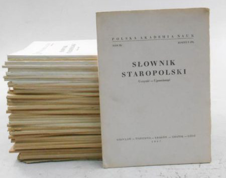{height=600}

## Słownik łaciny średniowiecznej w Polsce

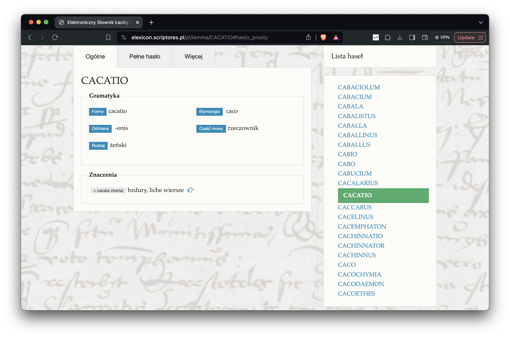{height=600}

## Słownik gwar polskich

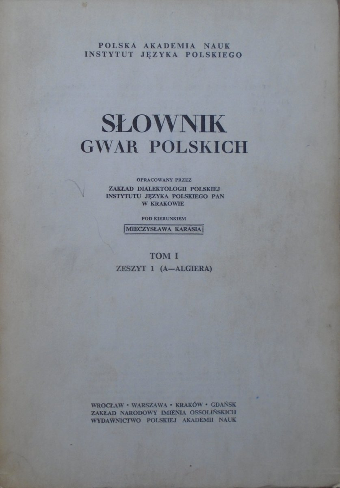{height=600}

## Nazwy miejscowe Polski

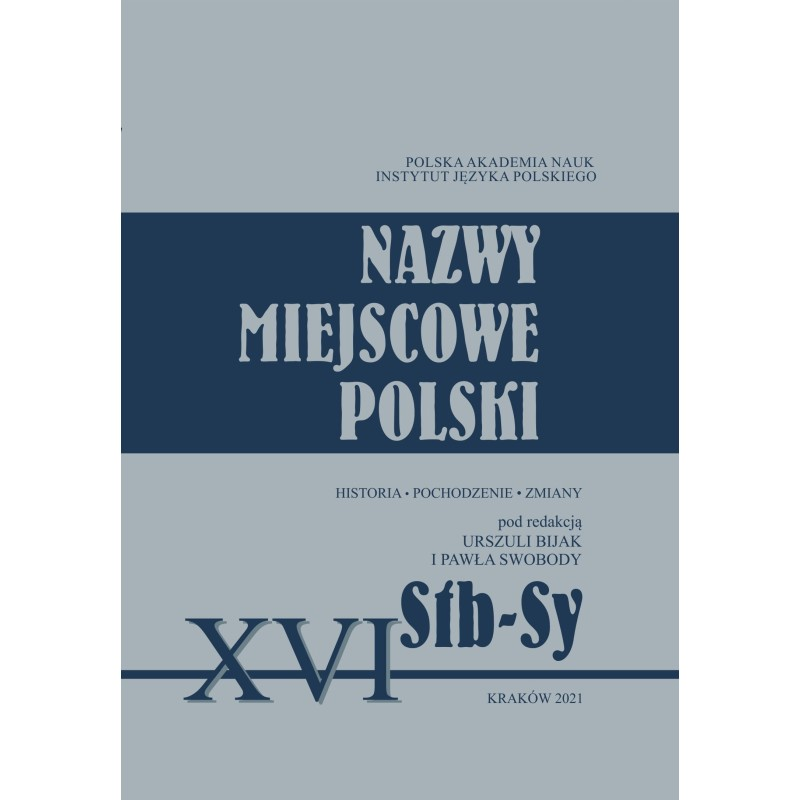{height=600}

## Internetowy słownik nazwisk w Polsce

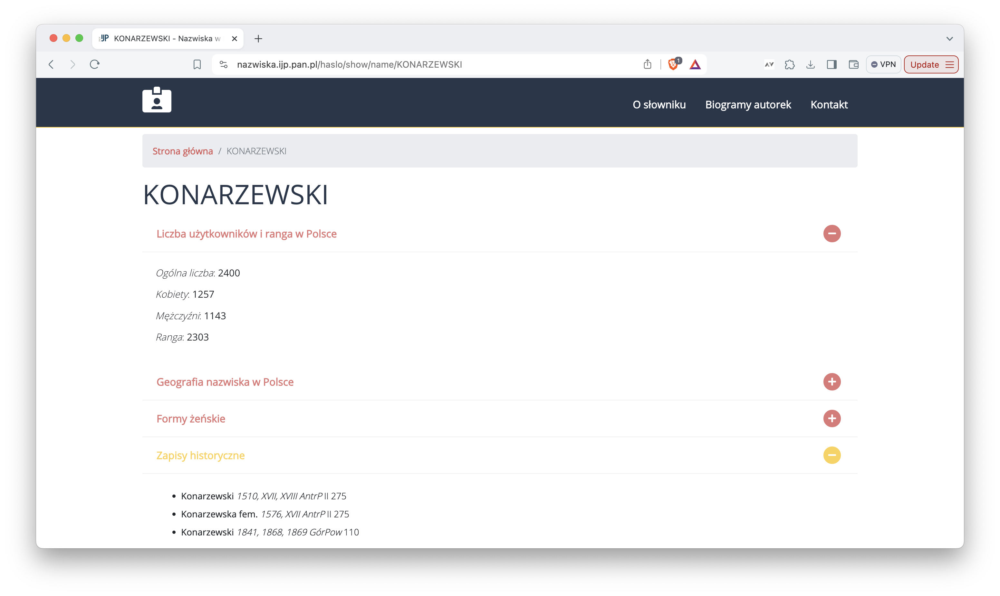{height=600}

## Korpusy elektroniczne

* Narodowy Korpus Języka Polskiego
* Korpus tekstów staropolskich
* Korpus tekstów polskich z XVII i XVIII w.
* Korpus polskiej łaciny średniowiecznej
* Korpus Spiski
* Korpus tekstów gwarowych z Maćkowiec na Podolu

# metodologia językoznawstwa

## Tzw. żółta gramatyka

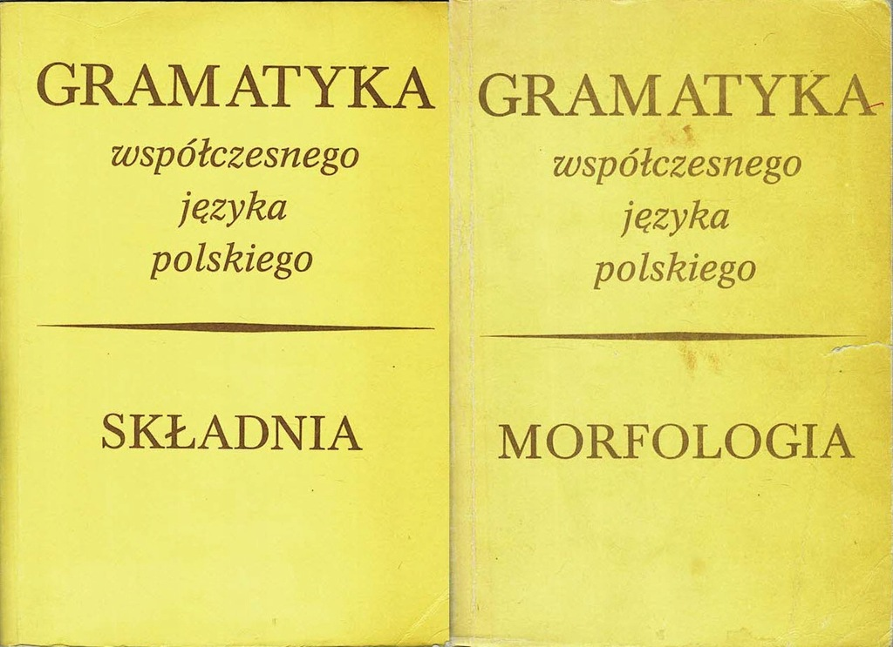{height=600}

## _Epistulae_ Owidiusza i ich autorstwo

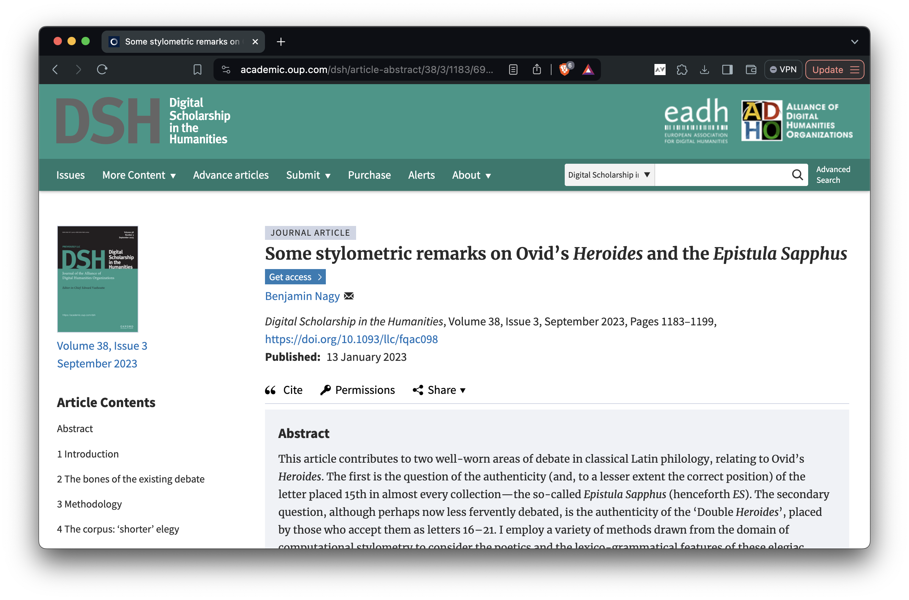{height=600}

## Autorstwo staroangielskiego eposu

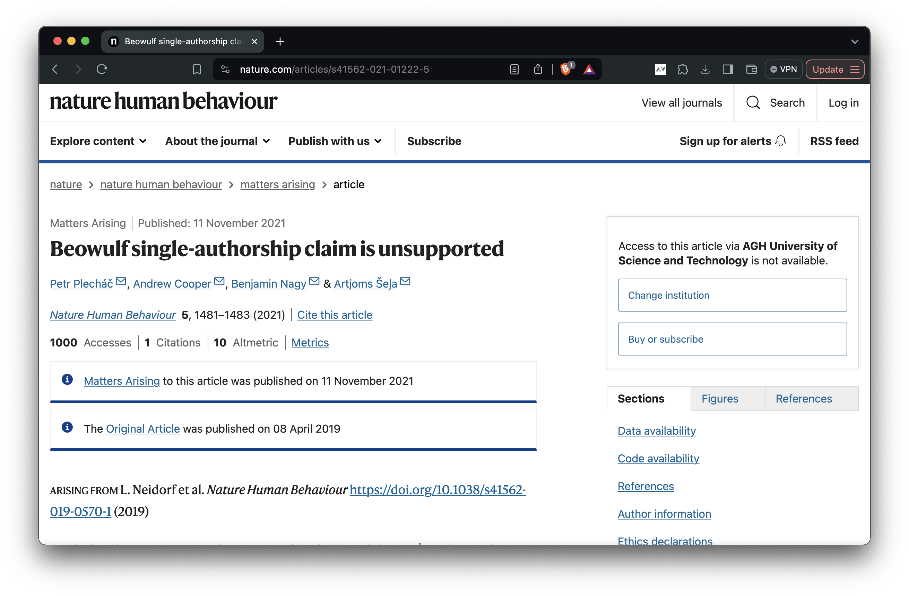{height=600}

## Tłumaczenie na Polski Język Migowy

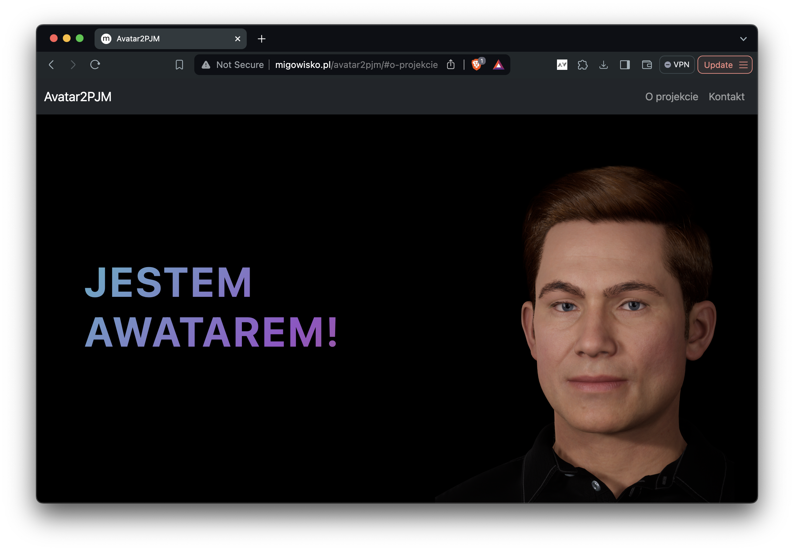{height=600}

# aktywność grantowa

## { .no-background }

