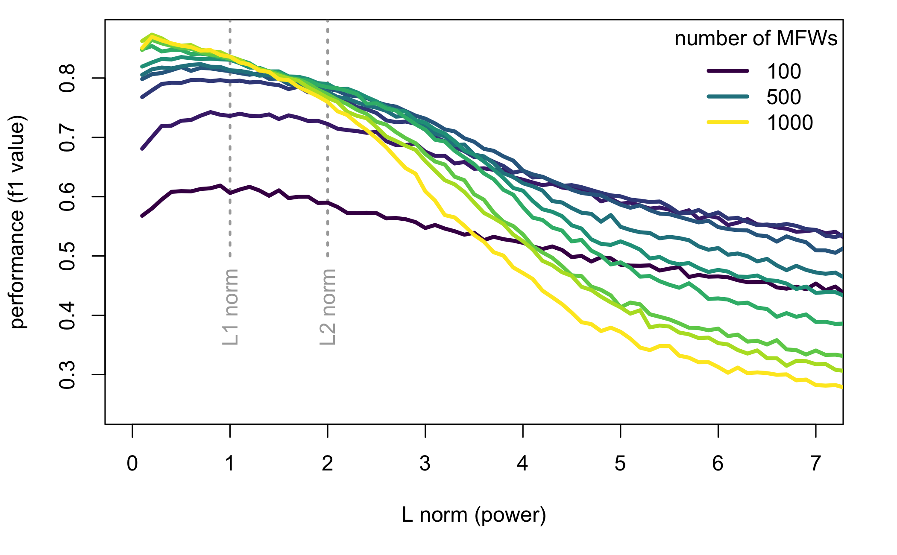
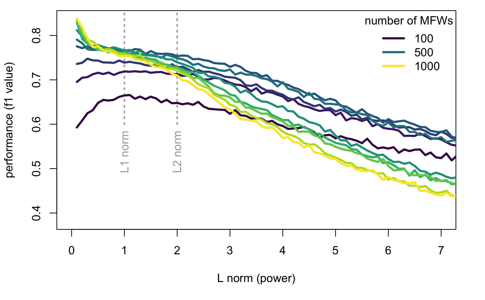
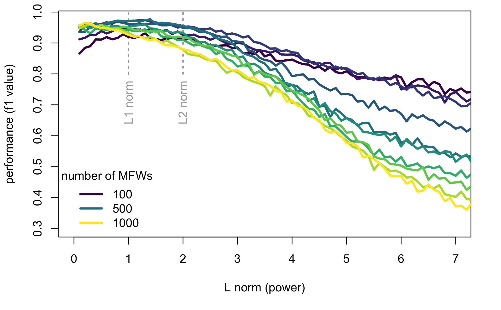
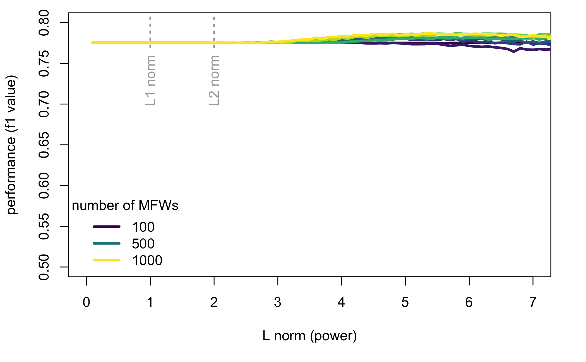

# introduction


## Why text analysis?

* Authorship attribution
* Forensic linguistics
* Register analysis
* Genre recognition
* Gender differences
* Translatorial signal
* Early vs. mature style
* Style evolution
* Detecting dementia
* ...


## How two compare a collection of texts?

* Extracting valuable (i.e. countable) language features from texts
* Comparing these features by means of multivariate analysis


## From words to features

> ‘It is a truth universally acknowledged, that a single man in possession of a good fortune, must be in want of a wife.’ </br> (J. Austen, _Pride and Prejudice_)

<p>“<span style="color: red;">the</span>” = 4.25%</p>
<p>“<span style="color: red;">in</span>” = 3.45%</p>
<p>“<span style="color: red;">of</span>” = 1.81%</p>
<p>“<span style="color: red;">to</span>” = 1.44%</p>
<p>“<span style="color: red;">a</span>” = 1.37%</p>
<p>“<span style="color: red;">was</span>” = 1.17%</p>
<p><span style="color: red;">. . .</span></p>


## From features to similarities

<!--
```{r, echo = FALSE, message = FALSE}
library(stylo)
data(galbraith)
rownames(galbraith) = gsub("_[0-9]+", "", rownames(galbraith))
round(galbraith[1:20,1:8], 3)
```
-->


# theory


## what is a distance?

[here 1-2 slides on the notion of similarity that can be represented as a distance]


## Euclidean distance 

between any two texts represented by two points A and B in an _n_-dimensional space can be defined as:

$$ \delta_{AB} = \sqrt{ \sum_{i = 1}^{n} (A_i - B_i)^2 } $$

where _A_ and _B_ are the two documents to be compared, and $A_i,\, B_i$ are the scaled (z-scored) frequencies of the _i_-th word in the range of _n_ most frequent words.

## Manhattan distance 

can be formalized as follows:

$$ \delta_{AB} = \sum_{i = 1}^{n} | A_i - B_i | $$

which is equivalent to

$$ \delta_{AB} = \sqrt[1]{ \sum_{i = 1}^{n} | A_i - B_i |^1 } $$

(the above weird notation will soon become useful)


## Euclidean and Manhattan are siblings!


$$ \delta_{AB} = \sqrt[2]{ \sum_{i = 1}^{n} (A_i - B_i)^2 } $$

vs.

$$ \delta_{AB} = \sqrt[1]{ \sum_{i = 1}^{n} | A_i - B_i |^1 } $$

For that reason, Manhattan and Euclidean are named L1 and L2, respectively.


## An (infinite) family of distances

* The above observations can be further generalized 
* Both Manhattan and Euclidean belong to a family of (possible) distances:

$$ \delta_{AB} = \sqrt[p]{ \sum_{i = 1}^{n} | A_i - B_i |^p } $$

where _p_ is both the power and the degree of the root.


## The norms L1, L2, L3, ... (and beyond)

* The power _p_ doesn’t need to be a natural number
* We can easily imagine norms such as L1.01, L3.14159, L1¾, L$\sqrt{2}$ etc. 
* Mathematically, $p < 1$ doesn’t satisfy the formal definition of a norm... 
* ... yet still, one can easily imagine a dissimilarity L0.5 or L0.0001. 
* (plus, the so-called Cosine Distance doesn't satisfy the definition either).


## To summarize...

* The _p_ parameter is a continuum
* Both $p = 1$ and $p = 2$ (for Manhattan and Euclidean, respectively) are but two specific points in this continuous space
* _p_ is a method’s hyperparameter to be set or possibly tuned


# research question


## 


<h2> 🧐 How do the norms from a wide range beyond L1 and L2 affect text classification?</h2>


# experiment


## Data

Four full-text datasets used:

* 99 English novels by 33 authors,
* 99 Polish novels by 33 authors, 
* 28 books by 8 American Southern authors: 
  * Harper Lee, Truman Capote, William Faulkner, Ellen Glasgow, Carson McCullers, Flannery O’Connor, William Styron and Eudora Welty, 
* 26 books by 5 fantasy authors: 
  * J.K. Rowling, Harlan Coben, C.S. Lewis, and J.R.R. Tolkien.


## Method

* A supervised classification experiment was designed, with
* leave-one-out cross-validation scenario
  * 100 independent bootstrap iterations... 
  * ... each of them involving 50\% randomly selected input features (most frequent words)
  * The procedure repeated for the ranges of 100, 200, 300, …, 1000 most frequent words. 
* The whole experiment repeated iteratively for L0.1, L0.2, …, L10.
* The performance in each iteration evaluated using accuracy, recall, precision, and the F1 scores. 


# results


## 99 English novels by 33 authors

{height=600}


## 99 Polish novels by 33 authors

{height=600}


## 28 novels by 8 Southern authors

{height=600}


## 26 novels by 5 fantasy writers

{height=600}


# conclusions


## A few observations

* Metrics with lower $p$ generally outperform higher-order norms. 
* Specifically, Manhattan is better than Euclidean...
* ... but values $p < 1$ are even better.
* Feature vectors that yield the best results (here: long vectors of most frequent words) are the most sensitive to the choice of the distance measure.


## Plausible explanations

* Small $p$ makes it more important for two feature vectors to have fewer differing features (rather than smaller differences among many features),
* Small $p$ amplifies small differences (important, e.g., for low-frequency features in distinguishing between 0 difference – for two texts lacking a feature – and a small difference).

Therefore:

* Small $p$ norms might be one way of effectively utilizing long feature vectors.


## Thank you!


Sources of the texts: the ELTeC corpus, and the package `stylo`.

The code and the datasets: [https://github.com/computationalstylistics/beyond_Manhattan](https://github.com/computationalstylistics/beyond_Manhattan)


