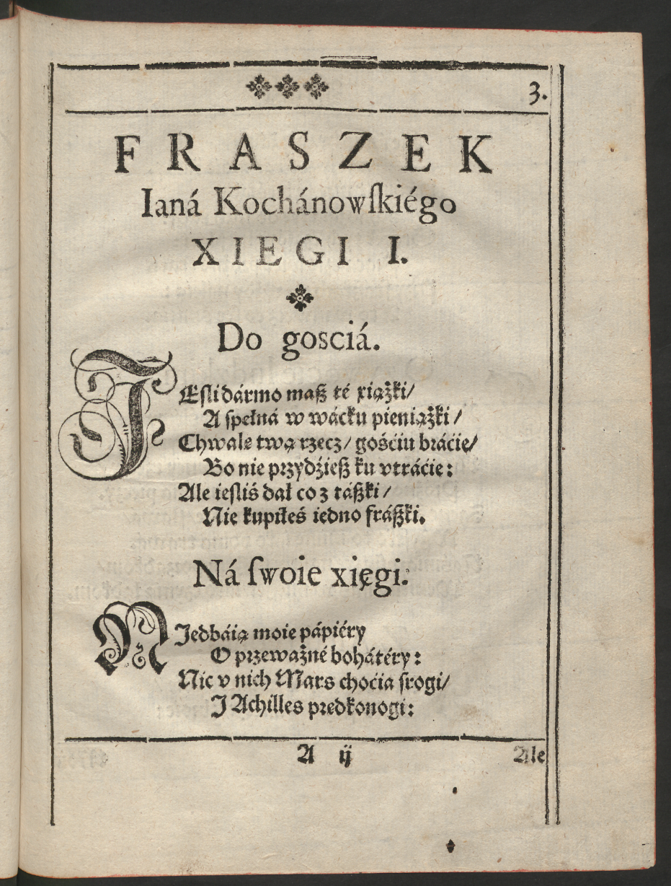
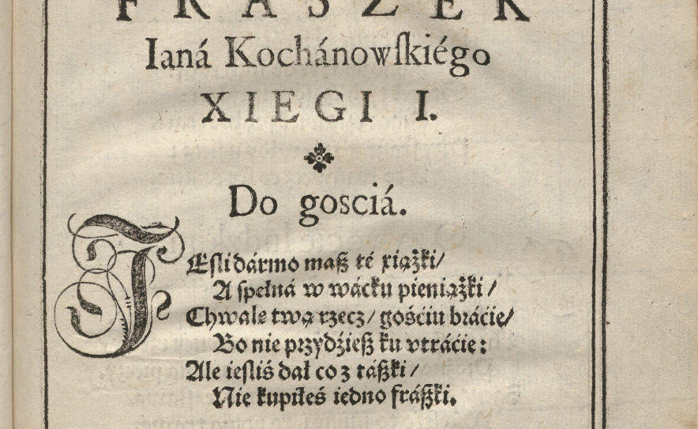
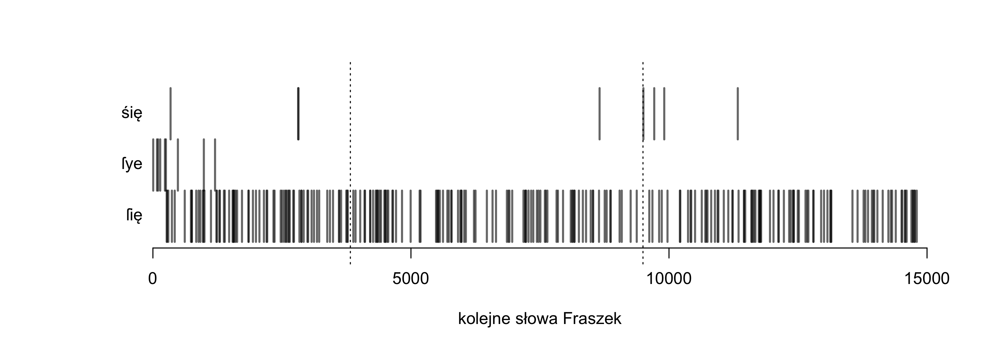
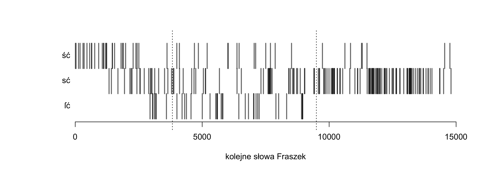
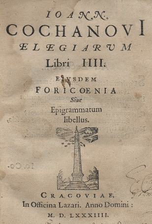
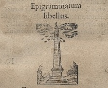

## Wprowadzenie

- Wydane w roku śmierci autora (1584)
- Wydane w jako osobny zbiór poetycki
- Być może pod jakąś kontrolą autorską
- Typowy utwór fragmentaryczny
- Ogromna różnorodność tematyczna


> „_Fraszki_ miały wyposażyć młodą literaturę w języku polskim w dzieło przypominające tematyką i strukturą _Antologię grecką_, bardzo wysoko cenioną […] przez humanistów” (C. Backvis, s. 94)


## Wydanie sejmowe

- uchwała Sejmu z 26 października 1978
- naukowa edycja dzieł wszystkich Kochanowskiego
- w serii Biblioteka Pisarzów Polskich
- edycja dokumentacyjna
    - fototypia
    - odmiany tekstu
    - transkrypcja
    - indeksy wyrazów i form
    - komentarz I, komentarz II
- red. naczelna: Maria Renata Mayenowa


## Wydane tomy

- tom 0: _Wprowadzenie wydawnicze_
- tom I, cz. 1, 3–5: _Psałterz_ (1982–1991) 
- tom II: _Treny_ (1983)
- tom IV: _Pieśni_ (1991)
- tom VII, cz. 2: _Proza_ (1997).
- (oraz: sporo surowych materiałów w szafie IBL PAN)


## Reaktywacja po 30 latach...

- projekt _Dokończenie wydania dzieł wszystkich Jana Kochanowskiego_ 
- red. naczelny: Andrzej Dąbrówka
- finansowany ze środków NPRH
- realizowany od 2012 r.
- oparty na zachowanych archiwaliach
    - tomy gotowe do druku: _Odprawa posłów greckich_
    - tomy w dużej mierze opracowane: _Poematy różne_
    - gotowa transkrypcja, brak komentarza: _Fragmenta_
    - brak jakichkolwiek materiałów: _Fraszki_


## Autorzy nowej edycji _Fraszek_

- Joanna Duska – komentarz językowy 
- Marek Janicki – komentarz historyczny
- Maria Chantry – komentarz neolatynistyczny 
- Teresa Szostek – komentarz klasyczny
- Maciej Eder – transkrypcja tekstu, fototypia, wykaz błędów druku, indeksy wyrazowe, redakcja całości

> pierwotnie: Janusz Pelc, Paulina Buchwald-Pelcowa oraz Franciszek Pepłowski


# Po co nowa edycja?


## Po co edycja, czy nie wystarczy oryginał?

- nie-filolodzy: przecież wystarczy przepisać tekst z oryginału
- językoznawcy: lepiej dostać wgląd do surowego materiału

## Fotografia oryginału




## Fraszka otwierająca zbiór




## Transliteracja?

Do gosciá.

IEſli dármo maſz té xiążki /

A ſpełná w wácku pieniążki /

Chwalę twą rzecz / gośćiu bráćie /

Bo nie przydźieſz ku vtráćie:

Ale ieſliś dał co z táſzki /

Nie kupiłeś iedno fráſzki.


## Transliteracja?

Do <span style="color:red">gosciá</span>.

<span style="color:red">IEſli</span> dármo maſz té xiążki /

A <span style="color:red">ſpełná</span> w wácku pieniążki /

Chwalę twą rzecz / gośćiu bráćie /

Bo nie <span style="color:red">przydźieſz</span> ku vtráćie:

Ale <span style="color:red">ieſliś</span> dał co z táſzki /

Nie kupiłeś iedno fráſzki.


## Założenia nowej edycji

- zagadnienia bibliologiczne
    - podstawa wydania: pierwodruk
    - w wypadku _Fraszek_: wyd. 1584, wariant A
    - Libri impr. rari qu. 297
- zagadnienia językoznawcze
    - procesy leksykalizacyjne i gramatykalizacyjne
    - rozchwianie pisowni np. pochyleń
    - wieloznaczność tekstu a pisownia małą/wielką literą
- zagadnienia komentarza (historyczne, literackie, językowe)


## Seria BPP a nowoczesny świat

- Monograficzny wstęp (?)
- Szczegółowe opisanie grafii druku (?)
- Indeks wyrazów i form (?)


## Korpus językowy

``` xml
<?xml version="1.0" encoding="UTF-8"?>
<teiCorpus xmlns:xi="http://www.w3.org/2001/XInclude" xmlns:nkjp="http://www.nkjp.pl/ns/1.0" xmlns="http://www.tei-c.org/ns/1.0">
  <xi:include href="../../KorBa_manual_header.xml"/>
  <TEI>
    <xi:include href="header.xml"/>
    <text xml:id="morph_text" xml:lang="pl">
      <body xml:id="morph_body">
        <p xml:id="morph_1-p" corresp="ann_segmentation.xml#segm_1-p">
          <s xml:id="morph_1.29-s" corresp="ann_segmentation.xml#segm_1.29-s">
            <seg xml:id="morph_1.1-seg" corresp="ann_segmentation.xml#segm_1.1-seg">
              <fs type="morph">
                <f name="orth">
                  <string>I</string>
                </f>
                <f name="translit">
                  <string>I</string>
                </f>
                <f name="interps">
                  <fs xml:id="morph_1.1.1-lex" type="lex">
                    <f name="base">
                      <string>I</string>
                    </f>
                    <f name="ctag">
                      <symbol value="romandig"/>
                    </f>
                    <f name="msd">
                      <symbol xml:id="morph_1.1.1.1-msd" value=""/>
                    </f>
                  </fs>
                  <fs xml:id="morph_1.1.2-lex" type="lex">
                    <f name="base">
                      <string>i</string>
                    </f>
                    <f name="ctag">
                      <symbol value="conj"/>
                    </f>
                    <f name="msd">
                      <symbol xml:id="morph_1.1.2.1-msd" value=""/>
                    </f>
                  </fs>
                  <fs xml:id="morph_1.1.3-lex" type="lex">
                    <f name="base">
                      <string>i</string>
                    </f>
                    <f name="ctag">
                      <symbol value="interj"/>
                    </f>
                    <f name="msd">
                      <symbol xml:id="morph_1.1.3.1-msd" value=""/>
                    </f>
                  </fs>
                  <fs xml:id="morph_1.1.4-lex" type="lex">
                    <f name="base">
                      <string>i</string>
                    </f>
                    <f name="ctag">
                      <symbol value="part"/>
                    </f>
                    <f name="msd">
                      <symbol xml:id="morph_1.1.4.1-msd" value=""/>
                    </f>
                  </fs>
                  <fs xml:id="morph_1.1.5-lex" type="lex">
                    <f name="base">
                      <string>i</string>
                    </f>
                    <f name="ctag">
                      <symbol value="romandig"/>
                    </f>
                    <f name="msd">
                      <symbol xml:id="morph_1.1.5.1-msd" value=""/>
                    </f>
                  </fs>
                </f>
                <f name="disamb">
                  <fs type="tool_report">
                    <f fVal="#morph_1.1.2.1-msd" name="choice"/>
                    <f name="interpretation">
                      <string>i:conj</string>
                    </f>
                  </fs>
                </f>
              </fs>
            </seg>
            <seg xml:id="morph_1.2-seg" corresp="ann_segmentation.xml#segm_1.2-seg">
              <fs type="morph">
```


## POS-tagging i przyjęta gramatyka

- Universal Dependencies
- tagset TaKIPI
- Nowoczesne korpusy
    - Narodowy Korpus Języka Polskiego (NKJP)
    - Korpus Barokowy (KorBa)
    - Baza Leksykalna Średniowiecznej Polszczyzny (BŚLP)


## W stronę NKJP 

SZEROKI (_2_) _ai_ – _sg A m_: Widźiéć ſzéroki Dunay 52/6. _pl N f_: Władze ſzérokié 118/9.

SZEROKOWŁADNY (_1_) _ai_ – _pl A m_: obiecháć ... Tyránny ſzéroko włádné 129/7.

SZKLENICA _cf_ ŚKLENICA.

_1_. SZKODA (_3_) _praed_ – ſzkodá pusćić ſię ták zgołá nádźieie 85/11, ſzkodá Odiéżdżáć towárzyſzá
133/18; ſzkodáć y vrody/ Y téy łyśiny 60/8.

_2_. SZKODA (_6_) _sb f_ – _sg N_: ZAmieſzkałem do ſtołu ... Z czego ... podkáłá mię ſzkodá 114/3. _sg G_:
Pánie nieżycz mi ſzkody 47/9, my nieſczęsćia płáczem/ y ſwéy znácznéy ſzkody 83/12. _sg A_:
owá ná ſwą ſzkodę ſuſzy bárzo koſći 58/2; iáko nagrody Od téy/ od któréy wſzytko/ chćiéć zá
ſwoie ſzkody? 86/9. _pl A_: PRzy iednym ſczęſćiu dwie ſzkodźie bóg dáie 35/2.


# Komentarz I & Komentarz II


## Do Janá (Fr I 78)

Rádzę, Janie, daj pokój przedsięwzięciu swemu,

Bo bądź krótko, bądź długo, przedsię przydzie k temu,

Że się człowiek obaczy, á co mu dziś miło,

To mu będzie zá czásem wstyd w oczu mnożyło.

[ . . . . . . . . . . . . ]

Świádomeś słów łáskáwych i pięknéj postáwy,

Zdrádę widzisz – znajże więc, co przyjaciél práwy.

Á ty, o morska Wenus, <span style="color:red">chluśni z raz téj pániéj</span>

Á pomści się wzdychánia i moich łzes ná niéj.


## O żywocie ludzkim (Fr I 101)

[ verte -> ]

##

<span style="color:red">Wieczna Myśli</span>, któraś jest dáléj niż od wieká,

Jesli cię téż to rusza, co czásem człowieká,

Wierzę, że tám ná niebie masz mięsopust práwy,

Pátrząc ná rozmáité świátá tego spráwy.

Bo ledá co wyrzucisz, to my jáko dzieci

<span style="color:red">W táki tréter</span>, że z sobą wyniesiem i śmieci.

Więc temu rękaw urwą, á ten czapkę stráci,

Drugi téj krotochwile i włosy przypłáci,

Ná koniec niefortuná álbo śmierć przypádnie,

To drugi, choćby nierad, <span style="color:red">czacz</span> porzuci snádnie.

Pánie, godno li, niech tę rozkosz z tobą czuję,

Niech drudzy zá łby chodzą, á ja się dziwuję.


## Do gospodarzá (Fr III 62)

Nie bądź gościem u siebie – wiédz, co się w cię wleje,

Wedle tegóż swé spráwy miárkuj i nádzieje.

\ \ 

\ \ 

-> por. "Nie z słów, nie z oczu, nie z cery, nie z mniemania, nie z obcej powieści, ale co się w kogo wlewa, sprawy i postępki uważaj, inaczej się zawiedziesz" (A.M. Fredro, wyd. 1658) 

-> por. "i nie czyni tego żaden, kto ma baczenie, áby z ubioru miał sędzić, á nie z spraw ábo z mowy, co się w człowieká wlewa" (GórnDworz L8)


# Wielkie i małe litery


## Ná frásowné (Fr I 85)

PRzy iednym ſczęſćiu dwie ſzkodźie bóg dáie:

Głupi nie widźi / więc <span style="color:red">fortunie</span> łáie.

Báczny co dobrze / to ná wirſch (!) wykłáda /

A co nie gmyśli to pilnie przyſiáda.

\ \ 

Przy jednym szczęściu dwie szkodzie Bóg dáje –

Głupi nie widzi, więc Fortunie łáje,

Báczny co dobrze, to ná wir<emph>z</emph>ch wykłáda,

Á co nie gmyśli, to pilnie przysiáda.


## Ná Fortunę (Fr I 86)

Ná <span style="color:red">fortunę</span>.

W Tym ſię <span style="color:red">fortuny</span> rádźić nie potrzebá /

Choway ſwé dobrze / coć <span style="color:red">bóg</span> życzył z niebá.

A kiedy będźieſz miał <span style="color:red">pogodę</span> ná co /

Lápay iéy z przodku / z tyłu niémáſz zá co.

\ \ 

W tym się Fortuny rádzić nie potrzebá,

Chowaj swé dobrze, co-ć Bóg życzył z niebá.

Á kiedy będziesz miał pogodę ná co,

Łápaj jéj z przodku – z tyłu niémász zá co.


## Źródła fraszki I 86 _Na Fortunę_

- Kochanowski, _Pieśni_ I 9, 5–7
- Kochanowski, _Pieśni_ II 23, 5–8
- Kochanowski, _Elegie_ III 2, 1–6
- epigramat Poseidipposa (AG XVI 275) <- postać Kairosa
- Auzoniusz _In simulacrum Occasionis et Poenitentiae_ (XXVI 33)
- Fedrus (Phaedr. V 8)
- _Carmina burana_, s. 44, nr 16
- Erazm z Rotterdamu, _Adagia_ (670: _Nosce tempus_)
- Tomasz Morus
- Andrea Alciato, emblemat _In occasionem_ <- Occasio, postać kobieca
- . . . 


## Kairos -- Occasio


## Fortuna: zawsze _n-pers_

FORTUNA (_6_) <span style="color:red">_n-pers f_</span> – _sg N_: Bo nie iuż wiecznie Fortuná ſłuży 49/7, łáſkáwie fortuná zemną
poſtępuie 107/4. _sg G_: v fortuny ſobie Ziednáć niemogę/ áby głowie obie ... ná ... mchu leżáły
18/15, W Tym ſię fortuny rádźić nie potrzebá 35/7. sg D: Głupi nie widźi/ więc fortunie łáie
35/3. _sg A_: Ná fortunę 35/6.

FORTUNNY (_1_) _ai_ – _sg N m comp_: Fortunnieyſzy był ięzyk 82/14.

[ . . . . . . . . ] 

NIEFORTUNA (_1_) <span style="color:red">_sb f_</span> – _sg N_: Ná koniec niefortuná/ álbo ſmierć przypádnie 40/5.

NIEFORTUNNY (_1_) _ai_ – _sg N m_: Ledwé táki ná świećie niefortunny drugi 98/11.


## O proporcyjéj (Fr II 41)

AToli / pátrząc ná ſwé iáycá śilné /

Myśliłem rzeczy moim zdániem pilné.

Ieſli mię chce miéć <span style="color:red">ſczęsćié</span> w tym nierządźie /

Niech mi da wedle proporciiéy mądźie.

\ \ 

Átoli pátrząc ná swé jájcá silné,

Myśliłem rzeczy moim zdániem pilné:

Jesli mię chce miéć Szczęścié w tym nierządzie,

Niech mi da wedle proporcyjéj mądzie.


## Szczęście i szczęście

_1_. SZCZĘŚCIE (_4_) _n-pers n_ – _sg N_: TYlko ćię tu ná źiemię ſczęsćié vkazáło ... Kryſztofie 17/19,
Przeto ... ſrogo Sczęſćié ſię ſtobą Obchodźi 48/14, Ieſli mię chce miéć ſczęsćié w tym nierządźie
58/15. _sg D_: ſczęsćiu ná złosć niebądź dłużéy w téy niewoli 108/8.

_2_. SZCZĘŚCIE (_8_) _sb n_ – _sg N_: Tákli ty chceſz/ tákli to nieśie ſczęsćié moie 95/18. _sg G_: ſczęsćia
ſwoiégo umié dobrze vżyć 20/11, znák ſczęſćia/ y oká miernégo 67/7, wſzytki narody Rzymowi
ſłużyły/ Póki mu doſtawáło y ſczęsćia y śiły 82/11. _sg A_: Ia ſczęsćié ták ſzácuię/ że vććiwym
cnotom Czynię czesć 104/5. _sg I_: Wſzyſcy piiáni ... Kto ſczęsćiem/ á ia winem 121/17. _sg L_:
PRzy iednym ſczęſćiu dwie ſzkodźie bóg dáie 35/2, żijmy ... cnoćie/ Któréy céná iednáż ieſt
w ſczęśćiu/ y w kłopoćie 132/18.


## Pamięć i pamięć, Zazdrość i zazdrość

_1_. PAMIĘĆ (_1_) _n-pers f_ – _sg G_: węzeł ... Który pięknéy pámięći córki záwiązáły 87/18.

_2_. PAMIĘĆ (_3_) _sb f_ – _sg N_: Pámięć twoiá w iéy ſercu záwżdy będźie trwáłá 70/7, PAmięć myśliſtwá
twego/ Pietrze vćieſzony/ Stoię tu 119/6. _sg L_: niemam wpámięći/ Bych ćię ... I przez
sen kiedy widział 87/7.

[ . . . . . . . . . ]

_1_. ZAZDROŚĆ (_3_) _n-pers f_ – _sg N_: Przeklęta zazdrość dźiwnie ſię fráſuie 15/4, z tych ſłów zazdrość
myśl rozumié moię 19/2. _sg L_: O zazdrosci 15/1.

_2_. ZAZDROŚĆ (_1_) _sb f_ – _sg A_: Ale mię ráczéy dáruy rymem pochwalonym/ Coby zazdrosć vczynić
mógł ... drzewom 93/15.


## Miłość i miłość

_1_. MIŁOŚĆ (_22_) _n-pers f_ – _sg N_: Miłość mi dawno rádźiłá 6/11, Lecz mię miłość poimáłá 9/1, tym
ſákiem miłosć iuż o płátné łowi 109/9, Táki vpad w mym ſercu miłosć vczyniłá 111/9. _sg G_:
Do miłosci 35/16, 95/5, 96/1, 96/16, 109/16. _sg A_: KTo naprzód począł miłoſć dźiéćięćiem
málowáć 81/9. _sg I_: Stoczyłem z miłośćią bitwę 6/20, PRóżno vćiéc/ próżno ſię przed miłośćią
ſchronić 39/4. _sg L_: O Miłosci 39/3, 81/8. _sg V_: w ſerce/ miłosći proſzę/ nieudérzay 35/17,
DLugóż maſz/ o miłosći/ fráſować (!) mé látá? 95/6, Ciebie ná pomoc wzywam/ ćiebie ô miłosći
96/6, IAm przegrał/ ia miłosći/ tyś plác otrzymáłá 109/17, iam zginął miłosći 110/6, ná
ten czás/ miłosći/ zemnie korzysć twoiá 110/22. _pl G_: MAtko ſkrzydlátych miłosći 96/17,
Przyzwól/ o mátko miłosći 98/1.

_2_. MIŁOŚĆ (_24_) _sb f_ – _sg N_: iáko wieniec/ ták ſię miłość iéy źieleni 44/4, choćia wieniec zwiędnie/
miłosć ſię niezmieni 44/5, Niewiéſz iáko niewdźięczna miłoſć w ſercu boli 65/4, Smákowáłá
mu miłosć/ niewiem iáko komu 73/9, nigdy prawdźiwa miłosć nieumiéra 86/15, by ſię miłosć
z rozumem ſprzągáłá 98/17, miłosć ma ſwé obyczáie 98/20, miłosć/ á powagá nigdy ſię
niezgodzą 109/7. _sg G_: Nagrobek I. M. p. Woiewodzinéy Lubelskiéy 122/15; do Iego mil. (_!_)
P. W. Wilenskiego (_!_) 77/9; Miłośći prágną nie prágną tu złotá 9/18, nádźieie záś niemáſz wzaiemnéy
miłoſći 58/1, niewiem bych żyć vmiał bez miłosći 75/20, 94/14, Wieléś ... pozyſkał
rádosći ... z téy to niewdźięcznéy miłosći 108/2. _sg A_: boże ... Day ráczéy miłość 61/18, Trudno
nagle porzućić miłosć záſtárzáłą 108/9, GLód á praca miłosć káźi 109/1. _sg I_: BOgini/
która miłosćią ſzáfuieſz 75/11, On miłosćią ſámégo śiebie záślepiony 128/8. _sg L_: Lutnia ...
O miłośći śpiéwáć woli 5/8, Zacność w miłośći zánic/ fráſzká obyczáie 18/6, niewdźięcznosći
Y ty nie lubiſz w vprzéyméy miłosći 75/14, 108/23.


# Kompozycja zbioru


## Zagadnienie kompozycji zbioru

- Możliwy nadzór autorski (?):
    - por. wstęp Januszowskiego
    - por. wystąpienia _śię_, _ſie_, _ſię_ oraz zbitek -_ść_-, -_sć_-, -_ſć_-
- Kompletność:
    - cenzura/autocenzura?
    - poza wyd. 1584 wszystkie pozostałe zmienione
    - krótsza (?) III księga zbioru
    - ok. 20 fraszek rozproszonych
- Konstrukcja zbioru
    - przemyślany początek i koniec każdej księgi
    - utwory programowe na początku
    - fraszka _O proporcyjej_ w miejscu złotego podziału


## Wystąpienia śię, ſie, ſię




## Wystąpienia zbitek -ść-, -sć-, -ſć-




## Kompozycja: _Księgi pierwsze_

- I 1: _Do gościá_
- I 2: _Ná swoje księgi_
- I 3: _O żywocie ludzkim_
- I 4: _Z Ánákreontá_ [o własnych fraszkach]
- . . .
- . . . 
- I 100: _O frászkách_
- I 101: _O żywocie ludzkim_

## Kompozycja: _Księgi wtóre_

- II 1: _Ku Muzom_
- . . . 
- . . . 
- II 106: _Ná most wárszewski_
- II 107: _Ná tenże_
- II 108: _Ná tenże_

## Kompozycja: _Księgi trzecie_

- III 1 _Do gór i lásów_
- . . . 
- . . . 
- III 84: _Ná słup kámięnny_ <- właściwy koniec zbioru?
- III 85: _Marcinowa powieść_
- III 86: _O flisie_


## Słup kamienny = pomnik, obelisk




## Pomnik, obelisk, kolumna, meta




## Ná słup kámięnny (Fr III 84)

Jest coś ná świecie, kto chce pilno wejźrzéć w rzeczy,

Z czego się dowcip wypléść nie może człowieczy.

Co rozumowi bárziéj, proszę cię, przystało,

Jeno żeby się złym źle, dobrym dobrze działo?

W czym ták częsta omyłká, że ten to sąd Boży

Niejednému sumnienié i serce zátrwoży.

Przedsię żyjmy pobożnie gwóli sáméj cnocie,

Któréj céná jednáż jest w szczęściu i w kłopocie.


## Ná słup kámięnny (Fr III 84)

Jest coś ná świecie, kto chce pilno wejźrzéć w rzeczy,

Z czego się dowcip wypléść nie może człowieczy.

Co rozumowi bárziéj, proszę cię, przystało,

Jeno żeby się złym źle, dobrym dobrze działo<span style="color:red">?</span>

W czym ták częsta omyłká, że ten to sąd Boży

Niejednému sumnienié i serce zátrwoży<span style="color:red">?</span>

Przedsię żyjmy pobożnie gwóli sáméj cnocie,

Któréj céná jednáż jest w szczęściu i w kłopocie.


##


