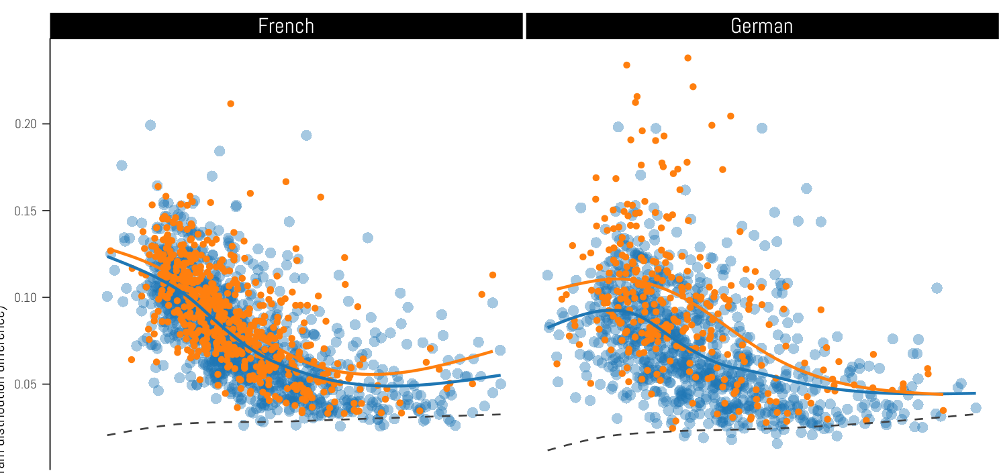

```{r setup, include=FALSE}
# set global chunk options


library(knitr)

#load("dane.RData")
#sie = sapply(dane, function(x) length(grep("\\b[ſśs][iy][eę]\\b", x)))
#dlugosc = sapply(dane, length)
#save(imieslow_uprzedni, zeby_aby_by, sie, ze, tedy, dlugosc, imieslow_wspolczesny, file = "results.RData")

load("results.RData")

my_blue = rgb(33, 102, 172, max = 255, alpha = 100)
my_orange = rgb(178, 24, 43, max = 255, alpha = 170)


daj_obrazek = function(leksem, gdzie_legenda = "topright") {

    daty = as.numeric(gsub("([0-9]{4}).*", "\\1", names(leksem)))
#    dlugosc = sapply(dane, length)
    wyniki = leksem / dlugosc * 100

#    wyniki = wyniki[650:951]
#    daty = daty[650:951]
#    dlugosc = dlugosc[650:951]

    wyniki = wyniki[744:951]
    daty = daty[744:951]
    dlugosc = dlugosc[744:951]

    wyniki_korpus = wyniki[-c(grep("_lem_", names(wyniki)))]
    dlugosc_korpus = dlugosc[-c(grep("_lem_", names(wyniki)))]
    daty_korpus = daty[-c(grep("_lem_", names(wyniki)))]
    wyniki_lem = wyniki[grep("_lem_", names(wyniki))]
    dlugosc_lem = dlugosc[grep("_lem_", names(wyniki))]
    daty_lem = daty[grep("_lem_", names(wyniki))]
    # correct the date of Dyktanda
    daty_lem[34] = 1978


    plot(wyniki_korpus ~ daty_korpus, col = my_blue, pch = 16, cex = 1,
        ylab = "frekwencja [%]", xlab = "rok")
#   points(wyniki_korpus ~ daty_korpus, col = my_blue, pch = 20, cex = 0.3)
    points(wyniki_lem ~ daty_lem, col = my_orange, pch = 16, cex = 1.3)
    model_korpus = lm(wyniki_korpus ~ daty_korpus, weights = dlugosc_korpus)
    lines(model_korpus$fitted.values ~ daty_korpus, col = "black", lwd = 2, lty = 9)
    model_lem = lm(wyniki_lem ~ daty_lem, weights = dlugosc_lem)
    lines(model_lem$fitted.values ~ daty_lem, col = "black", lwd = 2, lty = 1)
    legend(gdzie_legenda, legend = c("korpus porównawczy", "teksty St. Lema"), text.col = c("#2166AC", "#B2182B"), bty = "n", lty = c(9, 1), lwd = 2, col = "black")


#   library(mgcv)
    #mod_lm = gam(wyniki_korpus ~ daty_korpus, weights = dlugosc_korpus)
#   mod_gam = gam(wyniki_korpus ~ s(daty_korpus, bs = "cr"), weights = dlugosc_korpus)
    #summary(mod_lm)
    #lines(mod_lm$fitted.values ~ daty_korpus)
#   lines(mod_gam$fitted.values ~ daty_korpus)

#   mod_lem = gam(wyniki_lem ~ s(daty_lem, bs = "cr"), weights = dlugosc_lem)
#   lines(mod_lem$fitted.values ~ daty_lem, col = "red")
}


opts_chunk$set(cache = TRUE)
```


## wprowadzenie { .ijppan_section }


## First, what CLS is about

* Computational Literary Studies
* Aimed at analyzing (large amounts of) textual data...
* ... by computational techniques


## Imiesłów uprzedni

``` {R echo = FALSE, message = FALSE}

    daty = as.numeric(gsub("([0-9]{4}).*", "\\1", names(imieslow_uprzedni)))
    wyniki = imieslow_uprzedni / dlugosc * 100

    wyniki_korpus = wyniki[-c(grep("_lem_", names(wyniki)))]
    dlugosc_korpus = dlugosc[-c(grep("_lem_", names(wyniki)))]
    daty_korpus = daty[-c(grep("_lem_", names(wyniki)))]
    wyniki_lem = wyniki[grep("_lem_", names(wyniki))]
    dlugosc_lem = dlugosc[grep("_lem_", names(wyniki))]
    daty_lem = daty[grep("_lem_", names(wyniki))]
    # correct the date of Dyktanda
    daty_lem[34] = 1978

    plot(wyniki_korpus ~ daty_korpus, col = my_blue, pch = 16, cex = 1, ylim = c(0, 2),
        ylab = "frekwencja [%]", xlab = "rok")

```


## Imiesłów uprzedni

``` {R echo = FALSE, message = FALSE}
plot(wyniki_korpus ~ daty_korpus, col = my_blue, pch = 16, cex = 1, ylim = c(0, 2),
        ylab = "frekwencja [%]", xlab = "rok")
model_korpus = lm(wyniki_korpus ~ daty_korpus, weights = dlugosc_korpus)
lines(model_korpus$fitted.values ~ daty_korpus, col = rgb(1, 0, 0, 0.6), lwd = 5, lty = 1)
```


## Imiesłów uprzedni

``` {R echo = FALSE, message = FALSE}
plot(wyniki_korpus ~ daty_korpus, col = my_blue, pch = 16, cex = 1, ylim = c(0, 2),
        ylab = "frekwencja [%]", xlab = "rok")
model_korpus = lm(wyniki_korpus ~ daty_korpus, weights = dlugosc_korpus)
#lines(model_korpus$fitted.values ~ daty_korpus, col = "black", lwd = 2, lty = 9)

library(mgcv)
mod_gam = gam(wyniki_korpus ~ s(daty_korpus, bs = "cr"), weights = dlugosc_korpus)
lines(mod_gam$fitted.values ~ daty_korpus, col = rgb(1, 0, 0, 0.6), lwd = 5)
```


## Imiesłów uprzedni

``` {R echo = FALSE, message = FALSE}
plot(wyniki_korpus ~ daty_korpus, col = my_blue, pch = 16, cex = 1, ylim = c(0, 2),
        ylab = "frekwencja [%]", xlab = "rok")
model_korpus = lm(wyniki_korpus ~ daty_korpus, weights = dlugosc_korpus)
#lines(model_korpus$fitted.values ~ daty_korpus, col = "black", lwd = 2, lty = 9)

library(mgcv)
mod_gam = gam(wyniki_korpus ~ s(daty_korpus, bs = "cr"), weights = dlugosc_korpus)
lines(mod_gam$fitted.values ~ daty_korpus, col = rgb(1, 0, 0, 0.6), lwd = 5)
#polygon(x = c(1850, 1850, 2050, 2050), y = c(-1, 0.8, 0.8, -1))
polygon(x = c(1500, 1850, 1850, 2050, 2050, 1500), y = c(-1, -1, 0.8, 0.8, 3, 3), col = rgb(0, 0, 0, 0.1))
```


## Imiesłów uprzedni

``` {R echo = FALSE, message = FALSE}

    wyniki = wyniki[744:951]
    daty = daty[744:951]
    dlugosc = dlugosc[744:951]

    wyniki_korpus = wyniki[-c(grep("_lem_", names(wyniki)))]
    dlugosc_korpus = dlugosc[-c(grep("_lem_", names(wyniki)))]
    daty_korpus = daty[-c(grep("_lem_", names(wyniki)))]
    wyniki_lem = wyniki[grep("_lem_", names(wyniki))]
    dlugosc_lem = dlugosc[grep("_lem_", names(wyniki))]
    daty_lem = daty[grep("_lem_", names(wyniki))]
    # correct the date of Dyktanda
    daty_lem[34] = 1978

    plot(wyniki_korpus ~ daty_korpus, col = my_blue, pch = 16, cex = 1,
        ylab = "frekwencja [%]", xlab = "rok")
    model_korpus = lm(wyniki_korpus ~ daty_korpus, weights = dlugosc_korpus)
    lines(model_korpus$fitted.values ~ daty_korpus, col = "black", lwd = 2, lty = 9)
legend("topright", legend = c("korpus porównawczy", "teksty St. Lema"), text.col = c("#2166AC", "#B2182B"), bty = "n", lty = c(9, 1), lwd = 2, col = "black")
```


## Imiesłów uprzedni

``` {R echo = FALSE, message = FALSE}
    plot(wyniki_korpus ~ daty_korpus, col = my_blue, pch = 16, cex = 1,
        ylab = "frekwencja [%]", xlab = "rok")
    model_korpus = lm(wyniki_korpus ~ daty_korpus, weights = dlugosc_korpus)
    lines(model_korpus$fitted.values ~ daty_korpus, col = "black", lwd = 2, lty = 9)
legend("topright", legend = c("korpus porównawczy", "teksty St. Lema"), text.col = c("#2166AC", "#B2182B"), bty = "n", lty = c(9, 1), lwd = 2, col = "black")
points(wyniki_lem ~ daty_lem, col = my_orange, pch = 16, cex = 1.3)
```


## Imiesłów uprzedni


``` {R echo = FALSE, message = FALSE}


# load the dataset once more
load("results.RData")

#imieslow_uprzedni = sapply(dane, function(x) length(grep("[włl][ſs][żźz][iy]\\b", x)))
daj_obrazek(imieslow_uprzedni)
```


## Spójniki _aby_, _żeby_, _by_

``` {R echo = FALSE, message = FALSE}
#zeby_aby_by = sapply(dane, function(x) length(grep("\\b[żz]eby\\b|\\baby\\b|\\bby\\b", x)))
daj_obrazek(zeby_aby_by, "topleft")
```


## Zaimek zwrotny _się_

``` {R echo = FALSE, message = FALSE}
#sie = sapply(dane, function(x) length(grep("\\b[ſśs][iy][eę]\\b", x)))
daj_obrazek(sie, "topleft")
```


## Spójnik _że_

``` {R echo = FALSE, message = FALSE}
#ze = sapply(dane, function(x) length(grep("\\b[żz]e\\b", x)))
daj_obrazek(ze, "topleft")
```


## Spójnik _tedy_

``` {R echo = FALSE, message = FALSE}
#tedy = sapply(dane, function(x) length(grep("\\btedy\\b", x)))
daj_obrazek(tedy, "topleft")
```


## atrybucja autorska { .ijppan_section }


## stylistyczny odcisk palca

* Pojęcie stylistycznego odcisku palca
  * cechy języka niedostrzegalne gołym okiem
  * poza kontrolą autora (nieświadome)
  * odporne na imitację, parodię itp.
  * bardzo silny znacznik: częstości słów gramatycznych
  * chętnie wybierane przybliżenie: najczęstsze słowa
* Czy styl jest _jednoznacznie_ zależny od autora? (cf. kod DNA, odcisk palca, wzór na źrenicy, ...)


## Problemy atrybucyjne

* kim był Gall Anonim?
* czy Mikołaj Sęp-Szarzyński napisał zbiór erotyków?
* Ajschylos (_Prometeusz w okowach_), Eurypides (_Resus_)
* Owidiusz, Apulejusz
* John Milton, Francis Bacon
* Szołochow (_Cichy Don_)
* Harper Lee, Joseph Conrad, Ford Madox Ford  
* Elena Ferrante


## Roman de la Rose


* Roman de la Rose – Powieść o Róży
* XIII-wieczny starofrancuski poemat alegoryczny...
* ... napisany przez dwóch autorów:
  * Wilhelm z Lorris (ca. 1230)
  * Jan z Meun (ca. 1275)
* Wiemy, gdzie nastąpiła zmiana (w. 4058).


## Roman de la Rose

{height=500}


## Biblia królowej Zofii

* XV-wieczny przekład Biblii na polski
* Dwa tomy:
  * tom II rozmontowany przed XVII wiekiem.
  * tom I zaginiony (zniszczony?) w 1945
* Na szczęście mamy faksymile z 1930 r.


## Biblia królowej Zofii

{height=500}


## Biblia królowej Zofii

* Przełożony z czeskiego:
  * hebrajski -> łacina -> czeski -> polski
* Pięć rąk pisarskich
* Prawdopodobnie więcej niż jeden tłumacz
* **Wiele przemieszanych warstw stylistycznych**


## Biblia królowej Zofii

{height=500}


## idiolekt w idiolekcie { .ijppan_section }


## Zróżnicowanie języka bohaterów 


* Computation into criticism (John Burrows)
* 

* czy socjolingwistyczne zróżnicowanie tekstów da się odtworzyć w literaturze?


## Mocny idiolekt (kobiety)

{height=450}

## Mocny idiolekt (mężczyźni)

{height=450}

## Słaby idiolekt (mężczyźni)

{height=450}


##

* postaci kobiece bardziej charakterystyczne
* postaci drugoplanowe bardziej charakterystyczne


## Szekspir oraz dramat rosyjski

{height=450}


## Dramat francuski oraz niemiecki

{height=450}


## Różnicujące słowa

| fem.  |  masc.   | fem.   | masc.  | fem.      | masc. |
|-------|----------|--------|--------|-----------|-------|
| FR | | DE | | EN |
| vous  |   diable |    ach |    der |   husband |   the | 
| époux |   la     |      o |    die |       you |    of |
| mère  |   ami    |     du | teufel |      alas |  this |
| amant |   les    |  vater |    und |      love |   sir |
| mari  |  parbleu | mutter |    ein |  husbands |  and  |
| tante |  maître  |     er |    des |        me |   we  |
| hélas |  morbleu |   mich |     in |    romeo  |  king |
| coeur |      des |  liebe |    den |  lysander |   our |
| rivale |    amis |   mama |   kerl |    willow | their |
| ne    |   morgué |   papa | kaiser |   pisanio |  duke |
| ...   | ...      | ...    | ...    | ...       | ...   |


zaimki vs. rodzajniki 

słownictwo rodzinne vs. słownictwo polityczne


## { .no-background }

<!--

-->


