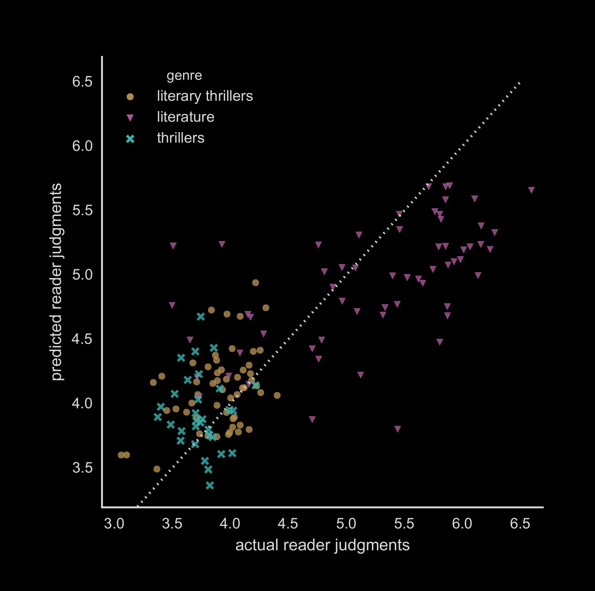

# introduction

<link rel="preconnect" href="https://fonts.googleapis.com">
<link rel="preconnect" href="https://fonts.gstatic.com" crossorigin>
<link href="https://fonts.googleapis.com/css2?family=Jost:ital,wght@0,100..900;1,100..900&display=swap" rel="stylesheet">

## First, what CLS is about

* Computational Literary Studies
* Aimed at analyzing (large amounts of) textual data...
* ... by computational techniques

## 1,000 Polish novels

{height=550}

## Perception of literary quality

{height=550}

## 

{height=700}

# CLS initiatives

## The community is growing

* SIG-DLS
* Computational Stylistics Group
* Federation of Stylometry Labs
* COST Action "Distant Reading"
* CLS INFRA
* Latent Reading Discord Server
* _Journal of Computational Literary Studies_
* _Cultural Analytics_
* ...

## 

{height=300}

* Special Interest Group: Digital Literary Studies (SIG-DLS)
	* devised during a workshop at DH2016
    * founded in 2017
    * part of ADHO (with nine other SIGs)
    * 175 members (2 Aug 2024)

##

* Distant Reading for European Literary History (COST Action CA16204), aimed to:
    * build a multilingual European Literary Text Collection (ELTeC) containing 2,500+ full-text novels
    * develop innovative computational methods of text analysis
    * rethinking fundamental concepts in literary theory and history

# CLS INFRA

## { .no-background }

Computational Literary Studies Infrastructure (CLS INFRA) is a four-year partnership to build a shared resource of high-quality data, tools and knowledge to aid new approaches to studying literature in the digital age.

This project has received funding from the European Union’s Horizon 2020 research and innovation programme under grant agreement No 101004984.

## CLS INFRA project

* text collections (corpora)
    * quality
    * metadata
    * conversion
* methodology
    * tools (NLP, datavis, ...)
    * methodological considerations
    * bibliographic survey
* network of scholars
    * training schools
    * short-term research stays (TNA)

## Program

* 9.30-11.30 Presentation of CLS INFRA outcomes
    * _11.30-12.00 Coffee break_
* 12.00-14.00  TNA Fellows’ presentations I
    * _14.00-15.00 Lunch_
* 15.00-16:30  TNA Fellows’ presentations II
    * _16.30-17.00 Coffee break_
* 17.00-18.00 The Future(s) of CLS – panel discussion
    * _18.30–23.59 discussion continues at ‘Kufle & Widelce’_

## { .no-background }

