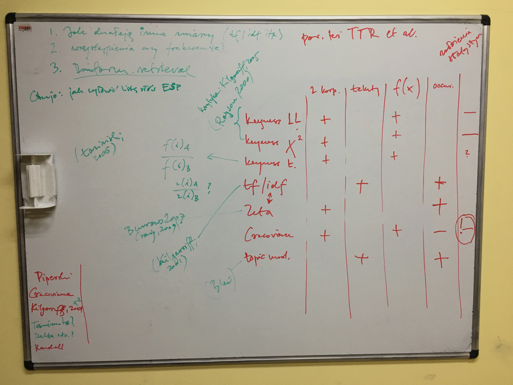
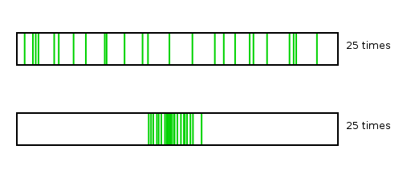
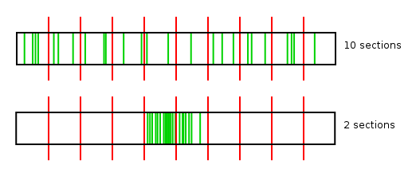

``` {r setup, include = FALSE}
library(knitr)
opts_chunk$set(cache = FALSE)
```


## { .white }



<p class="white" style="font-size: 180%">
<b>Nie czytając, poznać treść,</b> </br> <b>czyli o metodach</b> </br> <b>automatycznej identyfikacji</b> </br> <b>słów kluczowych</b>
</p>
<p class="white" style="font-size: 120%">
Maciej Eder
</p>
<p class="white" style="font-size: 90%; margin-bottom: 10em;">
Instytut Języka Polskiego PAN
</p>


## Wprowadzenie

* Nauki o informacji:
  * Jak “przeczytać” duży zbiór tekstów, np. całe archiwum?
* Językoznawstwo:
  * Czy można coś powiedzieć o znaczeniu słowa na podstawie jego frekwencji?

---


## Czy idealne słowo kluczowe może istnieć?

* nauki o informacji:
    * “znaczące” słowa
    * o czym jest dany tekst
* stylistyka:
    * czy warstwa stylistyczna też ma znaczenie?
    * jeśli jakiś autor nadużywa “się”, to czy powinniśmy to słowo uznać za kluczowe?

---


## Podstawowe założenia

* Te same słowa w różnych tekstach występują z różną częstością. 
* Frekwencja danego słowa w dwóch podkorpusach _zawsze_ będzie się różnić.
* Istotą jest znalezienie tych słów, które w obu podkorpusach różnią się _w istotnym stopniu_. 
* Słowo kluczowe = słowo znacząco częstsze w danym tekście.

---


## Przykładowy artykuł

Wystawę prezentującą dorobek Tadeusza Kantora obejrzą mieszkańcy Sao Paulo (Brazylia). Ekspozycja "Maszyna Kantor. Wystawianie, perforowanie, montowanie, malowanie i inne sposoby produkcji" otwarta zostanie 18 sierpnia. W tym roku przypada 100. rocznica urodzin artysty. Jak poinformował Błażej Filanowski z Muzeum Sztuki w Łodzi - jednego ze współorganizatorów wystawy - ekspozycja będzie "największą, komplementarną prezentacją dorobku tego twórcy poza granicami kraju, jak i jego pierwszą retrospektywą w Ameryce Południowej". W specjalnie przygotowanej przestrzeni pojawi się ponad 130 obiektów: oryginały i repliki rekwizytów scenicznych, dzieła malarskie, rysunki, asamblaże, a także bardzo bogata dokumentacja fotograficzna i filmowa happeningów, akcji oraz...

---


## 15 najsilniejszych słów kluczowych

kantora, kantor, sztuki, cricot, paulo, sao, teatru, krakowskiej, muzeum, ekspozycja,
twórczości, krakowie, happeningów, krzysztofory, kuratorów, ...

---


## Prosty pomysł...

> Rok 1647 był to dziwny rok, w którym rozmaite znaki na niebie i ziemi zwiastowały jakoweś klęski i nadzwyczajne zdarzenia.

rok zwiastowały jakieś zdarzenia nadzwyczajne klęski znaki rozmaite dziwny niebie ziemi którym był i to na w

``` {r echo = FALSE, message = FALSE, fig.width = 9, fig.height = 3}
par(mar = c(2, 4, 0, 5)) # default margins are too large!
plot(c(23.396, 18.944, 15.631, 14.622, 14.331, 14.008, 12.879, 12.140, 11.607, 10.752, 7.429, 7.363, 4.352, 1.782, 1.457, 0.843, 0.625), ylab = "keyness", xlab = "", ylim = c(0, 30), type = "p", lwd = 2, col = "blue")
```

---


## Słowa kluczowe vs. pozostałe

kantora, kantor, sztuki, cricot, paulo, sao, teatru, krakowskiej, muzeum, ekspozycja,
twórczości, krakowie, happeningów, krzysztofory, kuratorów, plastyków, 
scenografem, wielopole, wystawy, aktorem, malarza, muzeów, reżyserem, ..., ..., ..., ...,
**a, są, jak, jej, również, która, bardzo, tej, do, na, w, się**

---


## 

<h2 class="shout">Metoda LL</h2>

---


## Analiza słów kluczowych

* analiza słów kluczowych za pomocą zlogarytmowanej funkcji wiarygodności (ang. _log likelihood_)
* szeroko stosowana w ogólnodostępnym oprogramowaniu: AntConc, WordSmith Tools, etc.


``` {r include = FALSE}
library(stylo)

tokenized.texts = load.corpus.and.parse(files = c("lem_rozprawy_1974.txt", "lem_solaris_1961.txt"))

freqlist = make.frequency.list(tokenized.texts)
freqs = make.table.of.frequencies(tokenized.texts, freqlist)
# getting rid of single letters
#freqs = freqs[, -c(grep("\\b[a-z]\\b", colnames(freqs)))]
```


---


## Słowa kluczowe LL

``` {r echo = FALSE, message = FALSE}
freqs1 = freqs[1,]
freqs2 = freqs[2,]

#words = factor(union(names(freqs1), names(freqs2)))
words = union(names(freqs1), names(freqs2))

freqs1 = freqs1[words]
freqs2 = freqs2[words]

names(freqs1) = words
names(freqs2) = words
freqs1[is.na(freqs1)] = 0
freqs2[is.na(freqs2)] = 0

N1 = sum(freqs1) # total size of the corpus 1
N2 = sum(freqs2) # corpus 2
E1 = N1 * (freqs1 + freqs2) / (N1 + N2) # expected values
E2 = N2 * (freqs1 + freqs2) / (N1 + N2)

O1 = freqs1 * log(freqs1 / E1) # observed values
O1[is.na(O1)] = 0
O2 = freqs2 * log(freqs2 / E2)
O2[is.na(O2)] = 0

G2 = 2 * (O1 + O2)

# antimarkers multiplied by -1, to get them in reverse order
G2[(freqs2 / N2) >= (freqs1 / N1)] = G2[(freqs2 / N2) >= (freqs1 / N1)] * -1

G2 = sort(unclass(G2), decreasing = TRUE)


#names(G2[1:100])
names(G2[nchar(names(G2)) > 1])[1:100]
```

---


## 

<h2 class="shout">Zeta</h2>

---


## Zeta: założenia



---


## Zeta: rozwiązania



$$\zeta_{(a,b)} = \left(\frac{f_{(a)} - f_{(b)}}{100}\right) +1$$

(Burrows, 2007; Craig, 2009)

---


## Zeta: wyniki

``` {r echo = FALSE, message = FALSE}
a = oppose(primary.corpus = list(tokenized.texts[[1]], tokenized.texts[[1]]), secondary.corpus = list(tokenized.texts[[2]], tokenized.texts[[2]]))
```

---


## Słowa kluczowe obliczone metodą Zeta

``` {r echo = FALSE, message = FALSE}
#a$words.preferred[1:100]
#a$words.avoided[1:100]

a$words.preferred[nchar(a$words.preferred) > 1][1:100]
```

---


## 

<h2 class="shout">Krakowiana</h2>

---


## { .white }


## Szekspir vs. Conan Doyle


word      | count | word      | count
--------- | ----- | --------- | -----
the       | 27595 | the       | 28662
and       | 26735 | and       | 14109
I         | 22538 | of        | 13229
...       | ...   | ...       | ...
northerly | 1     | revolvers | 1


---


##


---


##


---


## Frekwencja **oraz** pozycja


$$P_{r(x)} = \frac{1}{N}\sum_{i=1}^{r(x)}f(i)$$

co jednocześnie zapewnia, że wartości znajdą się w przedziale {0, 1}.


---

## Frekwencja **oraz** pozycja

bardziej elegancka wersja omawianego pomysłu:

$$P_{r(x)} = \left( \frac{1}{N}\sum_{i=1}^{r(x)}f(x_{i}) \right) - f(x)$$

która jest oczywiście jednoznaczna z poniższym wzorem:

$$P_{r(x)} = \frac{1}{N}\sum_{i=1}^{r(x-1)}f(x_{i})$$


--- 


## Interpretacja algebraiczna

Z powyższych wzorów wynika, że pozycja danego słowa $P_{r(x)}$ jest po prostu **sumą skumulowaną frekwencji wszystkich słów poprzedzających**. 


``` {r include = FALSE}
freqs1 = make.frequency.list(tokenized.texts[[1]], value = TRUE)
freqs2 = make.frequency.list(tokenized.texts[[2]], value = TRUE)

#literowki = grep("\\b[a-z]\\b", names(freqs1))
#freqs1 = freqs1[-c(literowki)]
#freqs2 = freqs2[-c(literowki)]

freqs1 = cumsum(freqs1/100)
freqs2 = cumsum(freqs2/100)

freqs21 = freqs2[names(freqs1)]
freqs21[is.na(freqs21)] = 1
names(freqs21) = names(freqs1)
freqs11 = freqs1[names(freqs2)]
freqs11[is.na(freqs11)] = 1
names(freqs11) = names(freqs2)

x1 = (freqs21 - freqs1)
x2 = (freqs11 - freqs2)
x1 = x1[names(freqs1)]
x2 = x2[names(freqs2)]
```

---

## Słowa wydobyte nową metodą

``` {r echo = FALSE, message = FALSE}
#names(sort(x1, decreasing = TRUE)[1:100])

names(sort(x1, decreasing = TRUE))[nchar(names(sort(x1, decreasing = TRUE))) > 1][1:100]

#sort(x2, decreasing = TRUE)[1:100]
#plot(sort(x1, decreasing = TRUE))
```


---


## 

<h2 class="shout">Porównanie</h2>

---


## Słowa kobiece, słowa męskie (w literaturze)

* 50 powieści napisanych przez kobiety
    * Beczkowska, Deotyma, Dmochowska, Kossak, Kuncewiczowa, Mniszkówna, Orzeszkowa, Zapolska, ...
* 50 powieści napisanych przez mężczyzn
    * Bałucki, Berent, Dygasiński, Iwaszkiewicz, Kaczkowski, Mostowicz, Prus, Reymont... 
* Porównanie słów kluczowych następującymi metodami:
    * Analiza słów kluczowych LL
    * Krakowiana
    * Zeta

``` {r include = FALSE}
load("gender_keywords_PL.RData")
```
---


## Słowa kluczowe LL

* kobiece (?)

``` {r echo = FALSE, message = FALSE}
names(keywords_preferred)[1:35]
```

* męskie (?)

``` {r echo = FALSE, message = FALSE}
names(keywords_avoided)[1:35]
```

---


## Krakowiana

* kobiece (?)

``` {r echo = FALSE, message = FALSE}
names(cracovian_preferred)[1:35]
```

* męskie (?)

``` {r echo = FALSE, message = FALSE}
names(cracovian_avoided)[1:35]
```


---


## Zeta

* słowa kobiece

``` {r echo = FALSE, message = FALSE}
zeta_preferred[1:34]
```

* słowa męskie

``` {r echo = FALSE, message = FALSE}
zeta_avoided[1:34]
```


---


## Lematyzacja

Nie chodzi tutaj — u kaduka! — o herb ani o szeregi przodków podgolonych, z sarmackimi wąsami i przy karabelach — ani wydekoltowane prababki w fiokach. Ojciec i matka — otóż i cały rodowód, jak to jest u nas, w dziejach nowoczesnych ludzi bez wczoraj. Z konieczności wzmianka o jednym dziadku, z musu notka o jednym jedynym pradziadku. Chcemy uszanować nasyconą do pełna duchem i upodobaniem semickim awersję ludzi nowoczesnych do obciążania sobie pamięci wiadomościami, w którym kościele czy na jakim cmentarzu dany dziadek spoczywa. Otóż — ojciec nosił nazwisko Baryka, imię Seweryn, które na rozłogach rosyjskich zbytnio nie raziło. „Siewierian Grigoriewicz Baryka” — uchodziło wtedy, prześlizgiwało się niepostrzeżenie.

---

## Lematyzacja

nie chodzić tutaj — u kaduk — o herb ani o szereg przodek podgolony, z sarmacki wąs i przy karabela — ani wydekoltowany prababka w fiok. ojciec i matka — otóż i cały rodowód, jak to być u ja, w dzieje nowoczesny człowiek bez wczoraj. z konieczność wzmianka o jeden dziadek, z mus notka o jeden jedyny pradziadek. chcieć uszanować nasycony do pełen duch i upodobanie semicki awersja człowiek nowoczesny do obciążać sobie pamięć wiadomość, w który kościół czy na jaki cmentarz dany dziadek spoczywać. otóż — ojciec nosić nazwisko Baryka, imię Seweryn, który na rozłoga rosyjski zbytnio nie razić. „Siewierian Grigoriewicz Baryka” — uchodzić wtedy, prześlizgiwać się niepostrzeżenie.

---


## Słowa lematyzowane

``` {r include = FALSE}
load("gender_keywords_PL_lemmas.RData")
```

* kobiece:

``` {r echo = FALSE, message = FALSE}
zeta_lemmas_preferred[1:34]
```

* męskie:

``` {r echo = FALSE, message = FALSE}
zeta_lemmas_avoided[1:34]
```

---


## 

<h2 class="shout">Podsumowanie</h2>

---


## Podsumowanie

* Słowa kluczowe to w istocie **wszystkie słowa**, tyle że uszeregowane od najbardziej do najmniej istotnego.
* Nie ma czytelnej granicy miedzy słowami istotnymi i pozostałymi.
* Wydobyte słowa kluczowe zależą od użytej metody.
* Nowa metoda (krakowiana) równie skuteczna, lecz znacznie prostsza od innych.
* Zeta jest metodą wartą bliższego oglądu.


---


## Dziękuję za uwagę

* maciejeder@gmail.com
* [\@MaciejEder](https://twitter.com/MaciejEder)
* [https://github.com/computationalstylistics](https://github.com/computationalstylistics)


