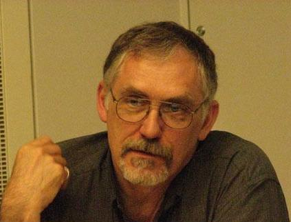

## introduction { .cls_section }

## looking back

* Computational Stylistics @ Wollombi
    * Wollombi 2015
* FoSL Meeting
    * Żabnica 2016
* Stylometry Summit
    * Amsterdam 2019
* Text Analysis Retreat
    * Vienna 2023

## David L. Hoover

{height=550}

## good old times...

{height=550}

## some initiatives

* Computational Stylistics Group
* SIG-DLS 
* Federation of Stylometry Labs
* COST Action "Distant Reading"
* CLS INFRA
* ...

## Federation of Stylometry Labs

{height=550}

## CLS INFRA { .cls_section }

An infrastructural project for computational literary studies, founded by Horizon 2020 scheme

## CLS INFRA project

* text collections (corpora)
    * quality
    * metadata
    * conversion
* methodology
    * tools (NLP, datavis, ...)
    * tool chains
    * methodological considerations
    * bibliographic survey
* network of scholars
    * training schools
    * short-term research stays
    * collaboration with COST Action

## ELTeC corpus

{height=550}

## DraCor

{height=550}

## Overarching idea is to connect...

* People
  * To establish a network of CLS researchers
* Data
  * To consolidate existing high-quality corpora...
  * ...covering prose, drama and poetry
* Tools
  * To build a chain of NLP tools to analyze texts
* Methods
  * To provide a survey of state-of-the-art methods

## The project's structure

{height=500}

## The team (30+ people)

Julie Birkholz, Ingo Börner, Joanna Byszuk, Sally Chambers, Vera Maria Charvat, Silvie Cinková, Tess Dejaeghere, Anna Dijkstra, Julia Dudar, Matej Ďurčo, Maciej Eder, Jennifer Edmond, Evgeniia Fileva, Frank Fischer, Serge Heiden, Michal Křen, Bartłomiej Kunda, Michał Mrugalski, Ciara Murphy, Carolin Odebrecht, Marco Raciti, Salvador Ros, Christof Schöch, Artjoms Šeļa, Toma Tasovac, Justin Tonra, Erzsébet Tóth-Czifra, Peer Trilcke, Karina van Dalen-Oskam, Lisanne van Rossum, ...

## activities { .cls_section }

## training schools

* Prague 2022
    * NLP tools
    * dates: 6–9 June 2022
    * 25 participants on site
    * many more remotely
* Madrid 2023
    * text analysis
    * dates: 10-11 May 2023
* Vienna 2024
    * corpus queries
    * tentative dates: 10–12 June 2024

## TNA

* transnational access
* short-term research stays...
* in one of 6 institutions:
    * NUI Galway
    * Uni Potsdam
    * Uni Trier
    * UNED Madrid
    * OEAW Vienna
    * Charles Uni, Prague
* everyone eligible
* two calls every year

## deliverables { .cls_section }

## deliverables published

* 3.1 Report on the methodological baseline for (computational) literary studies
* 3.2 Survey of methods
* 4.1 Report on the skills matrix for computational literary studies
* 5.1 Review of the data landscape
* 6.1 Assembly of existing data
* 7.1 On programmable corpora and DraCor
* 8.1 Tools for basic natural language processing (NLP) tasks
* ...

## survey of methods

{height=500}

## { .no-background }

