# [https://tinyurl.com/zampolli2026](https://tinyurl.com/zampolli2026)

{height=300}


# A bit of a context

## Krakow, Poland

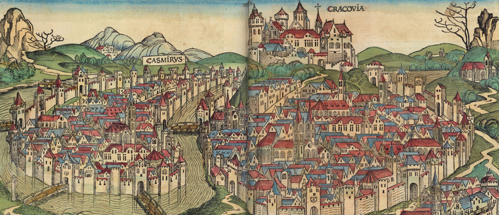


## Krakow's commitment to DH

- Wincenty Lutosławski (1863--1954) lived there
    - introduced the notion of "stylometry"
- home of Computational Stylistics Group
- hosted Digital Humanities 2016
- hosted TEI 2025
- will host EADH 2026


# The team


## Jan the Great

::: columns
::: {.column width="70%"}
- seminal works in text analysis & stylometry
- revolutionized translation studies
- introduced large-scale visualizations of literary texts 
:::
::: {.column width="30%"}

:::
:::


## Joanna the Strong

::: columns
::: {.column width="70%"}
- pioneering work on multimodal stylometry
- novel insights to film studies
- pinpointed the show-runners behind "Doctor Who" 
:::
::: {.column width="30%"}

:::
:::


## Artjoms the Mastermind

::: columns
::: {.column width="70%"}
- cutting-edge studies in versification... 
- ... in the context of cultural evolution
- developed the repository PoeTree
- runs "Latent Reading" Discord server
:::
::: {.column width="30%"}

:::
:::


## Laura the Wise

::: columns
::: {.column width="70%"}
- novel insights to the Spanish Golden Age
- verified the authorship of "La Segunda Celestina"
- explored the style of Gustavo Adolfo Bécquer
:::
::: {.column width="30%"}

:::
:::


## Jacek the Raising Star

::: columns
::: {.column width="70%"}
- transformative work in Hindi vs Sanskrit vs Urdu
- contributions to distributional semantics
- discovered latent structure of synonyms
:::
::: {.column width="30%"}

:::
:::


## Aleksandra the Genius 

::: columns
::: {.column width="70%"}
- novel work in stylometry and AI
- fluent in Java, Python, R, and more
- introduced a method of versification scansion
:::
::: {.column width="30%"}

:::
:::


## Computational Stylistics Group


- no formal structure
- no (serious) DH environment
- hosted (?) by a few entities
    - an institute for linguistics
    - a department of English Studies
    - a depratment of Medieval Studies
- initially, no funding


## Bottom-up, lightweight

- running a series of talks "Digital Humanities Lunch"
- running an informal Reading Group 
- running _ad hoc_ seminars
- committed to R as free software
- sharing the code and the datasets
- committed to open source & open science
- minimal computing in practice!


## Required equipment

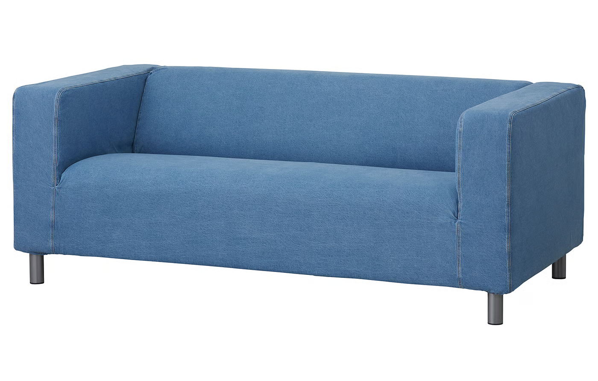{height=450}


# Computational stylistics


## 66 English Victorian novels

{height=550}


## Text analysis: two approaches

- focusing on the content
    - what my corpus is about?
    - how to "read" through a large library
    - approaches: topic modeling, keywords analysis
- focusing on stylistic similarities 👈
    - why my texts form groups?
    - how to detect different stylistics "signals"
    - approaches: multivariate text classification methods


## Theoretical foundations

- "Computation into criticism" (John Burrows)
- "Algorithmic criticism" (Steve Ramsay)
- "Distant reading" (Franco Moretti)
- "Macroanalysis" (Matt Jockers)
- "Riddle of literary quality" (Karina van Dalen-Oskam)


# Fictional characters' voices


## A collaborative paper

* Artjoms Šeļa
* Ben Nagy
* Joanna Byszuk
* Laura Hernández-Lorenzo
* Botond Szemes
* Maciej Eder

> Šeļa, A., Nagy, B., Byszuk, J., Hernández-Lorenzo, L., Szemes, B. and Eder, M. (2024). From stage to page: language independent bootstrap measures of distinctiveness in fictional speech. [https://arxiv.org/abs/2301.05659](https://arxiv.org/abs/2301.05659)


## Fictional characters: why bother?


* _Computation into criticism_ (John Burrows)
  * researched Jane Austen’s characters
* Can a good author differentiate voices?
* Are there any overall trends?
* Do distinctive fictional voices mimic some general sociolinguistic phenomena?


## Assumptions

* Authorship attribution methods to distinguish characters
* Telling apart particular characters should be doable in plays
* Corpus used: DraCor
  * Shakespeare (37 plays)
  * Russian drama (212 plays)
  * French drama (1560 plays)
  * German drama (592 plays)


## DraCor


## Strong idiolects (women)

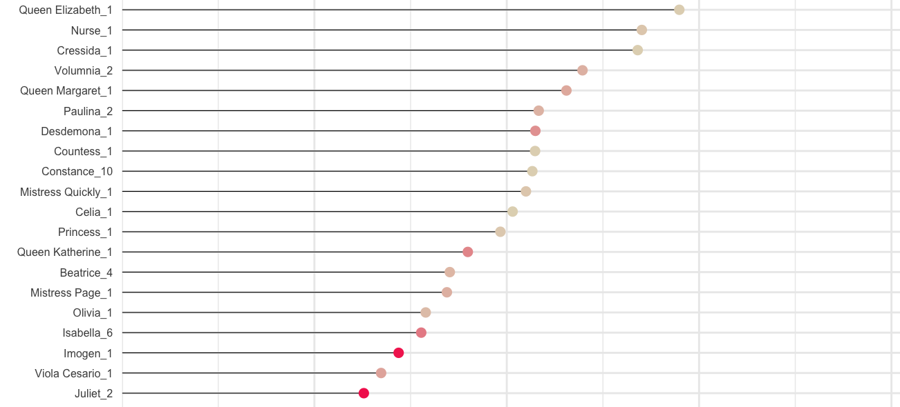


## Strong idiolect (men)

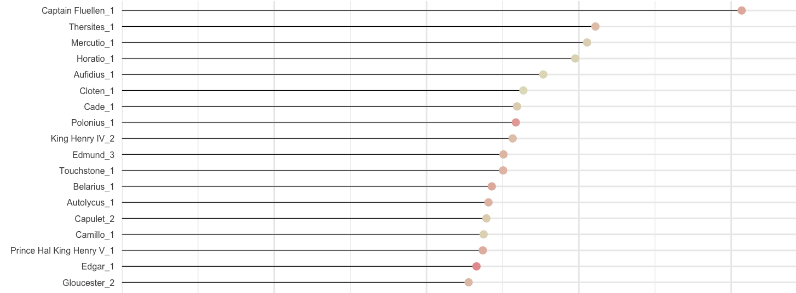

## Weak idiolect (men)

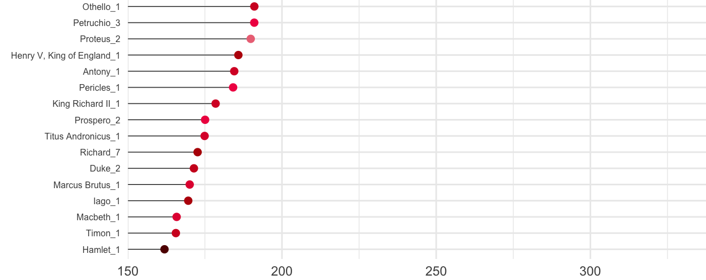


## Preliminary results

* Female characters more distinguishable than males
* Secondary characters more distinguishable than protagonists


## Shakespeare and Russian plays

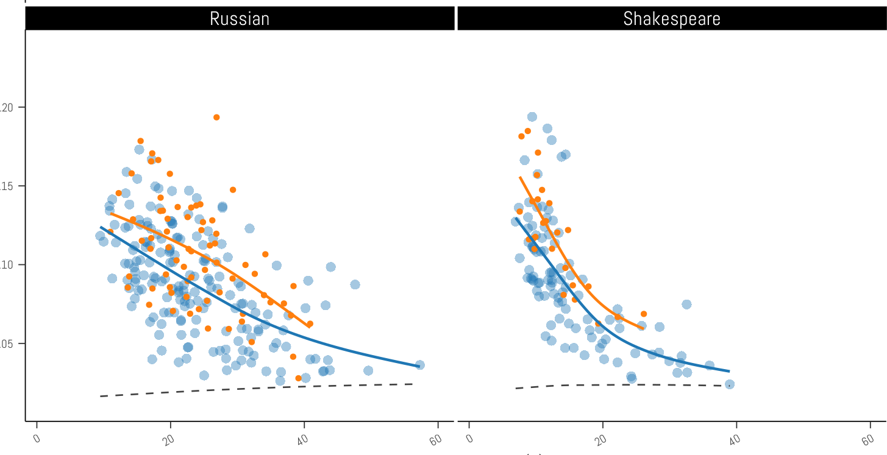{height=450}


## French plays, German plays

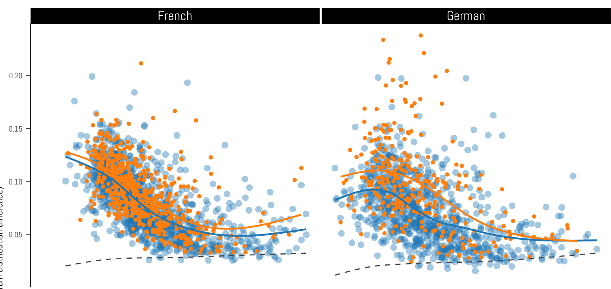{height=450}


## Further observations

* Female characters distinguishable...
* ... despite the language and epoch
* Because the authors were almost exclusively male?


##

::: {#tbl-panel layout-ncol=3}

| fem.  |  masc.   |
|-------|----------|
| vous  |  diable  |
| époux |  la      |
| mère  |  ami     |
| amant |  les     |
| mari  |  parbleu |
| tante |  maître  |
| hélas |  morbleu |
| coeur |  des     |
| rivale |  amis   |
| ne    |  morgué  |
| ...   | ...      |

: French {#tbl-first}

| fem.   | masc.  |
|--------|--------|
|    ach |    der |
|      o |    die |
|     du | teufel |
|  vater |    und |
| mutter |    ein |
|     er |    des |
|   mich |     in |
|  liebe |    den |
|   mama |   kerl |
|   papa | kaiser |
| ...    | ...    |

: German {#tbl-second}


| fem.      | masc. |
|-----------|-------|
|   husband |   the | 
|       you |    of |
|      alas |  this |
|      love |   sir |
|  husbands |  and  |
|        me |   we  |
|     romeo |  king |
|  lysander |   our |
|    willow | their |
|   pisanio |  duke |
| ...       | ...   |

: English {#tbl-third}


Most distinctive words
:::


##

::: {#tbl-panel layout-ncol=3}

| fem.  |  masc.   |
|-------|----------|
| <span style="color: red;">vous</span>  |  diable  |
| époux |  <span style="color: blue;">la</span>      |
| mère  |  ami     |
| amant |  <span style="color: blue;">les</span>     |
| mari  |  parbleu |
| tante |  maître  |
| hélas |  morbleu |
| coeur |  <span style="color: blue;">des</span>     |
| rivale |  amis   |
| ne    |  morgué  |
| ...   | ...      |

: French {#tbl-first}

| fem.   | masc.  |
|--------|--------|
|    ach |    <span style="color: blue;">der</span> |
|      o |    <span style="color: blue;">die</span> |
|     <span style="color: red;">du</span> | teufel |
|  vater |    und |
| mutter |    <span style="color: blue;">ein</span> |
|     <span style="color: red;">er</span> |    <span style="color: blue;">des</span> |
|   mich |     in |
|  liebe |    <span style="color: blue;">den</span> |
|   mama |   kerl |
|   papa | kaiser |
| ...    | ...    |

: German {#tbl-second}


| fem.      | masc. |
|-----------|-------|
|   husband |   <span style="color: blue;">the</span> | 
|       <span style="color: red;">you</span> |    of |
|      alas |  this |
|      love |   sir |
|  husbands |  and  |
|        <span style="color: red;">me</span> |   <span style="color: blue;">we</span>  |
|     romeo |  king |
|  lysander |   <span style="color: blue;">our</span> |
|    willow | their |
|   pisanio |  duke |
| ...       | ...   |

: English {#tbl-third}


Pronouns vs. articles
:::


##

::: {#tbl-panel layout-ncol=3}

| fem.  |  masc.   |
|-------|----------|
| vous  |  <span style="color: blue;">diable</span>  |
| <span style="color: red;">époux</span> |  la      |
| <span style="color: red;">mère</span>  |  ami     |
| amant |  les     |
| <span style="color: red;">mari</span>  |  parbleu |
| tante |  <span style="color: blue;">maître</span>  |
| hélas |  morbleu |
| coeur |  des     |
| rivale |  <span style="color: blue;">amis</span>   |
| ne    |  morgué  |
| ...   | ...      |

: French {#tbl-first}

| fem.   | masc.  |
|--------|--------|
|    ach |    der |
|      o |    die |
|     du | <span style="color: blue;">teufel</span> |
|  <span style="color: red;">vater</span> |    und |
| <span style="color: red;">mutter</span> |    ein |
|     er |    des |
|   mich |     in |
|  liebe |    den |
|   <span style="color: red;">mama</span> |   <span style="color: blue;">kerl</span> |
|   <span style="color: red;">papa</span> | <span style="color: blue;">kaiser</span> |
| ...    | ...    |

: German {#tbl-second}


| fem.      | masc. |
|-----------|-------|
|   <span style="color: red;">husband</span> |   the | 
|       you |    of |
|      alas |  this |
|      love |   <span style="color: blue;">sir</span> |
|  <span style="color: red;">husbands</span> |  and  |
|        me |   we  |
|     romeo |  <span style="color: blue;">king</span> |
|  lysander |   our |
|    willow | their |
|   pisanio |  <span style="color: blue;">duke</span> |
| ...       | ...   |

: English {#tbl-third}


Family relations vs. public sphere
:::


# More examples 👇

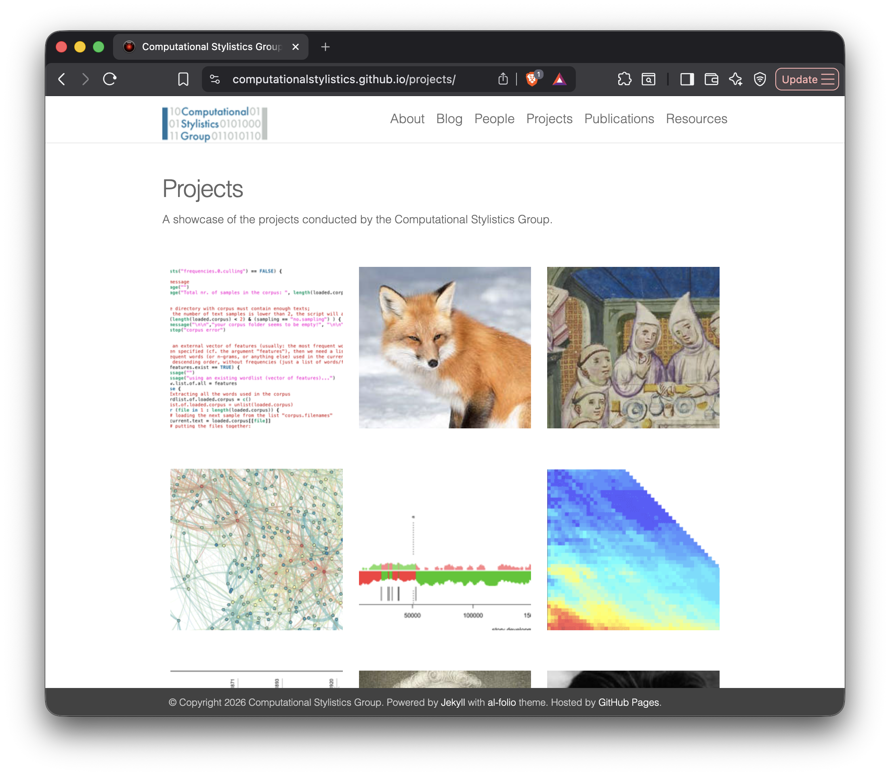


# Infrastructures in DH


## ELTeC: a corpus novels

{height=600}


## DraCor: a corpus of plays

{height=600}


## PoeTree: a corpus of poetry

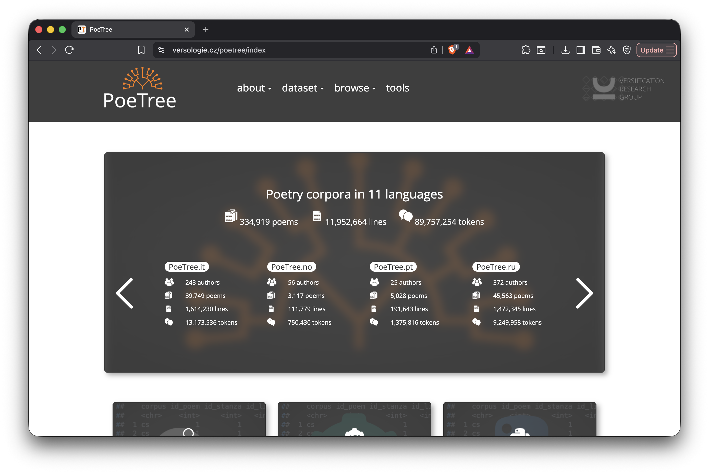{height=600}


# Beyond language resources


## TEI markup

``` xml
<sp xml:id="sp-0527" who="#Romeo_Rom">
    <speaker xml:id="spk-0527">ROMEO </speaker>
    <l xml:id="ftln-0527" n="1.4.45" part="I">Nay, that’s not so. </l>
</sp>
<sp xml:id="sp-0528" who="#Mercutio_Rom">
    <speaker xml:id="spk-0528">MERCUTIO </speaker>
    <l xml:id="ftln-0528" n="1.4.46" part="F">I mean, sir, in delay </l>
    <l xml:id="ftln-0529" n="1.4.47">We waste our lights; in vain, light lights by day. </l>
    <l xml:id="ftln-0530" n="1.4.48">Take our good meaning, for our judgment sits </l>
    <l xml:id="ftln-0531" n="1.4.49">Five times in that ere once in our five wits. </l>
</sp>
<sp xml:id="sp-0532" who="#Romeo_Rom">
    <speaker xml:id="spk-0532">ROMEO </speaker>
    <l xml:id="ftln-0532" n="1.4.50">And we mean well in going to this masque, </l>
    <l xml:id="ftln-0533" n="1.4.51" part="I">But ’tis no wit to go. </l>
</sp>
<sp xml:id="sp-0534" who="#Mercutio_Rom">
    <speaker xml:id="spk-0534">MERCUTIO </speaker>
    <l xml:id="ftln-0534" n="1.4.52" part="F">Why, may one ask? </l>
</sp>
<sp xml:id="sp-0535" who="#Romeo_Rom">
    <speaker xml:id="spk-0535">ROMEO </speaker>
    <l xml:id="ftln-0535" n="1.4.53" part="I">I dreamt a dream tonight. </l>
</sp>

```


## Voyant Tools

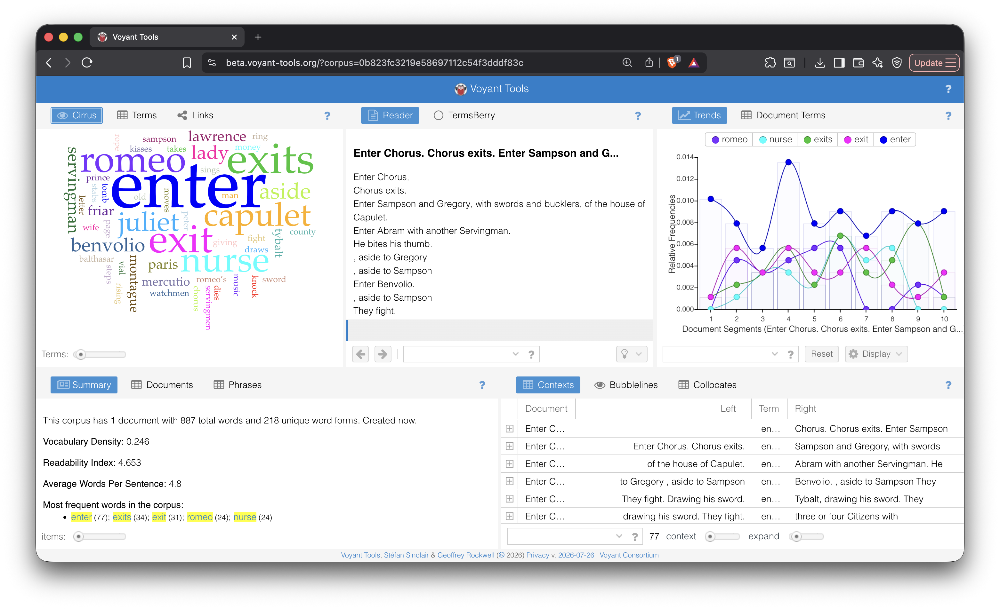


## The grammar of DH

- programming languages
    - Python
    - R
    - HTML, XML
    - . . .

- interoperable standards
    - TEI &nbsp; &nbsp; &nbsp; &nbsp; &nbsp; &nbsp; [👉 _Zampolli Prize 2017_]
    - Linked Open Data
    - IIIF
    - . . . 

## The grammar of DH

- methods
    - topic modeling
    - network analysis
    - NLP techniques
    - . . . 

- tools
    - Voyant Tools &nbsp; &nbsp; &nbsp; [👉 _Zampolli Prize  2022_]
    - Transkribus
    - Zotero
    - Distant Viewing Explorer
    - Stylo &nbsp; &nbsp; &nbsp; &nbsp; &nbsp; &nbsp; &nbsp; [👉 _Zampolli Prize  2026_]
    - . . .


## The grammar of DH

- teaching environments
    - ESU
    - DHSI &nbsp; &nbsp; &nbsp; &nbsp; [👉 _Zampolli Prize 2014_]
    - Programming Historian
    - Dariah Campus
    - . . .

- funding agencies
    - SSHRC &nbsp; &nbsp; &nbsp; [👉 _Zampolli Prize 2011_]
    - NEH &nbsp; &nbsp; &nbsp; &nbsp; [👉 _Busa Prize 2016_]
    - ERC
    - NCN, FWO, NWO, DFG, ETAG, NRF Korea, JSF, ...
    - . . . 


# Stylo


## Stylo: a package for text analysis

- an R package
- written in R and run in R
- simple
- fast
- offers a few extensions
- runs in command-line mode 🙀
- however, requires only three lines of code
- no programming skills needed!


## How to run stylo

``` R
library(stylo)
setwd("the/path/to/my/corpus")
stylo()
```


## Graphical User Interface (GUI)

{height=400}


## Set your parameters

{height=400}


## Hierarchical cluster analysis

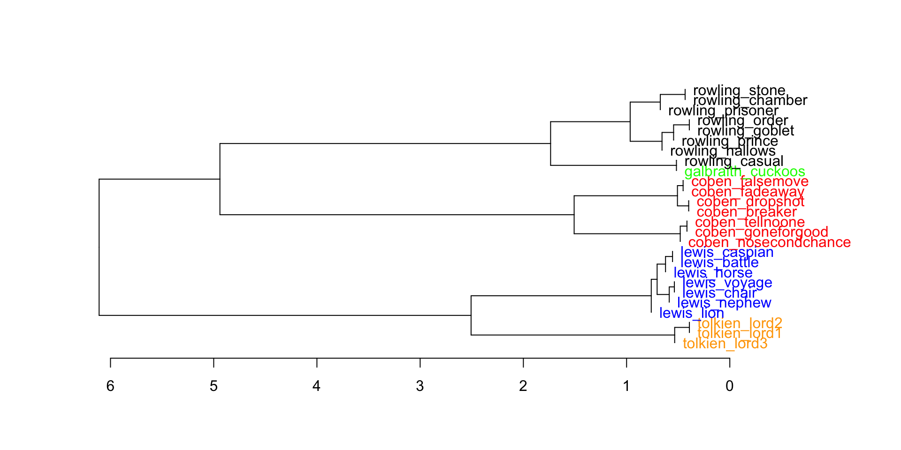


## Bootstrap consensus tree

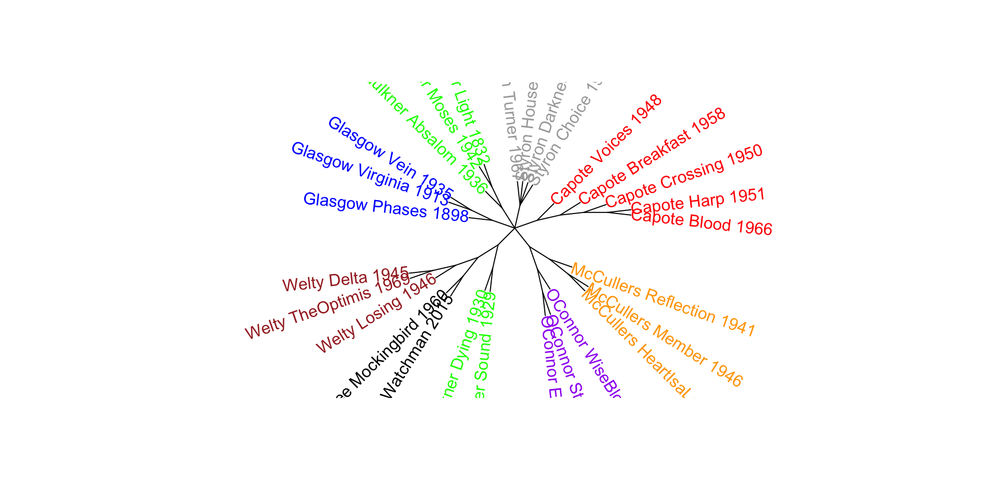


## GitHub & documentation

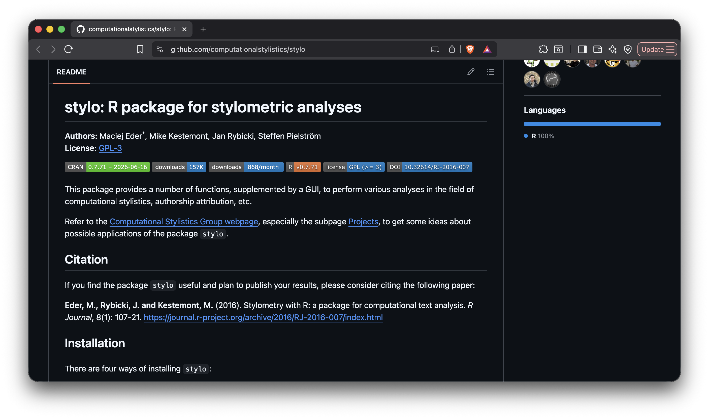


# Teaching environment


## Workshops and summer schools

- Digital Humanities Summer Institute (DHSI)
    - Victoria, 2016--2024
    - Montréal, 2025--2026
- Europen Summer University "Culture & Technology" (ESU)
    - Leipzig, 2009--2022
    - Cluj-Napoka, 2023--2024
    - Besançon, 2025--2026
- taught by Jan, Joanna, Jeremi, Artjoms, Maciej, Jacek, Michał
- well over a hundred participants in total


## ESU 2017

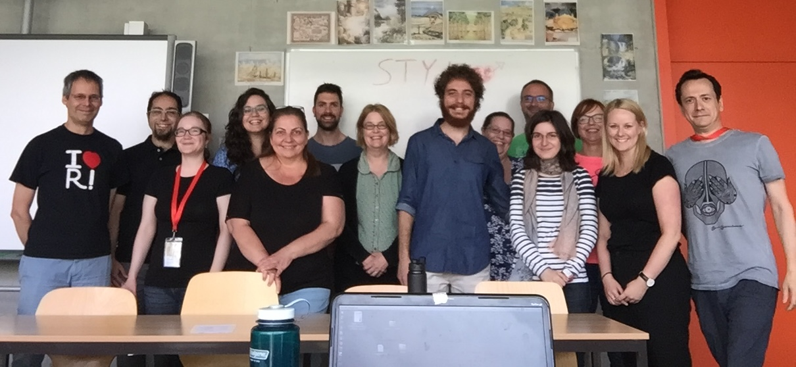


## Invisible colleges of DH


# Conclusions


## Big things start with small steps

- don't wait for big ideas -- start small, and do it _now_
- don't wait for your Dean's approval -- go bottom-up
- don't plan to build a large system -- share the code you already have
- do apply for funding, but conduct your research regardless
- collaborate
- use your coffee machine and a couch
- chase curiosity-driven research questions


# Thank you! 

